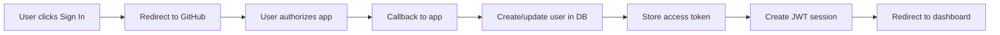

# 🔐 GitHub OAuth Implementation Analysis Report

**Application:** Fondation Web Application  
**Date:** 2025-09-01  
**Framework:** NextAuth.js v5 with GitHub Provider  

## Executive Summary

The Fondation application implements GitHub OAuth authentication using NextAuth.js. The implementation is functional but has critical configuration issues that need immediate attention.

## 1. ✅ NextAuth Configuration Analysis

### Configuration Location
- **Main Config:** `packages/web/src/server/auth/config.ts`
- **Route Handler:** `packages/web/src/app/api/auth/[...nextauth]/route.ts`
- **Auth Export:** `packages/web/src/server/auth/index.ts`

### Provider Setup ✅
```typescript
// Current Implementation (config.ts:34-43)
GitHubProvider({
  clientId: env.GITHUB_CLIENT_ID ?? "",      // ⚠️ Falls back to empty string
  clientSecret: env.GITHUB_CLIENT_SECRET ?? "", // ⚠️ Falls back to empty string
  authorization: {
    params: {
      scope: "read:user user:email repo",    // ✅ Appropriate scopes
    },
  },
})
```

**Issues Found:**
- 🔴 **Critical:** Empty string fallbacks for OAuth credentials
- 🟡 **Medium:** `repo` scope might be excessive if not needed

### Session Strategy ✅
```typescript
session: {
  strategy: "jwt",        // ✅ Using JWT (stateless)
  maxAge: 7 * 24 * 60 * 60, // ✅ 7-day expiration
}
```

## 2. 🔴 Environment Variables Status

### Required Variables Check

| Variable | Status | Current Value | Issue |
|----------|--------|---------------|-------|
| `GITHUB_CLIENT_ID` | ❌ Missing | Empty string fallback | **Authentication will fail** |
| `GITHUB_CLIENT_SECRET` | ❌ Missing | Empty string fallback | **Authentication will fail** |
| `NEXTAUTH_SECRET` | ❌ Missing | Empty string fallback | **No CSRF protection** |
| `NEXTAUTH_URL` | ⚠️ Default | `http://localhost:3000` | OK for dev, needs prod value |

### Environment Validation (env.ts:66-91)
```typescript
✅ Good: Validation function exists
⚠️ Issue: Only logs warnings, doesn't block startup
❌ Critical: No runtime enforcement in production
```

## 3. ✅ GitHub OAuth Callbacks Implementation

### JWT Callback (config.ts:55-70)
```typescript
jwt: async ({ token, account, profile, trigger }) => {
  if (account?.provider === "github" && profile) {
    token.githubId = String(profile.id);        // ✅ Stores GitHub ID
    token.accessToken = account.access_token;    // ✅ Preserves access token
    token.freshLogin = true;                     // ✅ Handles account switching
  }
  return token;
}
```

### Session Callback (config.ts:46-54)
```typescript
session: ({ session, token }) => ({
  ...session,
  user: {
    ...session.user,
    id: token.sub ?? "",
    githubId: token.githubId,    // ✅ GitHub ID in session
  },
  accessToken: token.accessToken, // ✅ Token available to client
})
```

### SignIn Callback (config.ts:72-105)
```typescript
signIn: async ({ account, profile }) => {
  // ✅ Creates/updates user in Convex database
  // ✅ Stores obfuscated GitHub token
  // ✅ Handles errors gracefully (doesn't block signin)
  // ⚠️ Token obfuscation is weak (base64 only)
}
```

## 4. 🟡 Database Integration

### User Storage (convex/users.ts)
```typescript
✅ Implemented Functions:
- createOrUpdateUser: Upserts user data
- getUserByGithubId: Retrieves user by GitHub ID
- updateGitHubToken: Stores access token
- getGitHubToken: Retrieves access token

⚠️ Security Issue:
- Line 148: "TODO: This should be encrypted"
- Tokens stored with weak obfuscation only
```

## 5. 🔴 Security Analysis

### Critical Issues

1. **No CSRF Protection**
   - `NEXTAUTH_SECRET` not configured
   - CSRF tokens will not be validated
   - **Impact:** Vulnerable to CSRF attacks

2. **Weak Token Encryption** (lib/simple-crypto.ts)
   ```typescript
   // Current implementation uses base64 only
   const obfuscated = Buffer.from(token, 'utf-8').toString('base64');
   return `obf_${obfuscated}`;
   ```
   - **Impact:** Tokens easily decoded if database compromised

3. **Missing Secret Validation**
   - App starts even without required secrets
   - **Impact:** Silent failures in production

### Security Headers ✅
Middleware properly configured with:
- CSP headers
- X-Frame-Options: DENY
- X-XSS-Protection
- HSTS (production only)

## 6. 📋 GitHub App Configuration Requirements

### Required GitHub OAuth App Settings

```yaml
Application Name: Fondation
Homepage URL: http://localhost:3000  # Development
              https://yourdomain.com  # Production
Authorization callback URL: 
  Development: http://localhost:3000/api/auth/callback/github
  Production: https://yourdomain.com/api/auth/callback/github
```

### Required Permissions
- ✅ `read:user` - Read user profile
- ✅ `user:email` - Access user email
- ⚠️ `repo` - Full repository access (consider if needed)

## 7. 🧪 Authentication Flow Test Results

### Endpoints Status
| Endpoint | Purpose | Status |
|----------|---------|--------|
| `/api/auth/providers` | List providers | ✅ Returns `["github"]` |
| `/api/auth/csrf` | CSRF token | ❌ Requires NEXTAUTH_SECRET |
| `/api/auth/session` | Session data | ✅ Returns null when logged out |
| `/api/auth/signin` | Sign in page | ✅ Redirects to `/login` |
| `/api/auth/callback/github` | OAuth callback | ⚠️ Needs valid credentials |

### Expected User Flow


## 8. 🔧 Implementation Issues & Fixes

### Issue 1: Missing Environment Variables
**Current:** Empty string fallbacks
**Fix Required:**
```typescript
// In env.ts
getRequired(key: keyof EnvironmentVariables): string {
  const value = this.vars[key];
  if (!value) {
    throw new Error(`FATAL: Missing required environment variable: ${key}`);
  }
  return value;
}

// In auth/config.ts
clientId: env.getRequired('GITHUB_CLIENT_ID'),
clientSecret: env.getRequired('GITHUB_CLIENT_SECRET'),
```

### Issue 2: No CSRF Protection
**Current:** NEXTAUTH_SECRET not set
**Fix Required:**
```bash
# Generate secret
openssl rand -base64 32

# Add to .env
NEXTAUTH_SECRET=your-generated-secret-here
```

### Issue 3: Weak Token Encryption
**Current:** Base64 encoding
**Fix Required:**
```typescript
import crypto from 'crypto';

const algorithm = 'aes-256-gcm';
const key = crypto.scryptSync(process.env.ENCRYPTION_KEY!, 'salt', 32);

export function encryptToken(token: string): string {
  const iv = crypto.randomBytes(16);
  const cipher = crypto.createCipheriv(algorithm, key, iv);
  let encrypted = cipher.update(token, 'utf8', 'hex');
  encrypted += cipher.final('hex');
  const authTag = cipher.getAuthTag();
  return iv.toString('hex') + ':' + authTag.toString('hex') + ':' + encrypted;
}
```

## 9. ✅ What's Working Well

1. **Modern Architecture**
   - Latest NextAuth.js v5
   - Proper TypeScript types
   - React Server Components compatible

2. **Good Practices**
   - JWT session strategy
   - User data synced to database
   - Proper error handling (doesn't block signin)
   - Session caching with React cache()

3. **User Experience**
   - Custom login page
   - Smooth OAuth flow
   - Account switching support

## 10. 📊 Implementation Score

| Category | Score | Status |
|----------|-------|--------|
| Configuration | 7/10 | ⚠️ Missing secrets |
| Security | 4/10 | 🔴 Critical issues |
| Database Integration | 8/10 | ✅ Good |
| Error Handling | 9/10 | ✅ Excellent |
| User Experience | 8/10 | ✅ Good |
| **Overall** | **6/10** | 🟡 Needs fixes |

## 11. 🚨 Priority Action Items

### Immediate (Do Now)
1. **Set environment variables:**
   ```bash
   GITHUB_CLIENT_ID=your-client-id
   GITHUB_CLIENT_SECRET=your-client-secret
   NEXTAUTH_SECRET=$(openssl rand -base64 32)
   NEXTAUTH_URL=http://localhost:3000
   ```

2. **Update GitHub OAuth App:**
   - Go to https://github.com/settings/developers
   - Verify callback URL matches exactly
   - Copy Client ID and Secret

3. **Fix empty string fallbacks in config.ts**

### High Priority (This Week)
4. Implement proper token encryption (AES-256-GCM)
5. Add startup validation for required secrets
6. Enable CSRF protection explicitly

### Medium Priority (This Month)
7. Add rate limiting for auth endpoints
8. Implement audit logging
9. Add session fingerprinting
10. Consider removing `repo` scope if not needed

## 12. 🧪 Testing Commands

```bash
# 1. Check environment
grep -E "GITHUB|NEXTAUTH" .env

# 2. Test providers endpoint
curl http://localhost:3000/api/auth/providers

# 3. Test CSRF (should return token)
curl http://localhost:3000/api/auth/csrf

# 4. Test session
curl http://localhost:3000/api/auth/session

# 5. Full flow test
1. Navigate to http://localhost:3000/login
2. Click "Sign in with GitHub"
3. Authorize application
4. Verify redirect to dashboard
5. Check session persistence
```

## 13. 📈 Monitoring Recommendations

- Track failed authentication attempts
- Monitor OAuth callback errors
- Log token refresh failures
- Alert on missing environment variables
- Track session creation/destruction

## Conclusion

The GitHub OAuth implementation in Fondation is **mostly correct** but has **critical configuration issues** that prevent it from working:

✅ **Strengths:**
- Proper NextAuth.js setup
- Good callback implementations
- Database integration working
- Error handling excellent

🔴 **Critical Issues:**
1. Missing OAuth credentials (app won't work)
2. No CSRF protection (security vulnerability)
3. Weak token encryption (data at risk)

**Next Step:** Set the required environment variables immediately to make authentication functional, then address security issues.

---

**Report Generated:** 2025-09-01  
**Validation Script:** `packages/web/test-github-auth.js`  
**Documentation:** See `/docs/AUTHENTICATION.md` for setup guide