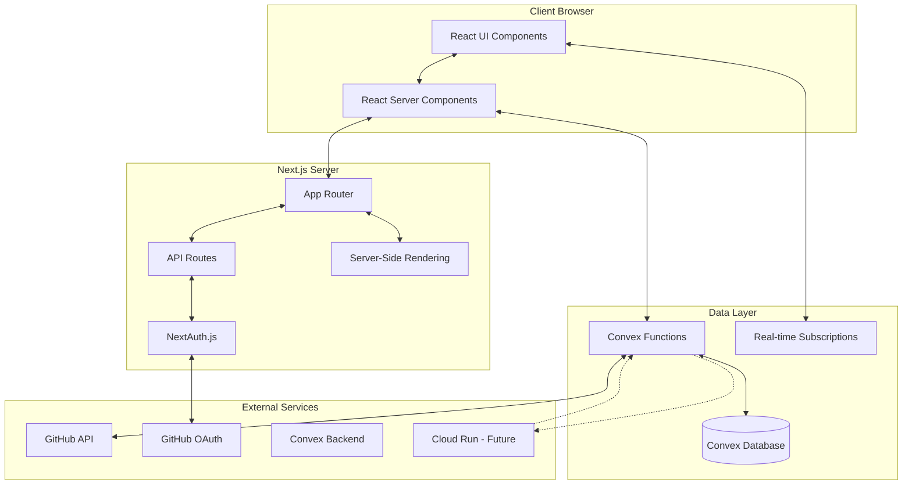
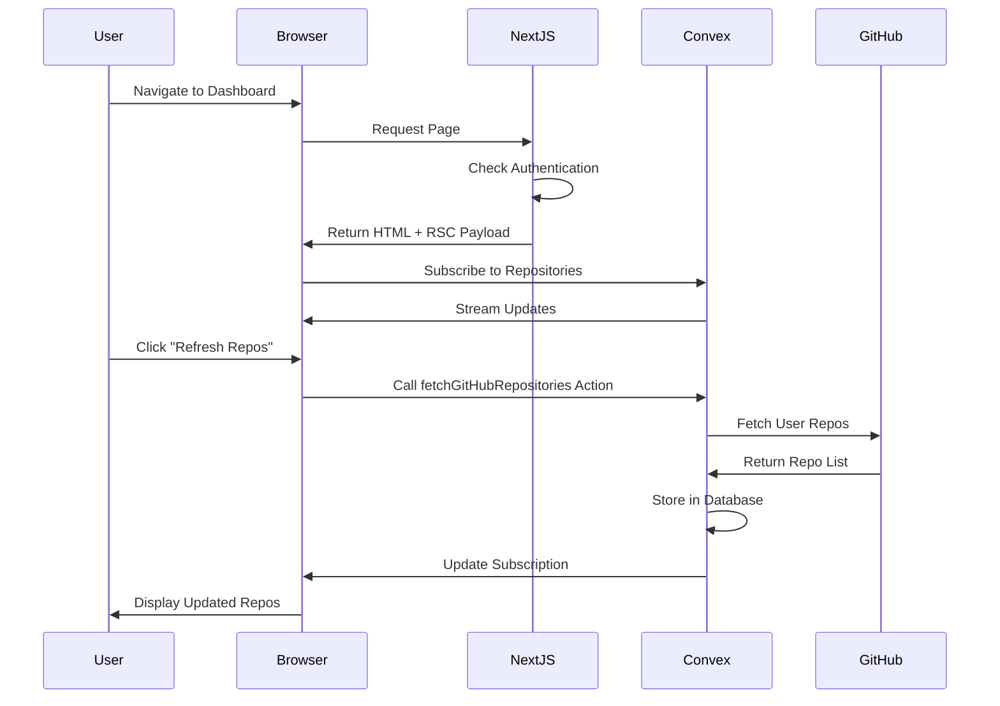

# Architecture Documentation

## System Architecture Overview

Fondation follows a modern, serverless architecture leveraging Next.js App Router, Convex for real-time backend, and GitHub OAuth for authentication.



## Core Components

### 1. Frontend Layer

#### Next.js 15 App Router
- **Server Components**: Default rendering mode for optimal performance
- **Client Components**: Used for interactivity (auth, forms, real-time updates)
- **Route Groups**: Organization without affecting URL structure
  - `(auth)`: Public authentication pages
  - `(dashboard)`: Protected user pages

#### UI Component Library
- **shadcn/ui**: Copy-paste component library
- **Radix UI**: Accessible, unstyled primitives
- **Tailwind CSS 4**: Utility-first styling
- **Lucide Icons**: Consistent icon set

### 2. Authentication Layer

#### NextAuth.js v5 (Beta)
- **Provider**: GitHub OAuth 2.0
- **Session Strategy**: JWT (stateless)
- **Token Storage**: HTTP-only secure cookies
- **Session Duration**: 30 days default

#### Security Flow
```
User → GitHub OAuth → NextAuth → JWT Generation → Session Cookie → Protected Routes
```

### 3. Backend Layer

#### Convex Platform
- **Real-time Database**: NoSQL with ACID transactions
- **Functions**: Type-safe serverless functions
- **Subscriptions**: Real-time data synchronization
- **File Storage**: For future document storage

#### Function Types
1. **Queries**: Read-only data fetching
2. **Mutations**: Data modifications
3. **Actions**: Side effects (API calls, emails)
4. **Internal Functions**: Not exposed to client

### 4. Data Flow Architecture



## Directory Structure

```
fondation-web-app/
├── src/
│   ├── app/                    # Next.js App Router
│   │   ├── (auth)/            # Public routes
│   │   │   ├── login/         # Login page
│   │   │   └── layout.tsx     # Auth layout
│   │   ├── (dashboard)/       # Protected routes
│   │   │   ├── page.tsx       # Dashboard home
│   │   │   ├── jobs/          # Job management
│   │   │   └── layout.tsx     # Dashboard layout
│   │   ├── api/               # API endpoints
│   │   │   └── auth/          # NextAuth routes
│   │   ├── layout.tsx         # Root layout
│   │   └── page.tsx           # Landing page
│   ├── components/            # React components
│   │   ├── auth/             # Authentication components
│   │   ├── dashboard/        # Dashboard components
│   │   ├── repos/            # Repository components
│   │   ├── ui/               # shadcn/ui components
│   │   └── providers.tsx     # Context providers
│   ├── lib/                  # Utilities
│   │   └── utils.ts          # Helper functions
│   ├── server/               # Server-only code
│   │   └── auth/            # Auth configuration
│   ├── styles/               # Global styles
│   └── env.js               # Environment validation
├── convex/                   # Convex backend
│   ├── _generated/          # Auto-generated types
│   ├── schema.ts            # Database schema
│   ├── users.ts             # User functions
│   ├── repositories.ts      # Repository functions
│   └── jobs.ts              # Job functions
├── public/                   # Static assets
├── docs/                     # Documentation
└── roadmap/                  # Development roadmap
```

## Design Patterns

### 1. Component Patterns

#### Server Components (Default)
```typescript
// Async data fetching on server
export default async function Page() {
  const session = await auth();
  return <div>{/* UI */}</div>;
}
```

#### Client Components
```typescript
"use client";
// Interactive components with hooks
export function InteractiveComponent() {
  const [state, setState] = useState();
  return <div>{/* Interactive UI */}</div>;
}
```

#### Hybrid Pattern
```typescript
// Server component wrapper
export default async function PageWrapper() {
  const data = await fetchData();
  return <ClientComponent initialData={data} />;
}
```

### 2. Data Fetching Patterns

#### Server-Side (Page Level)
```typescript
// In Server Component
const session = await auth();
const data = await fetch(...);
```

#### Client-Side (Real-time)
```typescript
// Using Convex hooks
const repos = useQuery(api.repositories.list);
const createJob = useMutation(api.jobs.create);
```

#### Optimistic Updates
```typescript
// Update UI before server confirms
setLocalState(newValue);
try {
  await mutation(newValue);
} catch {
  setLocalState(oldValue); // Rollback
}
```

### 3. Error Handling Patterns

#### Boundary Pattern
```typescript
// Error boundary for component tree
<ErrorBoundary fallback={<ErrorUI />}>
  <ComponentTree />
</ErrorBoundary>
```

#### Try-Catch Pattern
```typescript
try {
  const result = await riskyOperation();
  toast.success("Success!");
} catch (error) {
  toast.error(error.message);
  console.error(error);
}
```

### 4. Type Safety Patterns

#### Zod Validation
```typescript
const schema = z.object({
  email: z.string().email(),
  name: z.string().min(1),
});

const validated = schema.parse(input);
```

#### Convex Type Generation
```typescript
// Auto-generated types from schema
import { Doc, Id } from "../convex/_generated/dataModel";
type User = Doc<"users">;
type UserId = Id<"users">;
```

## Performance Optimizations

### 1. Bundle Size Management
- **Code Splitting**: Automatic with App Router
- **Dynamic Imports**: For heavy components
- **Tree Shaking**: Enabled by default
- **Target**: <200KB for v0.1

### 2. Rendering Optimizations
- **Server Components**: Reduce client JavaScript
- **Streaming SSR**: Progressive rendering
- **Suspense Boundaries**: Loading states
- **Static Generation**: Where possible

### 3. Data Fetching
- **Parallel Fetching**: Multiple queries simultaneously
- **Data Caching**: Convex handles automatically
- **Subscription Optimization**: Minimal data transfer
- **Pagination**: For large datasets

### 4. Image Optimization
```typescript
import Image from "next/image";

<Image
  src={avatarUrl}
  alt="Avatar"
  width={40}
  height={40}
  loading="lazy"
/>
```

## Security Architecture

### 1. Authentication Security
- **OAuth 2.0**: Industry standard protocol
- **JWT Tokens**: Signed and encrypted
- **CSRF Protection**: Built into NextAuth
- **Secure Cookies**: HttpOnly, Secure, SameSite

### 2. API Security
- **Rate Limiting**: Via Vercel/hosting platform
- **Input Validation**: Zod schemas
- **SQL Injection**: Not possible with Convex
- **XSS Protection**: React's default escaping

### 3. Data Security
- **Environment Variables**: Validated at build
- **Secrets Management**: Never in code
- **Token Rotation**: On each sign-in
- **Least Privilege**: Minimal OAuth scopes

## Scalability Considerations

### 1. Horizontal Scaling
- **Stateless Design**: No server-side sessions
- **Serverless Functions**: Auto-scaling
- **CDN Distribution**: Static assets
- **Edge Runtime**: Where applicable

### 2. Database Scaling
- **Convex Scaling**: Automatic
- **Indexes**: For query performance
- **Pagination**: For large datasets
- **Caching**: Built into Convex

### 3. Real-time Scaling
- **WebSocket Management**: Handled by Convex
- **Subscription Limits**: Based on plan
- **Connection Pooling**: Automatic
- **Reconnection Logic**: Built-in

## Deployment Architecture

### Development
```
Local Next.js Dev Server ← → Convex Dev Instance
         ↓
    GitHub OAuth (Dev App)
```

### Production
```
Vercel Edge Network
    ↓
Next.js on Vercel ← → Convex Production
    ↓                      ↓
GitHub OAuth          Cloud Run (Future)
```

## Monitoring & Observability

### 1. Application Monitoring
- **Vercel Analytics**: Performance metrics
- **Convex Dashboard**: Function logs
- **Browser Console**: Client errors
- **Sentry** (Future): Error tracking

### 2. Performance Metrics
- **Core Web Vitals**: LCP, FID, CLS
- **Bundle Analysis**: Size tracking
- **Lighthouse Scores**: Regular audits
- **Real User Monitoring**: Future

### 3. Logging Strategy
```typescript
// Development
console.log("Debug info");

// Production
logger.info("User action", { userId, action });
logger.error("Operation failed", { error, context });
```

## Future Architecture Enhancements

### Phase 2: Real-time Execution
- Add WebSocket streaming for logs
- Implement virtual scrolling for performance
- Add code syntax highlighting

### Phase 3: Document Management
- Implement document storage in Convex
- Add versioning system
- Enable export functionality

### Phase 4: Team Collaboration
- Multi-tenancy architecture
- Role-based access control (RBAC)
- Audit logging system

### Phase 5: Enterprise Features
- SSO integration
- Advanced security features
- Compliance certifications

## Technology Decisions

### Why Next.js 15?
- App Router for better performance
- Server Components reduce bundle size
- Built-in optimizations
- Excellent DX with TypeScript

### Why Convex?
- Real-time subscriptions out of the box
- Type-safe from schema to frontend
- No separate WebSocket management
- Automatic scaling

### Why GitHub OAuth?
- Target audience is developers
- Direct access to repositories
- No additional account creation
- Trusted authentication provider

### Why shadcn/ui?
- Copy-paste ownership of code
- Highly customizable
- Accessible by default
- No runtime overhead

## Development Workflow

### 1. Feature Development
```
1. Design API in Convex schema
2. Implement Convex functions
3. Create UI components
4. Add error handling
5. Write documentation
6. Test end-to-end
```

### 2. Code Review Checklist
- [ ] TypeScript types correct
- [ ] Error handling implemented
- [ ] Loading states present
- [ ] Responsive design works
- [ ] Accessibility standards met
- [ ] Performance targets achieved

### 3. Deployment Process
```
1. Run type checking
2. Run linting
3. Build application
4. Run tests
5. Deploy to staging
6. Verify functionality
7. Deploy to production
```

## Conclusion

This architecture provides a solid foundation for a scalable, maintainable, and performant documentation generation platform. The separation of concerns, type safety, and real-time capabilities position the application for future growth while maintaining excellent developer experience and user satisfaction.