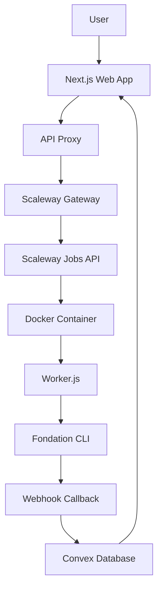
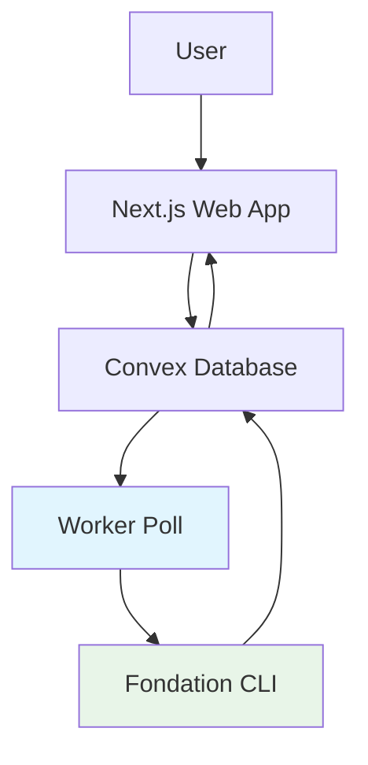

# Architecture Overview - Migration to Worker Permanent

⚠️ **MIGRATION EN COURS** ⚠️  
Cette architecture est en cours de migration vers une solution **Worker Permanent** plus simple.

**Voir les nouveaux documents :**
- 📋 [Plan de Migration Monorepo](./MONOREPO_MIGRATION_PLAN.md)
- 🏗️ [Architecture Worker Permanent](./WORKER_ARCHITECTURE.md)

---

## Architecture Actuelle (Scaleway - À Remplacer)

Le système actuel utilise une architecture complexe avec Scaleway Jobs qui sera simplifiée.

### Problèmes Architecture Actuelle
- ❌ **Complexité** : 3 niveaux (UI → Gateway → Scaleway → Worker)
- ❌ **Cold Start** : 10-30 secondes par job
- ❌ **Coût** : Facturé par exécution
- ❌ **Maintenance** : Gateway + Worker + API orchestration



---

## Nouvelle Architecture (Worker Permanent - En Migration)

### ✅ Avantages Nouvelle Architecture
- ✅ **Simplicité** : UI → Convex ← Worker
- ✅ **Performance** : Pas de cold start, réponse instantanée  
- ✅ **Coût** : VPS simple $4-10/mois
- ✅ **Maintenance** : Un seul service à gérer



### Composants Nouvelle Architecture

#### 1. **Monorepo Bun Workspaces**
```
fondation/
├── apps/
│   ├── web/          # Next.js (fondation-web-app)
│   ├── cli/          # Fondation CLI
│   └── worker/       # Worker permanent (NOUVEAU)
└── packages/
    └── shared/       # Types communs
```

#### 2. **Worker Permanent**
- Process Node.js qui tourne en continu
- Poll Convex toutes les 5 secondes pour nouveaux jobs
- Exécute directement le CLI Fondation
- Met à jour les statuts en temps réel

#### 3. **Flow Simplifié**
1. **UI** crée job avec `status: "pending"`
2. **Worker** trouve le job via polling
3. **Worker** exécute : clone → analyse CLI → sauvegarde
4. **UI** affiche résultats en temps réel

---

## Composants Actuels (À Supprimer)

### ❌ À Supprimer Pendant Migration

#### Scaleway Gateway
- **Location**: `/scaleway-gateway/` 
- **Status**: ❌ **À SUPPRIMER**
- **Remplacé par**: Worker permanent avec polling direct

#### Scaleway Worker  
- **Location**: `/scaleway-worker/`
- **Status**: ❌ **À SUPPRIMER**
- **Remplacé par**: Worker intégré dans monorepo

#### API Proxy
- **Location**: `/src/app/api/analyze-proxy/`
- **Status**: ❌ **À SUPPRIMER** 
- **Remplacé par**: Création job directe dans Convex

### ✅ À Conserver

#### Web Application (Next.js)
- **Location**: `/src/app/` → `apps/web/src/app/`
- **Status**: ✅ **MIGRATE VERS MONOREPO**
- **Changes**: Simplifier trigger jobs (plus d'API proxy)

#### Convex Database
- **Location**: `/convex/` → `apps/web/convex/`
- **Status**: ✅ **MIGRATE + SIMPLIFY**
- **Changes**: 
  - Supprimer `scalewayWorker.ts`
  - Supprimer `cloudRun.ts`
  - Ajouter `jobs.getNextPending()`
  - Simplifier `repositories.triggerAnalyze()`

---

## Migration Status

| Composant | Status Actuel | Action | Status Migration |
|-----------|---------------|---------|------------------|
| **Web App** | ✅ Fonctionnel | Migrate vers monorepo | 🔄 Planifié |
| **Convex DB** | ✅ Fonctionnel | Simplifier APIs | 🔄 Planifié |  
| **Worker Permanent** | ❌ N'existe pas | Créer nouveau | 🔄 Planifié |
| **Scaleway Gateway** | ⚠️ Complexe | Supprimer | 🔄 Planifié |
| **Scaleway Worker** | ⚠️ Complexe | Supprimer | 🔄 Planifié |
| **API Proxy** | ⚠️ Inutile | Supprimer | 🔄 Planifié |

---

## Variables d'Environnement

### ❌ À Supprimer (Scaleway)
```bash
# Scaleway - Plus nécessaire
SCALEWAY_GATEWAY_URL=
SCW_ACCESS_KEY=
SCW_SECRET_KEY=  
SCW_DEFAULT_PROJECT_ID=
SCW_JOB_DEFINITION_ID=
```

### ✅ À Conserver
```bash
# Convex
CONVEX_URL=https://your-deployment.convex.cloud
NEXT_PUBLIC_CONVEX_URL=https://your-deployment.convex.cloud

# Authentication
NEXTAUTH_SECRET=your-nextauth-secret  
GITHUB_CLIENT_ID=your-github-app-id
GITHUB_CLIENT_SECRET=your-github-app-secret

# Analysis (Worker)
ANTHROPIC_API_KEY=your-anthropic-api-key
```

### 🆕 Nouvelles Variables (Worker)
```bash
# Worker Permanent
NODE_ENV=development|production
CLI_PATH=/app/apps/cli/dist/cli.bundled.cjs
TEMP_DIR=/tmp/fondation
POLL_INTERVAL=5000
MAX_CONCURRENT_JOBS=1
```

---

## Timeline Migration

| Phase | Durée | Description | Status |
|-------|-------|-------------|---------|
| **Phase 1** | 1-2h | Setup monorepo Bun | 📋 Planifié |
| **Phase 2** | 2-3h | Créer worker permanent | 📋 Planifié |
| **Phase 3** | 1h | Simplifier Convex APIs | 📋 Planifié |
| **Phase 4** | 1h | Supprimer code Scaleway | 📋 Planifié |
| **Phase 5** | 2h | Docker + déploiement | 📋 Planifié |
| **Total** | **7-9h** | Migration complète | 📋 Planifié |

---

## Performance Comparaison

| Métrique | Architecture Actuelle | Nouvelle Architecture |
|----------|----------------------|----------------------|
| **Cold Start** | 10-30 secondes | 0 seconde ⚡ |
| **Coût** | Scaleway Jobs (~$20-50/mois) | VPS Simple (~$4-10/mois) 💰 |
| **Complexité** | 6 composants | 3 composants 🎯 |
| **Maintenance** | Gateway + Worker + API | Worker seul 🔧 |
| **Dev/Prod** | Architectures différentes | Même code 🚀 |

---

**Pour les détails complets de la migration, consultez :**
- 📋 [Plan de Migration Monorepo](./MONOREPO_MIGRATION_PLAN.md)  
- 🏗️ [Architecture Worker Permanent](./WORKER_ARCHITECTURE.md)