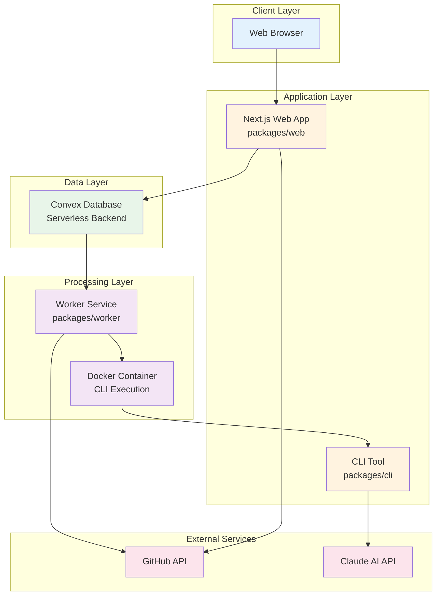

# Fondation Architecture Overview

## System Architecture

Fondation is a distributed system built on a monorepo architecture that leverages modern cloud-native technologies to analyze repositories and generate educational content.



## Component Architecture

### 1. Web Application (Next.js)
**Location**: `packages/web`  
**Technology**: Next.js 14 with App Router, React, TypeScript  
**Responsibilities**:
- User authentication (GitHub OAuth)
- Repository management UI
- Job creation and monitoring
- Course viewing and navigation
- Real-time status updates

**Key Features**:
- Server-side rendering for SEO
- Real-time updates via Convex subscriptions
- Responsive design for mobile/desktop
- Progressive enhancement

### 2. CLI Tool
**Location**: `packages/cli`  
**Technology**: TypeScript, Commander.js, Claude SDK  
**Responsibilities**:
- Repository analysis orchestration
- AI prompt execution
- Content generation pipeline
- File system operations

**Architecture**:
```
CLI
├── Commands (analyze, chat, worker, etc.)
├── Core (Claude integration, session management)
├── UI Components (Ink-based terminal UI)
└── Utils (formatting, logging, output)
```

### 3. Worker Service
**Location**: `packages/worker`  
**Technology**: TypeScript, Docker, Git  
**Responsibilities**:
- Job queue processing
- Repository cloning
- CLI execution orchestration
- Progress reporting

**Design Patterns**:
- **Strategy Pattern**: Different execution modes (dev/prod)
- **Polling Pattern**: Continuous job monitoring
- **Health Check Pattern**: Service monitoring

### 4. Shared Package
**Location**: `packages/shared`  
**Technology**: TypeScript  
**Responsibilities**:
- Common type definitions
- Environment configuration
- Validation schemas
- Utility functions

### 5. Convex Backend
**Location**: `convex/`  
**Technology**: Convex (Serverless database)  
**Responsibilities**:
- Data persistence
- Real-time subscriptions
- Job queue management
- Authentication state

## Data Flow Architecture

### 1. Authentication Flow
```
User → GitHub OAuth → NextAuth → Convex Users Table → Session
```

### 2. Job Processing Flow
```
UI → Convex Job → Worker Poll → Clone Repo → Execute CLI → Store Results → Update UI
```

### 3. Content Generation Flow
```
Repository → Extract → Analyze → Order → Generate → Review → Tutorials → Course
```

## Communication Patterns

### 1. Request-Response
- Web ↔ Convex: GraphQL-like queries and mutations
- Worker → CLI: Command execution with result

### 2. Publish-Subscribe
- Convex → Web: Real-time job status updates
- Worker → Convex: Progress notifications

### 3. Polling
- Worker → Convex: Job queue polling (configurable interval)

### 4. Webhooks
- Convex → Worker: Job completion callbacks (production)

## Deployment Architecture

### Development Deployment
```
┌─────────────┐     ┌─────────────┐     ┌─────────────┐
│   Next.js   │────▶│   Convex    │◀────│   Worker    │
│  localhost  │     │    Dev      │     │   Local     │
│    :3000    │     │   Server    │     │   Process   │
└─────────────┘     └─────────────┘     └─────────────┘
                           │                     │
                           ▼                     ▼
                    ┌─────────────┐     ┌─────────────┐
                    │   GitHub    │     │  Claude AI  │
                    │     API     │     │     API     │
                    └─────────────┘     └─────────────┘
```

### Production Deployment
```
┌─────────────┐     ┌─────────────┐     ┌─────────────┐
│   Vercel    │────▶│   Convex    │◀────│   Docker    │
│   Next.js   │     │ Production  │     │  Container  │
│     CDN     │     │   Server    │     │   Worker    │
└─────────────┘     └─────────────┘     └─────────────┘
                           │                     │
                           ▼                     ▼
                    ┌─────────────┐     ┌─────────────┐
                    │   GitHub    │     │  Claude AI  │
                    │     API     │     │     API     │
                    └─────────────┘     └─────────────┘
```

## Technology Stack

### Frontend
- **Framework**: Next.js 14 (App Router)
- **UI Library**: React 19
- **Styling**: Tailwind CSS
- **State Management**: Convex React hooks
- **Authentication**: NextAuth.js

### Backend
- **Database**: Convex (serverless)
- **Runtime**: Bun (development), Node.js (production)
- **Queue**: Convex-based job queue
- **File Storage**: Local filesystem (temporary)

### Infrastructure
- **Containerization**: Docker
- **CI/CD**: GitHub Actions
- **Hosting**: Vercel (web), VPS/Cloud (worker)
- **Monitoring**: Built-in health checks

### Development Tools
- **Package Manager**: Bun workspaces
- **Build Tool**: TypeScript, ESBuild
- **Linter**: Biome
- **Testing**: Bun test

## Scalability Considerations

### Horizontal Scaling
- **Web**: Auto-scales on Vercel edge network
- **Worker**: Multiple container instances
- **Database**: Convex handles scaling automatically

### Performance Optimizations
- **Caching**: Repository clones cached for reuse
- **Parallel Processing**: Concurrent chapter generation
- **Job Deduplication**: Prevents duplicate processing
- **Resource Limits**: Container memory/CPU limits

### Bottlenecks and Solutions
1. **Claude API Rate Limits**
   - Solution: Request queuing and backoff strategies
   
2. **Repository Size**
   - Solution: Streaming processing, file filtering
   
3. **Worker Memory**
   - Solution: Container resource limits, job splitting

## Security Architecture

### Authentication & Authorization
- GitHub OAuth 2.0 with PKCE
- Session-based authentication
- Role-based access control

### Data Protection
- Encryption at rest (Convex)
- TLS for all communications
- Token encryption in database
- Sensitive data masking in logs

### Execution Security
- Docker container isolation
- Limited filesystem access
- Network segmentation
- Input validation and sanitization

## Monitoring & Observability

### Health Checks
```typescript
// Worker health endpoint
GET /health → {
  status: "healthy",
  uptime: 3600,
  activeJobs: 2,
  memoryUsage: "450MB"
}
```

### Logging Strategy
- **Application Logs**: Pino logger with levels
- **Audit Logs**: Security events
- **Performance Logs**: Timing and metrics
- **Error Tracking**: Stack traces and context

### Metrics
- Job processing time
- Success/failure rates
- API call counts
- Resource utilization

## Configuration Management

### Environment-based Configuration
```
Development → .env.local
Staging → .env.staging  
Production → .env.production
```

### Configuration Hierarchy
1. Environment variables (highest priority)
2. Configuration files
3. Default values (lowest priority)

### Secrets Management
- GitHub secrets for CI/CD
- Environment variables for runtime
- Encrypted storage for tokens

## API Design

### REST Endpoints (Next.js API Routes)
```
POST /api/auth/[...nextauth]   - Authentication
POST /api/jobs/create           - Create analysis job
GET  /api/jobs/[id]/status      - Get job status
POST /api/jobs/[id]/cancel      - Cancel job
POST /api/webhook/job-callback  - Job completion webhook
```

### Convex Functions
```typescript
// Queries
api.jobs.getJob
api.repositories.list
api.users.current

// Mutations
api.jobs.create
api.jobs.updateStatus
api.repositories.upsert

// Actions
api.github.fetchUserRepos
api.queue.process
```

## Development Workflow

### Local Development
```bash
# Install dependencies
bun install

# Start all services
bun run dev

# Run specific service
bun run dev:web
bun run dev:worker
bun run dev:convex
```

### Testing Strategy
- Unit tests for utilities
- Integration tests for API
- E2E tests for critical paths
- Manual testing for UI

### Deployment Pipeline
1. Code push to GitHub
2. CI runs tests and linting
3. Build Docker images
4. Deploy to staging
5. Run smoke tests
6. Deploy to production

## Future Architecture Considerations

### Planned Improvements
1. **Message Queue**: Replace polling with RabbitMQ/Redis
2. **Object Storage**: S3 for generated content
3. **CDN**: CloudFront for course delivery
4. **Microservices**: Split worker into specialized services

### Scaling Considerations
1. **Database Sharding**: For large-scale deployments
2. **Multi-region**: Geographic distribution
3. **Edge Computing**: Process near users
4. **Kubernetes**: Container orchestration

### Technical Debt
1. **Testing Coverage**: Increase automated testing
2. **Error Recovery**: Improve retry mechanisms
3. **Monitoring**: Add APM tools
4. **Documentation**: API documentation generation