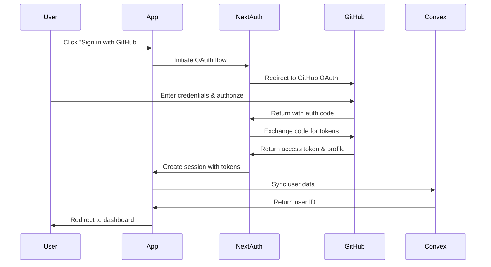

# Authentication Guide

## Overview

Fondation uses NextAuth.js v5 (Beta) with GitHub OAuth 2.0 provider for authentication. This guide covers the complete authentication flow, configuration, and implementation details.

## Authentication Flow



## Configuration

### 1. GitHub OAuth App Setup

1. Go to [GitHub Settings > Developer settings > OAuth Apps](https://github.com/settings/applications/new)
2. Create a new OAuth App with these settings:

| Field | Development | Production |
|-------|------------|------------|
| Application name | Fondation Dev | Fondation |
| Homepage URL | http://localhost:3000 | https://yourdomain.com |
| Authorization callback URL | http://localhost:3000/api/auth/callback/github | https://yourdomain.com/api/auth/callback/github |

3. After creation, you'll receive:
   - **Client ID**: Public identifier for your app
   - **Client Secret**: Private key (keep secure!)

### 2. Environment Variables

Create a `.env` file with your credentials:

```bash
# Authentication
AUTH_SECRET="generate-with-npx-auth-secret"
NEXTAUTH_SECRET="same-as-auth-secret"
NEXTAUTH_URL="http://localhost:3000"

# GitHub OAuth
GITHUB_CLIENT_ID="your-client-id"
GITHUB_CLIENT_SECRET="your-client-secret"

# Convex
NEXT_PUBLIC_CONVEX_URL="your-convex-url"
```

### 3. NextAuth Configuration

Location: `src/server/auth/config.ts`

```typescript
import { type NextAuthConfig } from "next-auth";
import GitHubProvider from "next-auth/providers/github";

export const authConfig = {
  providers: [
    GitHubProvider({
      clientId: process.env.GITHUB_CLIENT_ID!,
      clientSecret: process.env.GITHUB_CLIENT_SECRET!,
      authorization: {
        params: {
          scope: "read:user user:email repo",
        },
      },
    }),
  ],
  callbacks: {
    session: ({ session, token }) => ({
      ...session,
      user: {
        ...session.user,
        id: token.sub ?? "",
        githubId: token.githubId,
      },
      accessToken: token.accessToken,
    }),
    jwt: async ({ token, account, profile }) => {
      if (account?.provider === "github" && profile) {
        token.githubId = String(profile.id);
        token.accessToken = account.access_token;
      }
      return token;
    },
  },
  pages: {
    signIn: "/login",
  },
} satisfies NextAuthConfig;
```

## Scopes and Permissions

The app requests these GitHub OAuth scopes:

| Scope | Purpose | Access Level |
|-------|---------|--------------|
| `read:user` | Read user profile information | Read-only access to profile |
| `user:email` | Access user email addresses | Read-only access to emails |
| `repo` | Access user repositories | Full control of private repos |

**Note**: The `repo` scope grants broad access. In production, consider using fine-grained personal access tokens for better security.

## Implementation Details

### Type Augmentation

We extend NextAuth types for TypeScript support:

```typescript
declare module "next-auth" {
  interface Session extends DefaultSession {
    user: {
      id: string;
      githubId?: string;
    } & DefaultSession["user"];
    accessToken?: string;
  }
}

declare module "@auth/core/jwt" {
  interface JWT {
    githubId?: string;
    accessToken?: string;
  }
}
```

### Session Management

Sessions are managed using JWT strategy (default in NextAuth v5):

- **Session Duration**: 30 days (default)
- **Token Rotation**: On each sign-in
- **Storage**: HTTP-only secure cookies
- **CSRF Protection**: Built-in

### User Sync with Convex

After successful authentication, user data is synced to Convex:

```typescript
// src/components/auth/user-sync.tsx
export function UserSync() {
  const { data: session } = useSession();
  const createOrUpdateUser = useMutation(api.users.createOrUpdateUser);

  useEffect(() => {
    if (session?.user && session.user.githubId) {
      createOrUpdateUser({
        githubId: session.user.githubId,
        username: session.user.name ?? "",
        email: session.user.email ?? undefined,
        avatarUrl: session.user.image ?? undefined,
      });
    }
  }, [session]);
}
```

## Usage in Components

### Client Components

```typescript
"use client";
import { useSession } from "next-auth/react";

export function MyComponent() {
  const { data: session, status } = useSession();

  if (status === "loading") return <Loading />;
  if (status === "unauthenticated") return <SignIn />;

  return <div>Welcome {session.user.name}!</div>;
}
```

### Server Components

```typescript
import { auth } from "@/server/auth";
import { redirect } from "next/navigation";

export default async function ProtectedPage() {
  const session = await auth();
  
  if (!session) {
    redirect("/login");
  }

  return <div>Protected content</div>;
}
```

### API Routes

```typescript
import { auth } from "@/server/auth";
import { NextResponse } from "next/server";

export async function GET() {
  const session = await auth();
  
  if (!session) {
    return NextResponse.json({ error: "Unauthorized" }, { status: 401 });
  }

  // Use session.accessToken for GitHub API calls
  const octokit = new Octokit({
    auth: session.accessToken,
  });

  // ... make API calls
}
```

## Protected Routes

### Middleware Protection (Optional)

```typescript
// middleware.ts
import { auth } from "@/server/auth";

export default auth((req) => {
  const isLoggedIn = !!req.auth;
  const isOnDashboard = req.nextUrl.pathname.startsWith("/dashboard");

  if (isOnDashboard && !isLoggedIn) {
    return Response.redirect(new URL("/login", req.url));
  }
});

export const config = {
  matcher: ["/dashboard/:path*"],
};
```

### Layout Protection

```typescript
// app/(dashboard)/layout.tsx
import { auth } from "@/server/auth";
import { redirect } from "next/navigation";

export default async function DashboardLayout({
  children,
}: {
  children: React.ReactNode;
}) {
  const session = await auth();
  
  if (!session?.user?.githubId) {
    redirect("/login");
  }

  return <>{children}</>;
}
```

## Security Best Practices

### 1. Environment Variables
- Never commit `.env` files to version control
- Use different secrets for development and production
- Rotate secrets regularly
- Use strong, randomly generated AUTH_SECRET

### 2. Token Storage
- Access tokens are stored in JWT, not in localStorage
- Tokens are transmitted only via secure HTTP-only cookies
- Never expose tokens to client-side JavaScript

### 3. CSRF Protection
- NextAuth includes built-in CSRF protection
- All state-changing operations require valid CSRF tokens

### 4. Content Security Policy
```typescript
// next.config.js
const cspHeader = `
  default-src 'self';
  script-src 'self' 'unsafe-eval' 'unsafe-inline';
  style-src 'self' 'unsafe-inline';
  img-src 'self' blob: data: https://avatars.githubusercontent.com;
  font-src 'self';
  object-src 'none';
  base-uri 'self';
  form-action 'self';
  frame-ancestors 'none';
`;
```

## Troubleshooting

### Common Issues

#### 1. "NEXTAUTH_URL is not set"
**Solution**: Ensure NEXTAUTH_URL is set in your environment variables.

#### 2. "Invalid callback URL"
**Solution**: Verify the callback URL in GitHub matches exactly (including trailing slashes).

#### 3. "Session is null"
**Possible causes**:
- AUTH_SECRET not set
- Cookies blocked by browser
- Incorrect middleware configuration

#### 4. "GitHub OAuth error"
**Check**:
- Client ID and Secret are correct
- OAuth app is not suspended
- Callback URL matches exactly

### Debug Mode

Enable debug mode for detailed logs:

```typescript
// auth/config.ts
export const authConfig = {
  // ... other config
  debug: process.env.NODE_ENV === "development",
};
```

## Testing Authentication

### Manual Testing
1. Sign in with GitHub account
2. Verify session in browser DevTools (Application > Cookies)
3. Check user record in Convex dashboard
4. Test sign out functionality
5. Verify protected routes redirect when signed out

### Automated Testing (Future)
```typescript
// __tests__/auth.test.ts
import { render, screen } from "@testing-library/react";
import { SessionProvider } from "next-auth/react";

const mockSession = {
  user: {
    name: "Test User",
    email: "test@example.com",
    githubId: "12345",
  },
  accessToken: "mock-token",
};

test("renders user name when authenticated", () => {
  render(
    <SessionProvider session={mockSession}>
      <Dashboard />
    </SessionProvider>
  );
  
  expect(screen.getByText("Test User")).toBeInTheDocument();
});
```

## Migration Notes

### From NextAuth v4 to v5
- `useSession` now requires `SessionProvider` in root layout
- `getServerSession` replaced with `auth()`
- Configuration uses `NextAuthConfig` type
- Middleware API has changed
- Environment variables can use `AUTH_` prefix

## Resources

- [NextAuth.js Documentation](https://authjs.dev/)
- [GitHub OAuth Documentation](https://docs.github.com/en/apps/oauth-apps)
- [Convex Authentication Guide](https://docs.convex.dev/auth/nextauth)
- [JWT Best Practices](https://datatracker.ietf.org/doc/html/rfc8725)