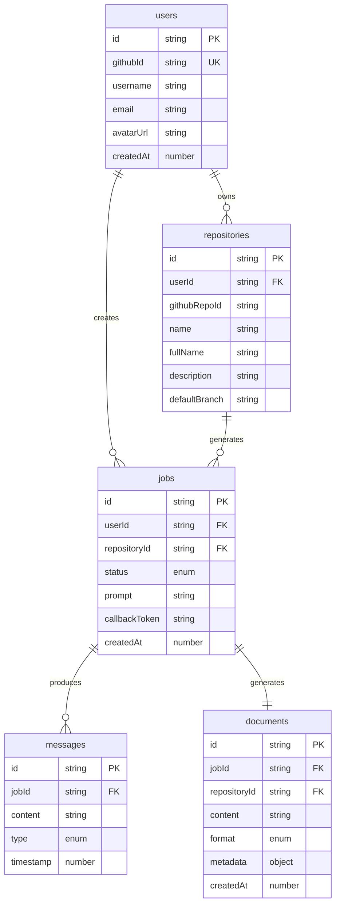

# Convex Database Schema Documentation

## Overview

Fondation uses Convex as its backend database and real-time sync engine. This document details the complete database schema, relationships, indexes, and usage patterns.

## Schema Definition

The schema is defined in `convex/schema.ts` using Convex's type-safe schema definition language.

## Tables

### 1. Users Table

Stores authenticated user information from GitHub OAuth.

```typescript
users: defineTable({
  githubId: v.string(),      // GitHub user ID (unique identifier)
  username: v.string(),       // GitHub username
  email: v.optional(v.string()),     // User email (optional)
  avatarUrl: v.optional(v.string()), // GitHub avatar URL (optional)
  createdAt: v.number(),      // Unix timestamp of creation
}).index("by_github_id", ["githubId"])
```

**Indexes:**
- `by_github_id`: Enables fast lookup by GitHub ID

**Usage:**
- Created/updated on first login via GitHub OAuth
- Referenced by repositories and jobs tables
- Immutable GitHub ID ensures consistency

**Example Record:**
```json
{
  "_id": "jd7x8...",
  "githubId": "12345678",
  "username": "johndoe",
  "email": "john@example.com",
  "avatarUrl": "https://avatars.githubusercontent.com/u/12345678",
  "createdAt": 1700000000000
}
```

### 2. Repositories Table

Caches GitHub repository information for authenticated users.

```typescript
repositories: defineTable({
  userId: v.id("users"),      // Reference to users table
  githubRepoId: v.string(),   // GitHub repository ID
  name: v.string(),            // Repository name
  fullName: v.string(),        // Full name (owner/repo)
  description: v.optional(v.string()), // Repository description
  defaultBranch: v.string(),   // Default branch (usually "main" or "master")
}).index("by_user", ["userId"])
```

**Indexes:**
- `by_user`: Enables fast lookup of all repositories for a user

**Relationships:**
- `userId` → Foreign key to `users._id`
- One-to-many: One user has many repositories

**Usage:**
- Populated via GitHub API when user visits dashboard
- Cached to reduce API calls
- Can be manually refreshed by user

**Example Record:**
```json
{
  "_id": "jx9k2...",
  "userId": "jd7x8...",
  "githubRepoId": "987654321",
  "name": "my-project",
  "fullName": "johndoe/my-project",
  "description": "An awesome project",
  "defaultBranch": "main"
}
```

### 3. Jobs Table

Tracks documentation generation jobs and their status.

```typescript
jobs: defineTable({
  userId: v.id("users"),           // Reference to users table
  repositoryId: v.id("repositories"), // Reference to repositories table
  status: v.union(                 // Job status enumeration
    v.literal("pending"),
    v.literal("running"),
    v.literal("completed"),
    v.literal("failed")
  ),
  prompt: v.string(),               // Generation prompt/instructions
  callbackToken: v.string(),        // Secure token for status updates
  createdAt: v.number(),            // Unix timestamp of creation
}).index("by_user", ["userId"])
```

**Indexes:**
- `by_user`: Enables fast lookup of all jobs for a user

**Relationships:**
- `userId` → Foreign key to `users._id`
- `repositoryId` → Foreign key to `repositories._id`
- Many-to-one: Many jobs can exist for one repository

**Status Flow:**
```
pending → running → completed
                 ↘→ failed
```

**Usage:**
- Created when user clicks "Generate Docs"
- Status updated via callback endpoint
- Callback token ensures secure updates

**Example Record:**
```json
{
  "_id": "jm3n5...",
  "userId": "jd7x8...",
  "repositoryId": "jx9k2...",
  "status": "pending",
  "prompt": "Generate comprehensive documentation for this repository",
  "callbackToken": "550e8400-e29b-41d4-a716-446655440000",
  "createdAt": 1700000000000
}
```

## Future Schema Extensions (Planned)

### Messages Table (v0.2)
For real-time job execution logs:
```typescript
messages: defineTable({
  jobId: v.id("jobs"),
  content: v.string(),
  type: v.union(
    v.literal("log"),
    v.literal("tool"),
    v.literal("error")
  ),
  timestamp: v.number(),
}).index("by_job", ["jobId"])
```

### Documents Table (v0.3)
For storing generated documentation:
```typescript
documents: defineTable({
  jobId: v.id("jobs"),
  repositoryId: v.id("repositories"),
  content: v.string(),
  format: v.union(
    v.literal("markdown"),
    v.literal("html"),
    v.literal("pdf")
  ),
  metadata: v.optional(v.any()),
  createdAt: v.number(),
}).index("by_repository", ["repositoryId"])
```

## Relationships Diagram



## Query Patterns

### Common Queries

1. **Get user by GitHub ID:**
```typescript
const user = await ctx.db
  .query("users")
  .withIndex("by_github_id", q => q.eq("githubId", githubId))
  .first();
```

2. **List user's repositories:**
```typescript
const repos = await ctx.db
  .query("repositories")
  .withIndex("by_user", q => q.eq("userId", userId))
  .collect();
```

3. **Get user's jobs (sorted by newest):**
```typescript
const jobs = await ctx.db
  .query("jobs")
  .withIndex("by_user", q => q.eq("userId", userId))
  .order("desc")
  .collect();
```

4. **Check for existing repository:**
```typescript
const existing = await ctx.db
  .query("repositories")
  .withIndex("by_user", q => q.eq("userId", userId))
  .filter(q => q.eq(q.field("githubRepoId"), githubRepoId))
  .first();
```

## Mutations

### User Operations
```typescript
// Create or update user
const userId = await ctx.db.insert("users", {
  githubId,
  username,
  email,
  avatarUrl,
  createdAt: Date.now()
});

// Update user
await ctx.db.patch(userId, {
  username: newUsername,
  avatarUrl: newAvatarUrl
});
```

### Repository Operations
```typescript
// Create repository
const repoId = await ctx.db.insert("repositories", {
  userId,
  githubRepoId,
  name,
  fullName,
  description,
  defaultBranch
});

// Delete repository
await ctx.db.delete(repoId);
```

### Job Operations
```typescript
// Create job
const jobId = await ctx.db.insert("jobs", {
  userId,
  repositoryId,
  status: "pending",
  prompt,
  callbackToken: uuidv4(),
  createdAt: Date.now()
});

// Update job status
await ctx.db.patch(jobId, {
  status: "running"
});
```

## Best Practices

### 1. Always Use Indexes
- Define indexes for common query patterns
- Use `.withIndex()` for optimal performance
- Avoid full table scans

### 2. Type Safety
- Leverage Convex's generated types
- Use `v.id("tableName")` for foreign keys
- Define enums with `v.union(v.literal(...))`

### 3. Data Validation
```typescript
// Use Zod for additional validation
import { z } from "zod";

const githubIdSchema = z.string().regex(/^\d+$/);

// In mutation
if (!githubIdSchema.safeParse(githubId).success) {
  throw new Error("Invalid GitHub ID");
}
```

### 4. Pagination
For large datasets, implement pagination:
```typescript
const PAGE_SIZE = 20;

const paginatedRepos = await ctx.db
  .query("repositories")
  .withIndex("by_user", q => q.eq("userId", userId))
  .paginate({ numItems: PAGE_SIZE, cursor });
```

### 5. Transactions
Convex mutations are automatically transactional:
```typescript
// This entire mutation is atomic
export const transferRepository = mutation({
  handler: async (ctx, { fromUserId, toUserId, repoId }) => {
    const repo = await ctx.db.get(repoId);
    if (repo?.userId !== fromUserId) {
      throw new Error("Unauthorized");
    }
    await ctx.db.patch(repoId, { userId: toUserId });
    // If this fails, the patch above is rolled back
    await ctx.db.insert("audit_log", { ... });
  }
});
```

## Performance Considerations

### Index Performance
- Indexes make queries O(log n) instead of O(n)
- Each additional index increases write time slightly
- Design indexes based on actual query patterns

### Data Size Limits
- Document size limit: 1MB per document
- Query result limit: 16MB total
- Use pagination for large result sets

### Real-time Subscriptions
- Subscriptions automatically update when data changes
- Minimize subscription scope for better performance
- Use `filter()` to reduce data transfer

## Migration Strategy

For schema changes:

1. **Additive Changes**: Safe to deploy immediately
   ```typescript
   // Adding optional field
   newField: v.optional(v.string())
   ```

2. **Breaking Changes**: Require migration
   ```typescript
   // Step 1: Add new field as optional
   // Step 2: Migrate data
   // Step 3: Make field required
   // Step 4: Remove old field
   ```

3. **Use Convex Migrations**:
   ```typescript
   // convex/migrations/add_field.ts
   export default mutation({
     handler: async (ctx) => {
       const docs = await ctx.db.query("table").collect();
       for (const doc of docs) {
         await ctx.db.patch(doc._id, { newField: "default" });
       }
     }
   });
   ```

## Monitoring and Debugging

### Convex Dashboard
- View real-time data at https://dashboard.convex.dev
- Monitor function execution logs
- Inspect database contents
- Track performance metrics

### Local Development
```bash
# View function logs
bunx convex logs

# Open dashboard
bunx convex dashboard

# Export data
bunx convex export
```

### Debug Queries
```typescript
// Add console.logs in development
console.log("Query result:", result);
console.time("Query duration");
const result = await ctx.db.query("table").collect();
console.timeEnd("Query duration");
```

## Security

### Access Control
- All Convex functions run server-side
- Validate user permissions in every mutation
- Never expose internal IDs to URLs

### Token Security
```typescript
// Good: Generate secure tokens
import { v4 as uuidv4 } from "uuid";
const token = uuidv4();

// Good: Validate tokens
if (job.callbackToken !== providedToken) {
  throw new Error("Invalid token");
}
```

### Data Privacy
- Store minimal user data
- Follow GDPR/privacy requirements
- Implement data deletion on request

## Resources

- [Convex Documentation](https://docs.convex.dev)
- [Convex Schema Reference](https://docs.convex.dev/database/schemas)
- [Convex Query Reference](https://docs.convex.dev/database/reading-data)
- [Convex Best Practices](https://docs.convex.dev/production/best-practices)