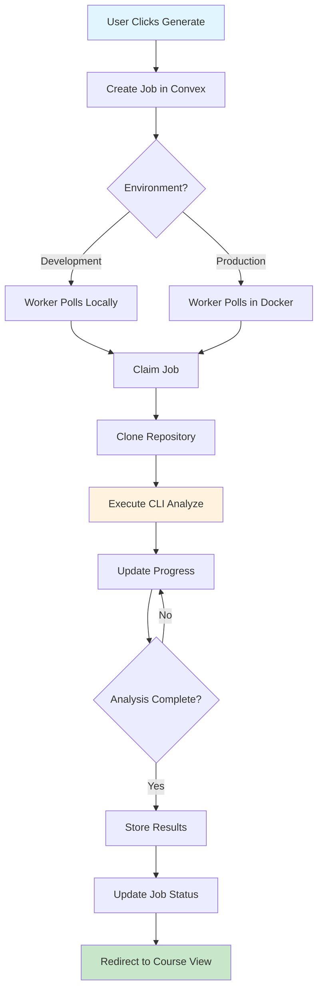

# Course Generation Flow - Complete Documentation

## Overview
The course generation flow is a multi-component orchestration that transforms a GitHub repository into a comprehensive educational course. The system uses a job queue pattern with real-time updates and Docker-based execution for consistency.

## Flow Diagram



## Detailed Component Interactions

### 1. Web UI - Repository Card (`packages/web/src/components/repos/repo-card.tsx`)

#### Trigger Points
- **Generate Button**: Creates new job for repository
- **Regenerate Modal**: Overwrites existing course
- **View Course**: Navigates to existing course

#### Code Flow
```typescript
// User clicks generate
const handleGenerate = async () => {
  const result = await createJob({
    userId,
    repositoryId: repo._id,
    prompt: `Analyze ${repo.fullName}`,
  });
  
  // Navigate to course view
  router.push(`/course/${owner}/${repo}/${result.jobId}`);
};
```

### 2. Convex Backend - Job Creation (`convex/jobs.ts`)

#### Job Creation Process
```typescript
// jobs.create mutation
1. Validate repository exists
2. Check for existing active jobs
3. Create job with initial status: "pending"
4. Generate callback token for security
5. Set queue parameters (runAt, attempts, dedupeKey)
6. Return jobId and callbackToken
```

#### Job Schema
```typescript
{
  userId: Id<"users">,
  repositoryId: Id<"repositories">,
  status: JobStatus,
  prompt: string,
  callbackToken: string,
  
  // Queue fields
  runAt: number,
  attempts: number,
  maxAttempts: 5,
  dedupeKey: string,
  
  // Progress tracking
  currentStep: number,
  totalSteps: 6,
  progress: string,
  
  // Timestamps
  createdAt: number,
  updatedAt: number,
}
```

### 3. Worker Service (`packages/worker/src/worker.ts`)

#### Polling Mechanism
```typescript
while (isRunning) {
  // Poll for pending jobs
  const job = await convex.query(api.queue.peek);
  
  if (job) {
    await processJob(job);
  }
  
  await sleep(pollInterval);
}
```

#### Job Processing Pipeline
```typescript
async processJob(job) {
  // 1. Claim job
  await updateStatus(job.id, "claimed");
  
  // 2. Clone repository
  await updateStatus(job.id, "cloning");
  const repoPath = await repoManager.clone(job.repositoryUrl);
  
  // 3. Execute analysis
  await updateStatus(job.id, "analyzing");
  const result = await cliExecutor.execute(repoPath, {
    prompt: job.prompt,
    onProgress: async (step) => {
      await updateProgress(job.id, step);
    }
  });
  
  // 4. Store results
  await updateStatus(job.id, "completed", result);
}
```

### 4. CLI Execution Strategies (`packages/worker/src/cli-strategies/`)

#### Development Strategy
```typescript
class DevelopmentStrategy {
  async execute(repoPath, options) {
    // Direct execution with host authentication
    const command = `bun ${cliPath} analyze ${repoPath}`;
    return await exec(command);
  }
}
```

#### Production Strategy
```typescript
class ProductionStrategy {
  async execute(repoPath, options) {
    // Docker container execution
    const command = [
      'docker', 'run',
      '--rm',
      '-v', `${repoPath}:/workspace`,
      '-v', `${outputDir}:/output`,
      'fondation/cli:latest',
      'analyze', '/workspace',
      '--output-dir', '/output'
    ];
    return await spawn(command);
  }
}
```

## Development vs Production Differences

### Development Environment

#### Characteristics
- Worker runs locally with `NODE_ENV=development`
- CLI executed directly via Bun
- Uses local file system for repositories
- Real-time debugging possible
- No Docker requirement

#### Setup
```bash
# Start all services
bun run dev

# Or individually
bun run dev:convex
bun run dev:web
bun run dev:worker:local
```

#### Job Trigger Flow
1. Web creates job → Convex
2. Worker polls Convex (localhost allowed)
3. Worker executes CLI locally
4. Results stored in Convex
5. Web receives real-time updates

### Production Environment

#### Characteristics
- Worker runs in Docker container
- CLI bundled and executed in isolation
- Repository cloned to container volume
- Consistent execution environment
- Enhanced security

#### Setup
```bash
# Build Docker images
bun run docker:build

# Deploy with docker-compose
docker-compose -f docker-compose.worker.yml up -d

# Or manual deployment
docker run -d \
  --name fondation-worker \
  --env-file .env \
  fondation/cli:latest worker
```

#### Job Trigger Flow
1. Web creates job → Convex (production URL)
2. Worker polls Convex from container
3. Worker executes CLI in Docker
4. Results uploaded to Convex
5. Web receives updates via webhooks

## Progress Tracking

### Step Progression
The analysis process reports progress through 6 main steps:

```typescript
const steps = [
  { step: 1, name: "Extract", status: "Extracting abstractions..." },
  { step: 2, name: "Analyze", status: "Analyzing relationships..." },
  { step: 3, name: "Order", status: "Ordering chapters..." },
  { step: 4, name: "Generate", status: "Generating chapters..." },
  { step: 5, name: "Review", status: "Reviewing chapters..." },
  { step: 6, name: "Tutorials", status: "Creating tutorials..." }
];
```

### Real-time Updates
```typescript
// Worker updates progress
await convex.mutation(api.jobs.updateStatus, {
  jobId,
  status: "analyzing",
  currentStep: 2,
  totalSteps: 6,
  progress: "Analyzing relationships between components"
});

// Web UI subscribes to updates
const job = useQuery(api.jobs.getJob, { jobId });
// UI automatically re-renders with new progress
```

## Error Handling

### Retry Mechanism
```typescript
if (job.attempts < job.maxAttempts) {
  // Exponential backoff
  const delay = Math.pow(2, job.attempts) * 1000;
  await convex.mutation(api.queue.reschedule, {
    jobId,
    runAt: Date.now() + delay,
    attempts: job.attempts + 1
  });
}
```

### Failure States
- **failed**: Recoverable error, can retry
- **dead**: Exceeded max attempts
- **canceled**: User intervention

## Integration Points

### 1. GitHub API Integration
- Repository cloning with user's GitHub token
- Branch selection support
- Private repository access

### 2. Claude AI Integration
- Direct SDK usage in CLI
- Model selection (Sonnet/Opus)
- Token management

### 3. Convex Real-time Sync
- Instant job status updates
- Progress tracking
- Result delivery

### 4. Docker Container Orchestration
- Volume mounting for repositories
- Environment variable injection
- Process isolation

## Monitoring and Debugging

### Health Checks
```typescript
// Worker health endpoint (port 8081)
GET /health
{
  "status": "healthy",
  "activeJobs": 2,
  "stats": {
    "total": 45,
    "succeeded": 43,
    "failed": 2
  }
}
```

### Debug Commands
```bash
# View worker logs
docker logs fondation-worker

# Check job status in Convex
bun run convex:dashboard

# Manual job trigger
curl -X POST http://localhost:3000/api/jobs/trigger \
  -H "Content-Type: application/json" \
  -d '{"repositoryId": "..."}'
```

## Performance Considerations

### Optimization Strategies
1. **Parallel Chapter Generation**: Chapters 4-6 can run concurrently
2. **Caching**: Repository clones cached for 1 hour
3. **Job Deduplication**: Prevents duplicate jobs per repository
4. **Resource Limits**: Docker containers limited to 2GB RAM

### Scalability
- Multiple workers can run simultaneously
- Job queue ensures no double-processing
- Horizontal scaling via container orchestration

## Security Measures

### Token Management
- GitHub tokens encrypted at rest
- Tokens never logged or exposed
- Per-job callback tokens for verification

### Execution Isolation
- Docker containers for production
- Limited file system access
- Network restrictions

### Rate Limiting
- API endpoint rate limits
- GitHub API rate limit handling
- Job creation throttling