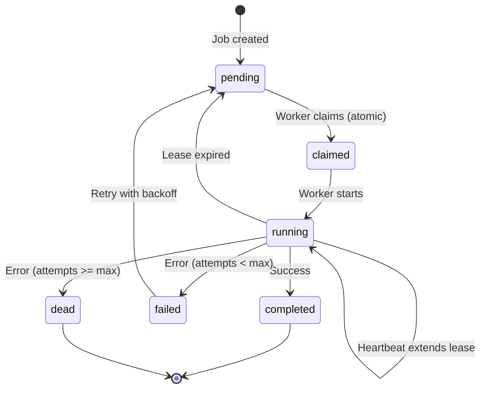

# Migration Plan: Vendor-Agnostic Worker Architecture

## Executive Summary

Migrating from complex Scaleway Jobs architecture to a simple, vendor-agnostic Docker worker that polls Convex for jobs. The worker runs persistently on any Docker-capable host (starting with Scaleway Instance VPS).

**Core Principle**: Docker = the package, Cloud Provider = just where it runs.

## Current State Analysis

### Repository Structure
```
fondation-web-app/                  # Main web application
├── src/                            # Next.js app
├── convex/                         # Database & real-time
├── scaleway-gateway/               # TO BE REMOVED
├── scaleway-worker/                # TO BE REMOVED  
└── docs/                           # Documentation
```

### Vendor Dependencies Found
| Location | Dependency | Purpose | Action |
|----------|------------|---------|---------|
| `scaleway-gateway/` | `@scaleway/sdk` | Job orchestration | Remove entirely |
| `src/env.js` | `SCW_*` env vars | Scaleway config | Remove |
| `src/lib/config.ts` | `SCALEWAY_*` vars | API configuration | Remove |
| `src/app/api/analyze-proxy/` | Scaleway API calls | Job triggering | Replace with Convex |
| `src/app/api/jobs/[id]/cancel/` | Scaleway job cancel | Job management | Move to Convex |

### Files to Remove
- `/scaleway-gateway/` - Entire directory
- `/scaleway-worker/` - Entire directory after extracting useful patterns
- `/src/app/api/analyze-proxy/` - Replace with direct Convex mutations
- `/src/app/api/jobs/[id]/cancel/` - Replace with Convex mutations

### Environment Variables Cleanup
**To Remove:**
```bash
SCW_ACCESS_KEY
SCW_SECRET_KEY
SCW_DEFAULT_PROJECT_ID
SCW_DEFAULT_REGION
SCW_JOB_DEFINITION_ID
SCW_GATEWAY_URL
SCALEWAY_GATEWAY_URL
```

**To Keep:**
```bash
CONVEX_URL
NEXT_PUBLIC_CONVEX_URL
GITHUB_CLIENT_ID
GITHUB_CLIENT_SECRET
NEXTAUTH_SECRET
```

**New (Worker):**
```bash
# No ANTHROPIC_API_KEY needed - uses Claude CLI auth
CONVEX_URL
POLL_INTERVAL=5000
MAX_CONCURRENT_JOBS=1
TEMP_DIR=/tmp/fondation
```

## Target Architecture

### Monorepo Structure (Bun Workspaces)
```
fondation/
├── apps/
│   ├── web/                        # Next.js (current fondation-web-app)
│   │   ├── src/
│   │   ├── convex/
│   │   ├── package.json
│   │   └── next.config.js
│   ├── worker/                     # NEW: Persistent poller
│   │   ├── src/
│   │   │   ├── index.ts           # Entry point
│   │   │   ├── worker.ts          # Core polling logic
│   │   │   ├── cli-executor.ts    # CLI integration
│   │   │   └── health.ts          # Health checks
│   │   ├── Dockerfile
│   │   └── package.json
│   └── cli/                        # Fondation CLI (if needed)
│       └── [cli files if separate]
├── packages/
│   └── shared/                     # Shared types
│       ├── src/
│       │   ├── types.ts
│       │   └── schemas.ts
│       └── package.json
├── docs/
│   ├── ARCHITECTURE.md
│   ├── OPERATIONS.md
│   ├── RUNBOOK.md
│   └── SECURITY.md
├── package.json                    # Bun workspace config
└── bun.lockb
```

## Migration Phases

### Phase 0: Audit & Plan ✅ (Current)
**Status**: Completed
**Deliverables**: This document

### Phase 1: Monorepo & Workspaces
**Goal**: Setup Bun workspace structure
**Tasks**:
1. Create root `package.json` with workspaces
2. Move `fondation-web-app` → `apps/web/`
3. Create `packages/shared/` with common types
4. Update all imports and paths
5. Verify `bun dev` works

**PR**: `workspace-init`

### Phase 2: Vendor Detox
**Goal**: Remove all vendor SDKs from runtime
**Tasks**:
1. Delete `/scaleway-gateway/` directory
2. Delete `/scaleway-worker/` directory
3. Remove Scaleway env vars from `src/env.js`
4. Replace `/api/analyze-proxy/` with Convex mutation
5. Replace `/api/jobs/[id]/cancel/` with Convex mutation
6. Grep verify: zero vendor imports in `apps/*`

**PR**: `vendor-agnostic-runtime`

### Phase 3: Job Model & Orchestration
**Goal**: Implement proper queue in Convex
**New Schema Fields**:
```typescript
jobs: defineTable({
  // Existing fields...
  
  // New queue fields
  runAt: v.optional(v.number()),        // Scheduled time
  attempts: v.number(),                  // Retry counter
  maxAttempts: v.number(),              // Max retries (default: 3)
  lockedBy: v.optional(v.string()),    // Worker ID
  leaseUntil: v.optional(v.number()),  // Lease expiration
  dedupeKey: v.optional(v.string()),   // Deduplication
  lastError: v.optional(v.string()),   // Last failure reason
  updatedAt: v.number(),                // Last modification
})
```

**New Mutations**:
- `jobs.claimOne(workerId, leaseMs)` - Atomic claim with lease
- `jobs.heartbeat(jobId, workerId, leaseMs)` - Extend lease
- `jobs.complete(jobId, result)` - Mark successful
- `jobs.retryOrFail(jobId, error)` - Handle failure with backoff

**PR**: `queue-and-leases`

### Phase 4: Worker Container
**Goal**: Production-ready Docker container
**Components**:
1. Minimal Alpine Linux base
2. Node.js runtime
3. Git for cloning
4. Claude CLI (pinned version)
5. Non-root user
6. Health endpoint

**Claude Auth Strategy**:
```bash
# First run (interactive auth)
docker run -it \
  -v /srv/claude-creds:/home/worker/.claude \
  fondation-worker \
  /bin/sh -c "claude login"

# Production (read-only mount)
docker run -d \
  -v /srv/claude-creds:/home/worker/.claude:ro \
  --restart unless-stopped \
  fondation-worker
```

**PR**: `worker-container-prod`

### Phase 5: Deploy to Scaleway Instance
**Goal**: Deploy to production VPS
**Steps**:
1. Provision Scaleway Instance (DEV1-S or similar)
2. Install Docker
3. Pull and run worker container
4. Setup systemd service for auto-restart
5. Configure log rotation
6. Document in OPERATIONS.md

**PR**: `deploy-scw-instance`

### Phase 6: Observability & Runbooks
**Goal**: Basic monitoring and ops docs
**Metrics** (via Convex queries):
- Queue depth
- Jobs per hour
- Success/failure rate
- Average duration

**Runbooks**:
- Stuck job recovery
- Claude auth refresh
- Disk space management
- Worker scaling

**PR**: `observability-basics`

### Phase 7: Documentation Cleanup
**Goal**: Accurate, consolidated docs
**Remove**:
- `ARCHITECTURE_LEGACY.md`
- Old Scaleway references
- Conflicting instructions

**Update**:
- `ARCHITECTURE.md` - Final design
- `OPERATIONS.md` - Day-2 ops
- `SECURITY.md` - Security posture
- Root `README.md` - Quick start

**PR**: `docs-cleanup-final`

## State Transitions



## Testing Matrix

| Scenario | Test | Success Criteria |
|----------|------|------------------|
| Happy Path | Small repo analysis | Completes < 5 min |
| Large Repo | 1000+ file repo | Completes < 30 min |
| Auth Failure | Invalid Claude token | Clear error, job retries |
| Network Issue | Disconnect mid-job | Lease expires, job reclaimed |
| Worker Crash | Kill -9 worker | Job reclaimed after lease |
| Disk Full | Fill /tmp | Graceful failure, cleanup |
| Private Repo | GitHub auth required | Uses user token correctly |

## Security Considerations

1. **Claude Auth**: Manual login, credentials mounted read-only
2. **Container**: Non-root user, minimal attack surface
3. **Secrets**: No API keys in code, only env vars
4. **Logs**: Redact tokens and sensitive data
5. **Network**: Outbound only (Convex, GitHub, Claude)

## Rollback Plan

If issues arise:
1. Keep Scaleway gateway code in git history
2. Can redeploy old version from git tag
3. Environment variables preserved in backup
4. Database schema additions are backward-compatible

## Success Metrics

- [ ] Zero vendor SDK imports in runtime
- [ ] Worker processes jobs without Scaleway
- [ ] Manual Claude auth documented and working
- [ ] Lease/retry mechanism tested
- [ ] Deployed to Scaleway Instance (VPS)
- [ ] All docs reflect new architecture

## GitHub Issues to Create

1. "Workspace migration to Bun (apps/*, packages/shared)"
2. "Remove vendor SDKs and replace with Convex-only orchestration"  
3. "Convex job model: schema + claim/lease/backoff"
4. "Dockerize worker (non-root, pinned CLI, healthcheck)"
5. "Manual Claude auth: volume and docs"
6. "Scaleway instance deploy: scripts + OPERATIONS.md"
7. "Observability basics: metrics + RUNBOOK.md"
8. "Docs cleanup: remove outdated Markdown and consolidate"

## Timeline Estimate

| Phase | Duration | Dependencies |
|-------|----------|--------------|
| Phase 1 | 2-3 hours | None |
| Phase 2 | 2-3 hours | Phase 1 |
| Phase 3 | 3-4 hours | Phase 2 |
| Phase 4 | 4-5 hours | Phase 3 |
| Phase 5 | 2-3 hours | Phase 4 |
| Phase 6 | 2-3 hours | Phase 5 |
| Phase 7 | 1-2 hours | Phase 6 |
| **Total** | **16-23 hours** | Sequential |

## Notes

- Docker image is provider-agnostic (no vendor code)
- Same container runs on laptop, Scaleway, AWS, anywhere
- Worker polls Convex - no webhooks needed initially
- Can add multiple workers by running more containers
- Claude CLI auth persists via mounted volume