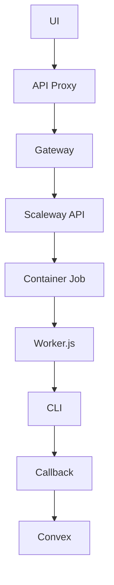
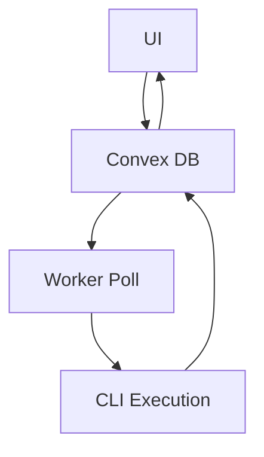

# 🏗️ Architecture Worker Permanent - Guide Technique

## 🎯 Vue d'ensemble

Le **Worker Permanent** remplace l'architecture Scaleway complexe par une solution simple et efficace :
- Un processus qui tourne en permanence
- Poll la base Convex pour détecter les nouveaux jobs
- Exécute le CLI Fondation directement
- Met à jour les statuts en temps réel

---

## 📊 Comparaison Architectures

### **Avant (Scaleway - Complexe)**


### **Après (Worker Permanent - Simple)**


---

## 🔧 Architecture Détaillée

### **Composants**

1. **Worker Process** - Process Node.js permanent
2. **Polling Engine** - Vérification jobs toutes les 5s
3. **CLI Executor** - Interface avec Fondation CLI
4. **Status Manager** - Gestion états jobs
5. **Error Handler** - Gestion erreurs robuste

### **Flow de Traitement**

```typescript
// Pseudo-code du worker
class PermanentWorker {
  async run() {
    while (true) {
      const pendingJob = await this.pollConvex();
      
      if (pendingJob) {
        await this.processJob(pendingJob);
      }
      
      await sleep(5000); // 5 secondes
    }
  }
  
  async processJob(job) {
    try {
      // 1. Marquer comme running
      await this.updateStatus(job.id, 'running');
      
      // 2. Cloner repository
      await this.updateStatus(job.id, 'cloning');
      const repoPath = await this.cloneRepo(job.repositoryUrl);
      
      // 3. Exécuter CLI
      await this.updateStatus(job.id, 'analyzing');
      const result = await this.executeCLI(repoPath, job.prompt);
      
      // 4. Sauver résultats
      await this.updateStatus(job.id, 'completed', result);
      
    } catch (error) {
      await this.updateStatus(job.id, 'failed', null, error);
    }
  }
}
```

---

## 💾 Schema Base de Données

### **Jobs Table (Convex)**
```typescript
// convex/schema.ts
jobs: defineTable({
  userId: v.id("users"),
  repositoryId: v.id("repositories"),
  status: v.union(
    v.literal("pending"),    // ← Worker poll ces jobs
    v.literal("running"),    // ← Worker en cours
    v.literal("cloning"),    // ← Étapes intermédiaires
    v.literal("analyzing"), 
    v.literal("gathering"),
    v.literal("completed"),  // ← Job terminé
    v.literal("failed")      // ← Job échoué
  ),
  prompt: v.string(),
  progress: v.optional(v.string()),
  currentStep: v.optional(v.number()),
  totalSteps: v.optional(v.number()),
  result: v.optional(v.string()),
  error: v.optional(v.string()),
  createdAt: v.number(),
  updatedAt: v.optional(v.number()),
})
```

### **Queries Worker**
```typescript
// convex/jobs.ts
export const getNextPending = query({
  handler: async (ctx) => {
    return await ctx.db
      .query("jobs")
      .filter(q => q.eq(q.field("status"), "pending"))
      .order("asc")
      .first(); // Plus ancien job pending
  },
});

export const updateJobStatus = mutation({
  args: {
    jobId: v.id("jobs"),
    status: v.string(),
    progress: v.optional(v.string()),
    currentStep: v.optional(v.number()),
    result: v.optional(v.string()),
    error: v.optional(v.string()),
  },
  handler: async (ctx, args) => {
    await ctx.db.patch(args.jobId, {
      status: args.status,
      updatedAt: Date.now(),
      ...(args.progress && { progress: args.progress }),
      ...(args.currentStep && { currentStep: args.currentStep }),
      ...(args.result && { result: args.result }),
      ...(args.error && { error: args.error }),
    });
  },
});
```

---

## 🔨 Implémentation Worker

### **Structure des Fichiers**
```
apps/worker/
├── src/
│   ├── index.ts              # Point d'entrée
│   ├── worker.ts             # Classe principale
│   ├── cli-executor.ts       # Interface CLI
│   ├── repo-manager.ts       # Gestion repos
│   ├── status-manager.ts     # Gestion statuts
│   └── config.ts             # Configuration
├── package.json
├── Dockerfile
└── README.md
```

### **Point d'Entrée (index.ts)**
```typescript
import { PermanentWorker } from './worker';
import { config } from './config';

async function main() {
  console.log('🚀 Démarrage Worker Permanent Fondation');
  
  const worker = new PermanentWorker(config);
  
  // Graceful shutdown
  process.on('SIGTERM', async () => {
    console.log('⏹️  Arrêt gracieux du worker...');
    await worker.stop();
    process.exit(0);
  });
  
  // Gestion erreurs non catchées
  process.on('uncaughtException', (error) => {
    console.error('❌ Erreur non gérée:', error);
    process.exit(1);
  });
  
  await worker.start();
}

main().catch(console.error);
```

### **Worker Principal (worker.ts)**
```typescript
import { ConvexClient } from 'convex/browser';
import { api } from '../../web/convex/_generated/api';
import { CLIExecutor } from './cli-executor';
import { RepoManager } from './repo-manager';
import { StatusManager } from './status-manager';

export class PermanentWorker {
  private convex: ConvexClient;
  private cliExecutor: CLIExecutor;
  private repoManager: RepoManager;
  private statusManager: StatusManager;
  private isRunning = false;
  
  constructor(config: WorkerConfig) {
    this.convex = new ConvexClient(config.convexUrl);
    this.cliExecutor = new CLIExecutor(config.cliPath);
    this.repoManager = new RepoManager(config.tempDir);
    this.statusManager = new StatusManager(this.convex);
  }
  
  async start() {
    this.isRunning = true;
    console.log('✅ Worker permanent actif');
    
    while (this.isRunning) {
      try {
        await this.pollAndProcess();
        await this.sleep(5000);
      } catch (error) {
        console.error('❌ Erreur polling:', error);
        await this.sleep(10000); // Backoff
      }
    }
  }
  
  async stop() {
    this.isRunning = false;
    await this.repoManager.cleanup();
    console.log('⏹️  Worker arrêté');
  }
  
  private async pollAndProcess() {
    const job = await this.convex.query(api.jobs.getNextPending);
    
    if (job) {
      console.log(`📝 Job trouvé: ${job._id}`);
      await this.processJob(job);
    }
  }
  
  private async processJob(job: any) {
    const startTime = Date.now();
    
    try {
      // 1. Marquer running
      await this.statusManager.update(job._id, 'running', 
        'Initialisation...', 1, 5);
      
      // 2. Cloner repository  
      await this.statusManager.update(job._id, 'cloning',
        'Clonage du repository...', 2, 5);
      const repoPath = await this.repoManager.clone(
        job.repositoryUrl, 
        job.branch || 'main'
      );
      
      // 3. Exécuter CLI
      await this.statusManager.update(job._id, 'analyzing',
        'Analyse du code...', 3, 5);
      const result = await this.cliExecutor.execute(repoPath, {
        prompt: job.prompt,
        onProgress: (step: string) => {
          this.statusManager.updateProgress(job._id, step);
        }
      });
      
      // 4. Sauver résultats
      await this.statusManager.update(job._id, 'gathering',
        'Sauvegarde des résultats...', 4, 5);
      await this.saveResults(job, result);
      
      // 5. Terminer
      const duration = Date.now() - startTime;
      await this.statusManager.update(job._id, 'completed',
        `Terminé en ${Math.round(duration/1000)}s`, 5, 5);
        
      console.log(`✅ Job ${job._id} terminé (${duration}ms)`);
      
    } catch (error) {
      console.error(`❌ Job ${job._id} échoué:`, error);
      await this.statusManager.update(job._id, 'failed', 
        null, null, null, error.message);
    } finally {
      // Cleanup
      await this.repoManager.cleanup(job._id);
    }
  }
  
  private async saveResults(job: any, result: any) {
    // Sauver docs dans Convex
    for (const doc of result.documents) {
      await this.convex.mutation(api.docs.create, {
        jobId: job._id,
        repositoryId: job.repositoryId,
        title: doc.title,
        content: doc.content,
        slug: doc.slug,
        kind: doc.kind,
        chapterIndex: doc.chapterIndex,
      });
    }
  }
  
  private sleep(ms: number): Promise<void> {
    return new Promise(resolve => setTimeout(resolve, ms));
  }
}
```

### **CLI Executor (cli-executor.ts)**
```typescript
import { spawn } from 'child_process';
import * as path from 'path';

export class CLIExecutor {
  constructor(private cliPath: string) {}
  
  async execute(repoPath: string, options: {
    prompt: string;
    onProgress?: (step: string) => void;
  }): Promise<any> {
    return new Promise((resolve, reject) => {
      const args = [
        'analyze',
        '--path', repoPath,
        '--prompt', options.prompt,
        '--output', 'json'
      ];
      
      const child = spawn('node', [this.cliPath, ...args], {
        stdio: ['pipe', 'pipe', 'pipe']
      });
      
      let stdout = '';
      let stderr = '';
      
      child.stdout.on('data', (data) => {
        stdout += data.toString();
        
        // Parsing progress
        const lines = data.toString().split('\n');
        for (const line of lines) {
          if (line.includes('[PROGRESS]')) {
            const step = line.replace('[PROGRESS]', '').trim();
            options.onProgress?.(step);
          }
        }
      });
      
      child.stderr.on('data', (data) => {
        stderr += data.toString();
      });
      
      child.on('close', (code) => {
        if (code === 0) {
          try {
            const result = JSON.parse(stdout);
            resolve(result);
          } catch (error) {
            reject(new Error(`Invalid JSON output: ${error.message}`));
          }
        } else {
          reject(new Error(`CLI failed (${code}): ${stderr}`));
        }
      });
      
      child.on('error', reject);
    });
  }
}
```

---

## 🐳 Déploiement

### **Dockerfile Worker**
```dockerfile
FROM node:20-alpine

# Install git and bun
RUN apk add --no-cache git
RUN curl -fsSL https://bun.sh/install | bash
ENV PATH="/root/.bun/bin:$PATH"

WORKDIR /app

# Copy workspace config
COPY package.json bun.lockb ./

# Copy all apps (for workspaces to work)
COPY apps/ apps/
COPY packages/ packages/

# Install dependencies
RUN bun install --frozen-lockfile

# Build CLI if needed
WORKDIR /app/apps/cli
RUN bun run build

# Switch to worker
WORKDIR /app/apps/worker
RUN bun run build

# Create non-root user
RUN addgroup -g 1001 -S worker && \
    adduser -S worker -u 1001 -G worker

# Create temp directory
RUN mkdir -p /tmp/fondation && \
    chown -R worker:worker /tmp/fondation

USER worker

CMD ["bun", "start"]
```

### **Docker Compose Dev**
```yaml
version: '3.8'

services:
  web:
    build:
      context: .
      dockerfile: apps/web/Dockerfile.dev
    ports:
      - "3000:3000"
    volumes:
      - ./apps/web:/app/apps/web
      - /app/node_modules
    environment:
      - NODE_ENV=development
      
  worker:
    build:
      context: .
      dockerfile: apps/worker/Dockerfile
    volumes:
      - ./apps:/app/apps
      - worker_tmp:/tmp/fondation
    environment:
      - NODE_ENV=development
      - CONVEX_URL=${CONVEX_URL}
      - ANTHROPIC_API_KEY=${ANTHROPIC_API_KEY}
      - CLI_PATH=/app/apps/cli/dist/cli.bundled.cjs
      - TEMP_DIR=/tmp/fondation
    depends_on:
      - web
    restart: unless-stopped

volumes:
  worker_tmp:
```

### **Production (VPS)**
```yaml
# docker-compose.prod.yml
version: '3.8'

services:
  worker:
    image: fondation/worker:latest
    restart: unless-stopped
    environment:
      - NODE_ENV=production
      - CONVEX_URL=${CONVEX_URL}
      - ANTHROPIC_API_KEY=${ANTHROPIC_API_KEY}
    volumes:
      - worker_data:/tmp/fondation
    deploy:
      resources:
        limits:
          memory: 2G
          cpus: '1'
        reservations:
          memory: 1G
          cpus: '0.5'
    logging:
      driver: json-file
      options:
        max-size: 10m
        max-file: 3

volumes:
  worker_data:
```

---

## 📊 Monitoring et Health Checks

### **Health Check Endpoint**
```typescript
// Optionnel: serveur HTTP léger pour monitoring
import express from 'express';

class HealthServer {
  private app = express();
  
  constructor(private worker: PermanentWorker) {
    this.setupRoutes();
  }
  
  private setupRoutes() {
    this.app.get('/health', (req, res) => {
      res.json({
        status: 'healthy',
        uptime: process.uptime(),
        memory: process.memoryUsage(),
        isRunning: this.worker.isRunning,
        lastJobAt: this.worker.lastJobTime,
      });
    });
    
    this.app.get('/metrics', async (req, res) => {
      const stats = await this.worker.getStats();
      res.json({
        jobsProcessed: stats.total,
        jobsSucceeded: stats.succeeded,
        jobsFailed: stats.failed,
        averageJobTime: stats.averageTime,
      });
    });
  }
  
  listen(port: number) {
    this.app.listen(port, () => {
      console.log(`🏥 Health server sur port ${port}`);
    });
  }
}
```

### **Logging Structure**
```typescript
// Logging structuré pour production
import winston from 'winston';

const logger = winston.createLogger({
  format: winston.format.combine(
    winston.format.timestamp(),
    winston.format.json()
  ),
  transports: [
    new winston.transports.Console(),
    new winston.transports.File({ 
      filename: '/var/log/fondation/worker.log' 
    })
  ]
});

// Usage dans le worker
logger.info('Job started', { 
  jobId: job._id, 
  repository: job.repositoryUrl,
  user: job.userId 
});
```

---

## 🔧 Configuration

### **Config Worker**
```typescript
// apps/worker/src/config.ts
export interface WorkerConfig {
  convexUrl: string;
  cliPath: string;
  tempDir: string;
  pollInterval: number;
  maxConcurrentJobs: number;
  jobTimeout: number;
  anthropicApiKey: string;
  githubToken?: string;
}

export const config: WorkerConfig = {
  convexUrl: process.env.CONVEX_URL!,
  cliPath: process.env.CLI_PATH || '/app/apps/cli/dist/cli.bundled.cjs',
  tempDir: process.env.TEMP_DIR || '/tmp/fondation',
  pollInterval: parseInt(process.env.POLL_INTERVAL || '5000'),
  maxConcurrentJobs: parseInt(process.env.MAX_CONCURRENT_JOBS || '1'),
  jobTimeout: parseInt(process.env.JOB_TIMEOUT || '3600000'), // 1h
  anthropicApiKey: process.env.ANTHROPIC_API_KEY!,
  githubToken: process.env.GITHUB_TOKEN,
};
```

---

## ⚡ Performance et Optimisations

### **Gestion Mémoire**
- Cleanup automatique après chaque job
- Rotation des logs
- Limits Docker configurés
- Monitoring usage mémoire

### **Parallélisation (Optionnel)**
```typescript
// Pour traiter plusieurs jobs en parallèle
class ParallelWorker extends PermanentWorker {
  private activeJobs = new Set<string>();
  
  async pollAndProcess() {
    if (this.activeJobs.size >= this.config.maxConcurrentJobs) {
      return; // Limite atteinte
    }
    
    const job = await this.convex.query(api.jobs.getNextPending);
    
    if (job && !this.activeJobs.has(job._id)) {
      this.activeJobs.add(job._id);
      
      // Traitement asynchrone
      this.processJob(job).finally(() => {
        this.activeJobs.delete(job._id);
      });
    }
  }
}
```

### **Cache CLI Builds**
```typescript
// Cache des CLI builds pour éviter les rebuilds
class CLICache {
  private cache = new Map<string, string>();
  
  async getOrBuild(commit: string): Promise<string> {
    if (this.cache.has(commit)) {
      return this.cache.get(commit)!;
    }
    
    const builtPath = await this.buildCLI(commit);
    this.cache.set(commit, builtPath);
    return builtPath;
  }
}
```

---

Cette architecture worker permanent offre une solution robuste, simple et efficace pour remplacer la complexité Scaleway tout en conservant toutes les fonctionnalités de génération de cours.