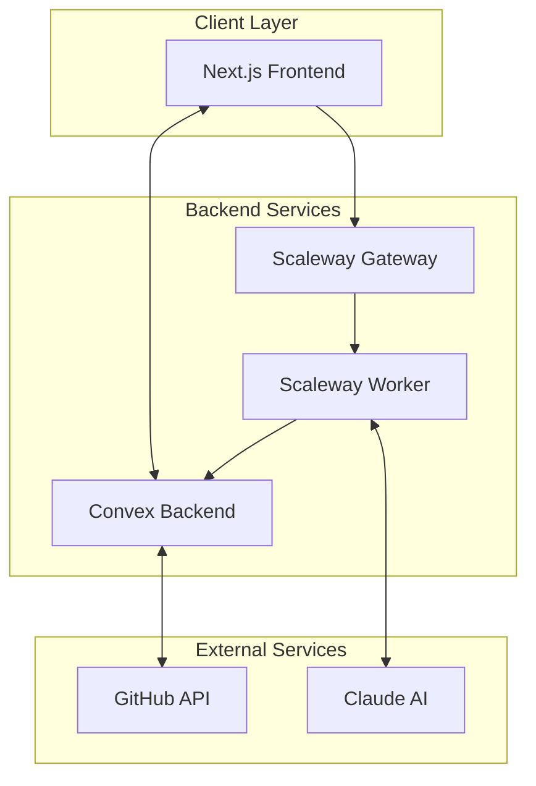
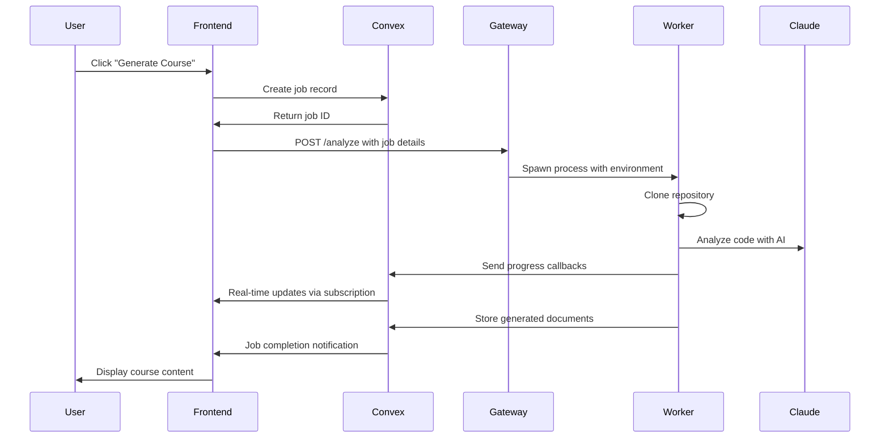

# Phase 1: Project Onboarding & High-Level Architecture Review

**Audit Timestamp:** August 25, 2025  
**Commit SHA:** `72b94e7a991936d58a155a6e66a14cec71c01072`  
**Phase:** 1 of 5  

---

## Phase 0: Preflight - Repository Inventory & Context

### Repository Overview
- **Name:** fondation-web-app
- **Version:** 0.1.0
- **Type:** Next.js application (ESM)
- **Package Manager:** Bun (with npm fallback)
- **Node/TS:** Node v18+, TypeScript 5.8.2, target ES2022

### Directory Structure
```
fondation-web-app/
├── src/                    # Next.js application (App Router)
├── convex/                 # Real-time backend functions
├── scaleway-gateway/       # Express.js API gateway
├── scaleway-worker/        # Long-running job processor
├── docs/                   # Project documentation
└── public/                 # Static assets
```

### Technology Stack
**Frontend:**
- Next.js 15 (App Router, Server Components, React 19)
- TypeScript with strict mode + noUncheckedIndexedAccess
- Tailwind CSS 4, shadcn/ui, Radix UI primitives
- NextAuth v5 beta (GitHub OAuth)

**Backend:**
- Convex (real-time database + serverless functions)
- Express.js gateway (TypeScript)
- Node.js worker with Fondation CLI integration

**Infrastructure:**
- Development: Local Next.js, Convex dev, local gateway/worker
- Production: Vercel (frontend), Convex Cloud (backend), Scaleway (jobs)

### Configuration Analysis
**Package.json:** Well-structured with comprehensive scripts for development workflow  
**TypeScript:** Strict configuration with proper path aliases and module resolution  
**ESLint:** Modern flat config with TypeScript-ESLint recommended rules  
**Environment:** T3 env validation with Zod schemas for type safety  

---

## Project Purpose & Architecture

### System Purpose
Fondation is an **AI-powered documentation generation platform** that analyzes GitHub repositories and creates comprehensive course materials using Claude AI. The system transforms code repositories into structured learning materials including chapters, tutorials, and reference documentation.

### High-Level Architecture



### Component Interactions

1. **Next.js Frontend** (`/src`)
   - User dashboard for repository management
   - Real-time job progress monitoring via Convex subscriptions
   - Course content viewer with markdown rendering
   - GitHub OAuth authentication

2. **Convex Backend** (`/convex`)
   - Real-time database with ACID transactions
   - User/repository/job/document management
   - WebSocket subscriptions for live updates
   - Webhook endpoints for external callbacks

3. **Scaleway Gateway** (`/scaleway-gateway`)
   - HTTP API for job triggering
   - Request validation and routing
   - Development: Direct worker spawning
   - Production: Scaleway Jobs API integration

4. **Scaleway Worker** (`/scaleway-worker`)
   - Long-running job processor (up to 24 hours)
   - GitHub repository cloning
   - Fondation CLI execution with Claude AI
   - Progress callbacks to Convex

---

## Architectural Findings

### F-01: Hybrid Architecture Complexity
- **Where:** Root architecture spanning 4 separate service directories
- **Severity:** P2 | **Effort:** L | **Confidence:** High
- **Issue:** The hybrid architecture creates deployment complexity with 4 different runtime environments requiring separate configuration, monitoring, and debugging
- **Evidence:**
  ```
  Development requires 4 separate processes:
  - npm run dev (Next.js frontend)
  - bunx convex dev (Backend)
  - Gateway server on port 8081
  - Worker process spawning
  ```
- **Recommendation:**

  --- before: Multiple service directories
  +++ after: Monorepo with shared configurations
  @@
  - Consider workspace-based monorepo structure
  + Shared build scripts, environment validation
  + Unified Docker compose for local development
  + Single start-dev.sh already implements this pattern

  **Rationale:** While the architecture is sound for scalability, development complexity could be reduced with better tooling integration.

### F-02: Environment Variable Proliferation  
- **Where:** src/env.js:45-53, multiple .env files needed
- **Severity:** P2 | **Effort:** S | **Confidence:** High
- **Issue:** Environment configuration scattered across multiple files with potential for drift between services
- **Evidence:**
  ```typescript
  runtimeEnv: {
    AUTH_SECRET: process.env.AUTH_SECRET,
    NEXTAUTH_SECRET: process.env.NEXTAUTH_SECRET, // Duplicate?
    NEXTAUTH_URL: process.env.NEXTAUTH_URL,
    // ... 7 total environment variables
  }
  ```
- **Recommendation:**

  --- before: src/env.js:14 & 46-47
  +++ after: src/env.js
  @@
  - NEXTAUTH_SECRET: z.string().optional(),
  - NEXTAUTH_SECRET: process.env.NEXTAUTH_SECRET,
  + // Remove NEXTAUTH_SECRET (NextAuth v5 uses AUTH_SECRET)

  **Rationale:** NextAuth v5 consolidated to AUTH_SECRET, reducing configuration drift.

### F-03: Production Readiness Gap
- **Where:** scaleway-gateway/server-gateway.ts, scaleway-worker/worker.js
- **Severity:** P1 | **Effort:** M | **Confidence:** High
- **Issue:** Gateway and worker components are development-focused with TODO comments for production Scaleway integration
- **Evidence:**
  ```javascript
  // TODO: Production mode should trigger Scaleway Jobs API
  // Current: Local process spawning
  ```
- **Recommendation:**

  --- before: Development process spawning
  +++ after: Conditional runtime switching
  @@
  - const workerProcess = spawn('node', ['worker.js'])
  + if (NODE_ENV === 'production') {
  +   await scalewayJobsAPI.trigger({...})
  + } else {
  +   const workerProcess = spawn('node', ['worker.js'])
  + }

  **Rationale:** Production deployment requires Scaleway Jobs API integration to handle 24-hour processing limits.

### F-04: Strong Architectural Separation
- **Where:** Entire codebase structure
- **Severity:** **Positive** | **Effort:** - | **Confidence:** High
- **Issue:** **Strength**: Excellent separation of concerns with clear boundaries between UI, backend, gateway, and worker
- **Evidence:**
  ```
  ✅ Frontend: Pure UI concerns, no business logic
  ✅ Convex: Clean database schema with proper indexing  
  ✅ Gateway: Stateless request routing
  ✅ Worker: Isolated long-running processes
  ```
- **Recommendation:** Maintain this architectural pattern as the system scales

### F-05: Schema Evolution Strategy Missing
- **Where:** convex/schema.ts:42-54
- **Severity:** P2 | **Effort:** M | **Confidence:** Medium
- **Issue:** Job schema uses `v.any()` for results and complex nested objects without migration strategy
- **Evidence:**
  ```typescript
  result: v.optional(v.any()), // Line 42
  regenerationStats: v.optional(v.object({
    inserted: v.number(),
    // ... nested schema
  })), // Lines 48-54
  ```
- **Recommendation:**

  --- before: convex/schema.ts:42
  +++ after: convex/schema.ts
  @@
  - result: v.optional(v.any()),
  + result: v.optional(v.object({
  +   files: v.array(v.object({
  +     path: v.string(),
  +     content: v.string(),
  +     type: v.string()
  +   }))
  + })),

  **Rationale:** Strongly typed schemas prevent runtime errors and enable better validation.

---

## Data Flow Analysis

### Request Flow Sequence


### F-06: Excellent Real-time Architecture
- **Where:** Frontend ↔ Convex subscription pattern
- **Severity:** **Positive** | **Effort:** - | **Confidence:** High  
- **Issue:** **Strength**: Convex subscriptions provide seamless real-time updates without complex WebSocket management
- **Evidence:** User receives live progress updates during multi-minute AI processing jobs

### F-07: Webhook Security Implementation
- **Where:** convex/schema.ts:37, job callback system
- **Severity:** P1 | **Effort:** S | **Confidence:** High
- **Issue:** Callback token validation exists but authentication mechanism unclear for webhook endpoints
- **Evidence:**
  ```typescript
  callbackToken: v.string(), // Line 37 - used for webhook auth
  ```
- **Recommendation:** Document webhook authentication flow and implement token validation in webhook handlers

---

## Risk Assessment

### High Priority Risks

1. **Production Deployment Gap** (F-03): System not production-ready for Scaleway
2. **Webhook Security** (F-07): Potential unauthorized access to job callbacks
3. **Schema Type Safety** (F-05): Runtime errors from untyped job results

### Medium Priority Risks  

1. **Environment Configuration** (F-02): Configuration drift between services
2. **Service Coordination** (F-01): Complex multi-service debugging

### Quick Wins

1. Remove duplicate NEXTAUTH_SECRET environment variable
2. Add production environment detection to gateway
3. Implement typed job result schema
4. Document webhook authentication mechanism

---

## Architecture Strengths

✅ **Clean Domain Separation**: Frontend/backend/gateway/worker boundaries are well-defined  
✅ **Real-time Capabilities**: Convex provides excellent user experience for long-running jobs  
✅ **Type Safety Foundation**: Strong TypeScript configuration throughout  
✅ **Scalable Design**: Architecture supports horizontal scaling of workers  
✅ **Modern Stack**: Next.js 15, React 19, contemporary best practices  

---

## Recommendations Summary

1. **Immediate** (P1): Complete production deployment integration for Scaleway components
2. **Short-term** (P2): Consolidate environment configuration and implement typed schemas  
3. **Long-term** (P3): Consider service mesh or unified observability as system scales

This architecture provides a solid foundation for an AI-powered documentation platform with excellent real-time capabilities and clear separation of concerns.