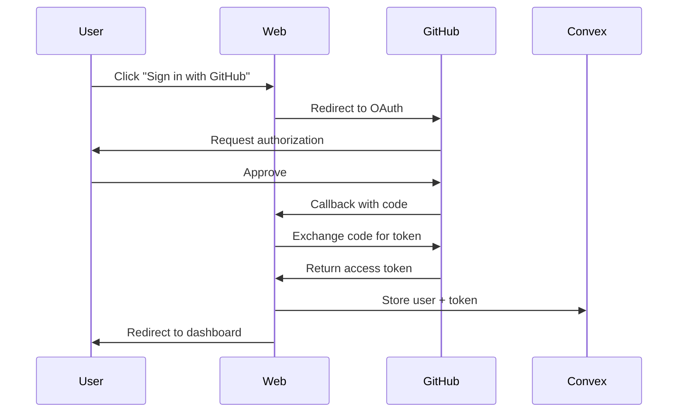

# API Documentation

## Convex Database Functions

Fondation uses Convex for all database operations. These functions are available through the generated API.

### Users API

#### `users.getOrCreate`
Creates or retrieves a user based on GitHub authentication.
```typescript
import { api } from "@convex/generated/api";

const user = await ctx.runMutation(api.users.getOrCreate, {
  githubId: "123456",
  username: "johndoe",
  email: "john@example.com",
  avatarUrl: "https://github.com/johndoe.png",
  accessToken: "ghu_xxxxx"
});
```

#### `users.getCurrentUser`
Get the current authenticated user.
```typescript
const user = useQuery(api.users.getCurrentUser, {
  userId: session.user.id
});
```

### Repositories API

#### `repositories.create`
Add a repository for analysis.
```typescript
const repo = await ctx.runMutation(api.repositories.create, {
  userId: user._id,
  githubRepoId: "12345",
  name: "my-repo",
  fullName: "user/my-repo",
  description: "Repository description",
  defaultBranch: "main",
  languages: {
    primary: "TypeScript",
    all: [
      { name: "TypeScript", percentage: 80, bytes: 50000 },
      { name: "JavaScript", percentage: 20, bytes: 12500 }
    ]
  }
});
```

#### `repositories.listByUser`
Get all repositories for a user.
```typescript
const repos = useQuery(api.repositories.listByUser, {
  userId: user._id
});
```

### Jobs API

#### `jobs.create`
Create a new analysis job.
```typescript
const { jobId, callbackToken } = await ctx.runMutation(api.jobs.create, {
  userId: user._id,
  repositoryId: repo._id,
  prompt: "Analyze this repository for educational content"
});
```

#### `jobs.getJob`
Get job details and status.
```typescript
const job = useQuery(api.jobs.getJob, {
  jobId: jobId
});

// Job status can be:
// - "pending": Waiting to be processed
// - "claimed": Worker has claimed the job
// - "cloning": Cloning repository
// - "analyzing": Running AI analysis
// - "gathering": Collecting results
// - "running": Processing
// - "completed": Successfully finished
// - "failed": Error occurred
// - "canceled": User canceled
```

#### `jobs.updateStatus`
Update job status (used by worker).
```typescript
await ctx.runMutation(api.jobs.updateStatus, {
  jobId: jobId,
  status: "analyzing",
  callbackToken: token,
  progress: "Analyzing dependencies...",
  currentStep: 2,
  totalSteps: 6
});
```

#### `jobs.cancelJob`
Cancel a running job.
```typescript
await ctx.runMutation(api.jobs.cancelJob, {
  jobId: jobId,
  userId: user._id
});
```

#### `jobs.getLogs`
Get job execution logs.
```typescript
const logs = useQuery(api.jobs.getLogs, {
  jobId: jobId,
  afterSeq: lastSeqNumber  // Optional: for pagination
});
```

### Documents API

#### `docs.storeGeneratedDoc`
Store generated course content.
```typescript
await ctx.runMutation(api.docs.storeGeneratedDoc, {
  jobId: jobId,
  type: "chapter",
  content: "# Chapter 1\n\nContent here...",
  metadata: {
    chapterNumber: 1,
    title: "Introduction"
  }
});
```

#### `docs.getByJob`
Retrieve all documents for a job.
```typescript
const docs = useQuery(api.docs.getByJob, {
  jobId: jobId
});
```

## REST API Endpoints

### Authentication

#### `POST /api/auth/callback/github`
GitHub OAuth callback endpoint.
```
Handled automatically by NextAuth.js
```

#### `GET /api/auth/session`
Get current session.
```typescript
const response = await fetch('/api/auth/session');
const session = await response.json();
```

### Job Management

#### `POST /api/webhook/job-callback`
Worker callback endpoint for job updates.
```typescript
// Request
POST /api/webhook/job-callback
{
  "jobId": "k97...",
  "callbackToken": "uuid-token",
  "status": "completed",
  "result": {
    "success": true,
    "data": "..."
  }
}

// Response
{ "success": true }
```

#### `POST /api/jobs/[id]/cancel`
Cancel a specific job.
```typescript
const response = await fetch(`/api/jobs/${jobId}/cancel`, {
  method: 'POST',
  headers: {
    'Content-Type': 'application/json'
  }
});
```

#### `GET /api/jobs/[id]/status`
Get job status (REST alternative to Convex subscription).
```typescript
const response = await fetch(`/api/jobs/${jobId}/status`);
const { status, progress } = await response.json();
```

### Repository Management

#### `POST /api/clear-stuck-jobs`
Clear stuck jobs for a repository.
```typescript
const response = await fetch('/api/clear-stuck-jobs', {
  method: 'POST',
  headers: {
    'Content-Type': 'application/json'
  },
  body: JSON.stringify({
    repositoryFullName: 'user/repo'
  })
});
```

## React Hooks

### `useJobManagement`
Custom hook for job lifecycle management.
```typescript
import { useJobManagement } from '@/hooks/use-job-management';

const {
  handleGenerate,  // Create new job
  handleCancel,    // Cancel job
  handleViewCourse // Navigate to course
} = useJobManagement({
  userId,
  repositoryId,
  onSuccess: () => console.log('Job completed'),
  onError: (error) => console.error(error)
});
```

### `useRepositories`
Hook for repository management.
```typescript
import { useRepositories } from '@/hooks/use-repositories';

const {
  repositories,
  loading,
  error,
  refreshRepositories
} = useRepositories(userId);
```

## TypeScript Types

### Core Types
```typescript
// User
interface User {
  _id: Id<"users">;
  githubId: string;
  username: string;
  email?: string;
  avatarUrl?: string;
  githubAccessToken?: string;
  createdAt: number;
}

// Repository
interface Repository {
  _id: Id<"repositories">;
  userId: Id<"users">;
  githubRepoId: string;
  name: string;
  fullName: string;
  description?: string;
  defaultBranch: string;
  languages?: {
    primary: string;
    all: Array<{
      name: string;
      percentage: number;
      bytes: number;
    }>;
  };
  stats?: {
    stars: number;
    forks: number;
    issues: number;
  };
}

// Job
interface Job {
  _id: Id<"jobs">;
  userId: Id<"users">;
  repositoryId: Id<"repositories">;
  status: JobStatus;
  prompt: string;
  callbackToken: string;
  progress?: string;
  currentStep?: number;
  totalSteps?: number;
  result?: {
    success: boolean;
    message?: string;
    data?: string;
  };
  error?: string;
  createdAt: number;
  updatedAt: number;
  completedAt?: number;
}

// Job Status
type JobStatus = 
  | "pending"
  | "claimed" 
  | "cloning"
  | "analyzing"
  | "gathering"
  | "running"
  | "completed"
  | "failed"
  | "canceled"
  | "dead";
```

## Error Handling

### Convex Errors
```typescript
try {
  const result = await ctx.runMutation(api.jobs.create, args);
} catch (error) {
  if (error.message.includes("already running")) {
    // Handle duplicate job
  } else {
    // Handle other errors
  }
}
```

### API Response Errors
```typescript
const response = await fetch('/api/endpoint');

if (!response.ok) {
  const error = await response.json();
  console.error('API Error:', error.message);
}
```

## Rate Limiting

### GitHub API
- Authenticated requests: 5,000/hour
- Monitor with `X-RateLimit-Remaining` header

### Convex Functions
- No hard limits in development
- Production limits based on plan

### Worker Processing
- Configurable via `MAX_CONCURRENT_JOBS`
- Default: 1 job at a time in development

## WebSocket Events

Convex provides real-time subscriptions automatically:

```typescript
// Component auto-updates when data changes
const job = useQuery(api.jobs.getJob, { jobId });

// Job status changes trigger re-render
useEffect(() => {
  if (job?.status === "completed") {
    // Handle completion
  }
}, [job?.status]);
```

## Authentication Flow



## CLI API

The CLI communicates with Claude AI through the SDK:

```typescript
// Internal CLI API (not exposed)
interface AnalysisStep {
  name: string;
  prompt: string;
  process: (input: any) => Promise<any>;
}

// Analysis pipeline
const steps: AnalysisStep[] = [
  { name: "extract", /* ... */ },
  { name: "analyze", /* ... */ },
  { name: "order", /* ... */ },
  { name: "generate", /* ... */ },
  { name: "review", /* ... */ },
  { name: "tutorials", /* ... */ }
];
```

---

For implementation examples, see [Development Guide](./DEVELOPMENT.md).
For architecture details, see [Architecture Guide](./ARCHITECTURE.md).