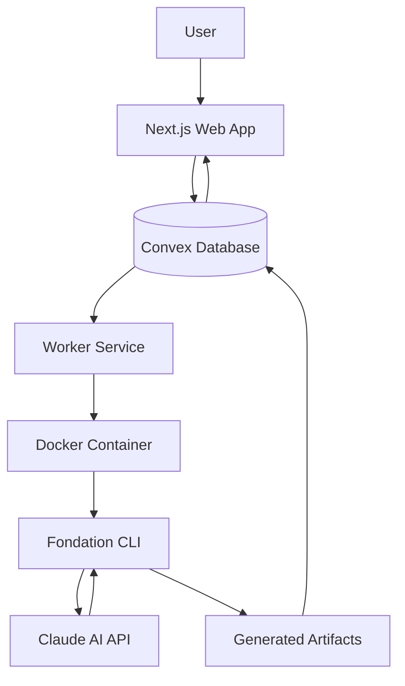

# Fondation Architecture

## System Overview

Fondation is an AI-powered course generation system that analyzes codebases and creates comprehensive educational content. It's built as a **TypeScript monorepo** with four main packages and a shared Convex database.



## Monorepo Structure

```
fondation/
├── packages/
│   ├── shared/          # Shared TypeScript types and utilities
│   ├── web/            # Next.js frontend application
│   ├── worker/         # Background job processor
│   └── cli/            # AI-powered analysis CLI tool
├── convex/             # Centralized database functions
├── docs/               # Comprehensive documentation
└── [root config]       # Monorepo orchestration
```

### Why This Structure?

1. **Single Source of Truth**: Convex at root means all packages reference the same database schema
2. **Type Safety**: Shared package ensures consistent types across all services
3. **Independent Scaling**: Each package can be deployed and scaled separately
4. **Clear Boundaries**: Each package has a specific responsibility

## Package Architecture

### 1. Shared Package (`packages/shared`)

**Purpose**: Type definitions and shared utilities

```typescript
// Example shared type
export interface Repository {
  id: string;
  fullName: string;
  defaultBranch: string;
  languages?: LanguageStats;
}
```

**Key Features**:
- TypeScript interfaces used by all packages
- Utility functions for data transformation
- Constants and enums
- No runtime dependencies

### 2. Web Package (`packages/web`)

**Purpose**: User interface and authentication

**Tech Stack**:
- Next.js 15 (App Router)
- React 19
- Tailwind CSS
- NextAuth.js (GitHub OAuth)
- Convex React client

**Key Flows**:
```
User Login → GitHub OAuth → Create User → Dashboard
Repository Selection → Create Job → Monitor Progress → View Course
```

**Directory Structure**:
```
packages/web/
├── src/
│   ├── app/           # Next.js App Router pages
│   ├── components/    # React components
│   ├── hooks/        # Custom React hooks
│   ├── lib/          # Utilities
│   └── server/       # Server-side code
```

### 3. Worker Package (`packages/worker`)

**Purpose**: Asynchronous job processing

**Key Responsibilities**:
1. Poll Convex for pending jobs
2. Spawn Docker containers for analysis
3. Update job status in real-time
4. Handle retries and failures

**Architecture**:
```typescript
// Simplified worker loop
while (true) {
  const job = await claimNextJob();
  if (job) {
    const container = spawnDocker(job);
    await monitorProgress(container, job);
    await uploadResults(job);
  }
  await sleep(POLL_INTERVAL);
}
```

### 4. CLI Package (`packages/cli`)

**Purpose**: AI-powered code analysis and course generation

**Architecture Highlights**:
- **Bundle Strategy**: External Claude SDK (476KB bundle)
- **Execution**: Runs inside Docker container
- **Authentication**: OAuth via Claude SDK
- **UI**: React-based CLI using Ink

**Analysis Pipeline**:
```
1. Extract Abstractions → identify key concepts
2. Analyze Relationships → map dependencies
3. Determine Order → create learning path
4. Generate Chapters → create content
5. Review Chapters → quality check
6. Create Tutorials → practical exercises
```

## Data Flow Architecture

### Job Creation Flow
```
1. User selects repository in Web UI
2. Web creates job in Convex with status: "pending"
3. Worker polls and claims job (status: "claimed")
4. Worker spawns Docker container with CLI
5. CLI analyzes repository through 6 steps
6. Results uploaded to Convex (status: "completed")
7. Web UI displays generated course
```

### Real-time Updates
```
Worker → Convex mutation → Real-time subscription → Web UI
        status: "analyzing"                      Updates progress bar
        progress: "Step 3/6"                     Shows current step
```

## Import Alias Strategy

### Why Aliases?

**Problem**: Deep relative imports become fragile
```typescript
// ❌ Bad - fragile and hard to maintain
import { api } from '../../../../../../../../convex/_generated/api';
```

**Solution**: Standardized aliases
```typescript
// ✅ Good - clear and maintainable
import { api } from '@convex/generated/api';
import { Repository } from '@fondation/shared/types';
```

### Alias Configuration

**Root `tsconfig.json`**:
```json
{
  "compilerOptions": {
    "paths": {
      "@fondation/*": ["./packages/*/src/*"],
      "@convex/*": ["./convex/*"]
    }
  }
}
```

**Package-level Override**:
```json
// packages/web/tsconfig.json
{
  "extends": "../../tsconfig.json",
  "compilerOptions": {
    "paths": {
      "@/*": ["./src/*"],
      "@convex/generated/*": ["../../convex/_generated/*"]
    }
  }
}
```

## TypeScript Configuration Inheritance

### Hierarchy
```
root tsconfig.json (base configuration)
    ├── packages/shared/tsconfig.json (extends root)
    ├── packages/web/tsconfig.json (extends root + Next.js specific)
    ├── packages/worker/tsconfig.json (extends root + Node specific)
    └── packages/cli/tsconfig.json (extends root + bundler specific)
```

### Module Resolution Strategy

Different packages require different module resolution:

| Package | Module Resolution | Why |
|---------|------------------|-----|
| **shared** | `node` | Standard Node.js package |
| **web** | `bundler` | Next.js webpack bundling |
| **worker** | `node` | Node.js runtime |
| **cli** | `bundler` | Ink (React for CLI) requirements |

## Docker Architecture

### CLI Container Structure
```dockerfile
FROM node:20-alpine
├── Install: bash, git, curl
├── Copy: cli.bundled.cjs (476KB)
├── Copy: prompts/ (analysis templates)
├── Install: @anthropic-ai/claude-code (external)
└── Entry: Run analysis commands
```

### Why External SDK?
1. **Size**: Bundling SDK would triple bundle size
2. **Spawn Requirements**: SDK needs to spawn processes
3. **Authentication**: OAuth tokens stored in container
4. **Updates**: SDK can be updated independently

## Authentication Architecture

### Two-Layer Authentication

1. **User Authentication** (GitHub OAuth)
   ```
   User → GitHub → Web App → Convex User Record
   ```

2. **CLI Authentication** (Claude OAuth)
   ```
   CLI → Claude OAuth → Browser → Token Storage
   ```

### Token Management
- **GitHub Tokens**: Stored in Convex, used for repository access
- **Claude Tokens**: Stored in Docker container's filesystem
- **Session Tokens**: Managed by NextAuth.js

## Database Architecture (Convex)

### Schema Design
```typescript
// Simplified schema
tables: {
  users: {
    githubId: string,
    username: string,
    githubAccessToken?: string
  },
  repositories: {
    userId: Id<"users">,
    fullName: string,
    languages?: LanguageStats
  },
  jobs: {
    repositoryId: Id<"repositories">,
    status: JobStatus,
    progress?: string,
    result?: AnalysisResult
  }
}
```

### Why Convex?
1. **Real-time**: Built-in subscriptions for live updates
2. **Type Safety**: Generated TypeScript types
3. **Serverless**: No infrastructure management
4. **Transactions**: ACID compliance for job processing

## Performance Optimizations

### Build Performance
- **Incremental Compilation**: TypeScript project references
- **Parallel Development**: Concurrently for service startup
- **Cached Builds**: Preserves .tsbuildinfo files
- **Optimized Bundles**: Tree-shaking and minification

### Runtime Performance
- **Lazy Loading**: Next.js dynamic imports
- **Edge Caching**: Static page generation where possible
- **Connection Pooling**: Reused database connections
- **Docker Layers**: Cached base images

## Security Architecture

### Principle of Least Privilege
- Worker only has job processing permissions
- CLI runs in isolated Docker container
- Web app uses read-only queries where possible

### Secret Management
```
Development: .env.local files (gitignored)
Production: Environment variables in deployment platform
Docker: Build args for non-sensitive config
```

### Data Protection
- GitHub tokens encrypted at rest
- Session cookies httpOnly and secure
- CORS configured for production domain
- Input validation at every layer

## Scalability Considerations

### Horizontal Scaling Points
1. **Web**: Multiple Next.js instances behind load balancer
2. **Worker**: Multiple workers polling job queue
3. **CLI**: Parallel Docker containers for analysis
4. **Database**: Convex handles scaling automatically

### Bottlenecks & Solutions
| Bottleneck | Solution |
|------------|----------|
| Job queue contention | Optimistic locking with retry |
| Docker container startup | Pre-warmed container pool |
| Large repository analysis | Streaming processing |
| Database write throughput | Batched mutations |

## Development vs Production

### Development Architecture
```
All services on localhost
├── Web: http://localhost:3000
├── Worker: Polls local Convex
├── Convex: Development deployment
└── CLI: Direct execution (no Docker)
```

### Production Architecture
```
Distributed services
├── Web: Vercel Edge Network
├── Worker: Cloud Run / ECS
├── Convex: Production deployment
└── CLI: Authenticated Docker registry
```

## Future Architecture Considerations

### Potential Enhancements
1. **Microservices**: Split worker into queue/processor
2. **Event Sourcing**: Complete audit trail
3. **Multi-tenancy**: Organization-level isolation
4. **Caching Layer**: Redis for hot data
5. **CDN**: Generated courses as static sites

### Scaling Strategies
1. **Job Priority Queues**: Premium vs free tiers
2. **Regional Deployments**: Reduce latency
3. **Batch Processing**: Multiple repos simultaneously
4. **Incremental Analysis**: Only analyze changes

---

This architecture provides a solid foundation for growth while maintaining simplicity and developer experience. Each component has clear responsibilities and well-defined interfaces, making the system maintainable and extensible.