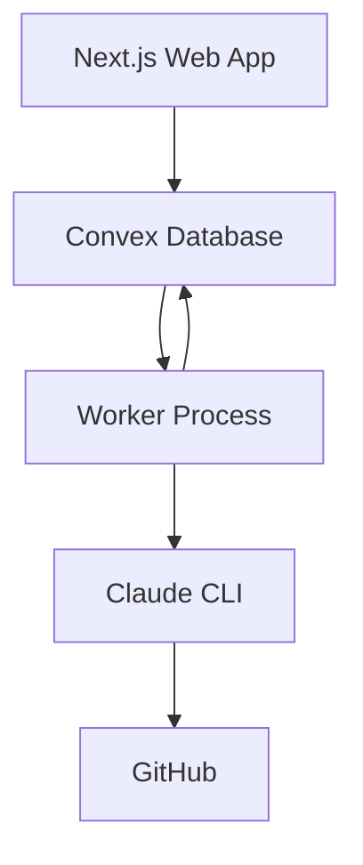
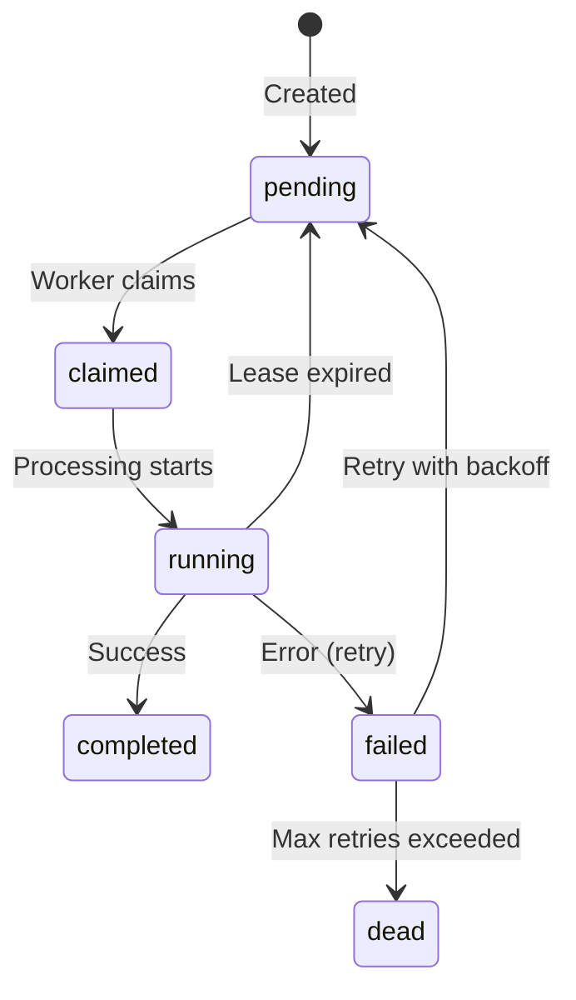

# Architecture Overview

## System Design

Fondation uses a simple, vendor-agnostic architecture with three main components:



## Components

### 1. Web Application (Next.js)
- **Location**: `apps/web/`
- **Purpose**: User interface for repository management and course viewing
- **Technologies**: Next.js 15, React 19, Tailwind CSS, NextAuth
- **Database**: Convex for real-time data and job queue

### 2. Worker Process
- **Location**: `apps/worker/`
- **Purpose**: Persistent job processor that polls Convex for work
- **Technologies**: Node.js, TypeScript
- **Deployment**: Docker container on any host (VPS, cloud, local)
- **Key Features**:
  - Polls Convex every 5 seconds for pending jobs
  - Atomic job claiming with lease-based locking
  - Automatic retry with exponential backoff
  - Health checks and metrics endpoints

### 3. Shared Types
- **Location**: `packages/shared/`
- **Purpose**: Type-safe schemas shared between web and worker
- **Technologies**: TypeScript, Zod validation

## Data Flow

### Job Creation and Processing

1. **User triggers analysis** in web UI
2. **Web app creates job** in Convex with `status: "pending"`
3. **Worker polls Convex** and claims the job atomically
4. **Worker updates status** through processing stages:
   - `claimed` → `cloning` → `analyzing` → `gathering` → `completed`
5. **Worker saves results** to Convex docs collection
6. **Web app displays results** via real-time Convex subscriptions

### Queue Management

The job queue is implemented directly in Convex with:
- **Atomic claiming**: Prevents duplicate processing
- **Lease mechanism**: Jobs have time-limited leases
- **Heartbeat**: Workers extend leases while processing
- **Automatic recovery**: Expired leases return jobs to queue
- **Retry logic**: Failed jobs retry with exponential backoff

## Deployment Architecture

### Production Setup

```
┌─────────────────────────┐
│   Scaleway Instance     │
│   (or any VPS/Docker)   │
│                         │
│  ┌──────────────────┐   │
│  │  Docker Worker   │   │
│  │   - Polls jobs   │   │
│  │   - Runs CLI     │   │
│  └──────────────────┘   │
│           ↕             │
└─────────────────────────┘
            ↕
    ┌──────────────┐
    │    Convex    │
    │   Database   │
    │   & Queue    │
    └──────────────┘
            ↕
    ┌──────────────┐
    │   Next.js    │
    │   Web App    │
    │  (Vercel)    │
    └──────────────┘
```

### Key Characteristics

- **No vendor lock-in**: Worker runs on any Docker host
- **No cold starts**: Worker is always running
- **Simple scaling**: Add more worker containers
- **Cost-effective**: ~$4-10/month for VPS

## Security

### Authentication
- **Web**: GitHub OAuth via NextAuth
- **Claude CLI**: Manual interactive authentication (not API key)
- **Jobs**: Callback tokens for secure updates

### Data Protection
- GitHub tokens encrypted in Convex
- Claude credentials mounted read-only
- Non-root Docker container
- Temporary files cleaned after each job

## Monitoring

### Health Checks
- Worker exposes `/health` endpoint on port 8080
- Includes uptime, memory usage, active jobs

### Metrics
- `/metrics` endpoint provides:
  - Jobs processed/succeeded/failed
  - Average processing time
  - Queue depth
  - Success rate

## Technology Stack

### Frontend
- Next.js 15 (App Router)
- React 19
- Tailwind CSS
- Convex React hooks

### Backend
- Convex (Database + Real-time)
- Node.js Worker
- Claude CLI
- Git

### Infrastructure
- Docker containers
- Any Linux VPS (Scaleway, DigitalOcean, etc.)
- GitHub for source control
- Vercel for web hosting (optional)

## Scaling Strategy

### Vertical Scaling
- Increase worker memory/CPU limits
- Adjust `MAX_CONCURRENT_JOBS`

### Horizontal Scaling  
- Deploy multiple worker containers
- Each with unique `WORKER_ID`
- Automatic load distribution via queue

## Design Principles

1. **Simplicity**: Minimal moving parts
2. **Vendor Independence**: No provider-specific code
3. **Reliability**: Automatic retries and recovery
4. **Observability**: Health checks and metrics
5. **Security**: Least privilege, encrypted secrets
6. **Cost-Effectiveness**: Efficient resource usage

## State Management

### Job States



### Lease Management
- Jobs claimed with 5-minute lease
- Heartbeat every minute extends lease
- Expired leases automatically reclaimed
- Prevents zombie jobs

## Error Handling

### Retry Policy
- Maximum 3 attempts per job
- Exponential backoff: 1s, 2s, 4s
- Jitter added to prevent thundering herd
- Dead letter state after max attempts

### Failure Recovery
- Worker crash: Jobs return to queue after lease expires
- Network issues: Automatic reconnection
- Claude auth failure: Manual intervention required
- Repository access: Retry with backoff

## Performance

### Typical Metrics
- Job pickup latency: < 5 seconds
- Small repo analysis: 2-5 minutes
- Large repo analysis: 10-30 minutes
- Concurrent jobs: 1-2 per worker
- Memory usage: 500MB-1.5GB

### Optimization Opportunities
- Reduce poll interval for faster pickup
- Increase concurrent jobs for parallel processing
- Cache CLI results for repeated analyses
- Use dedicated workers for large repos