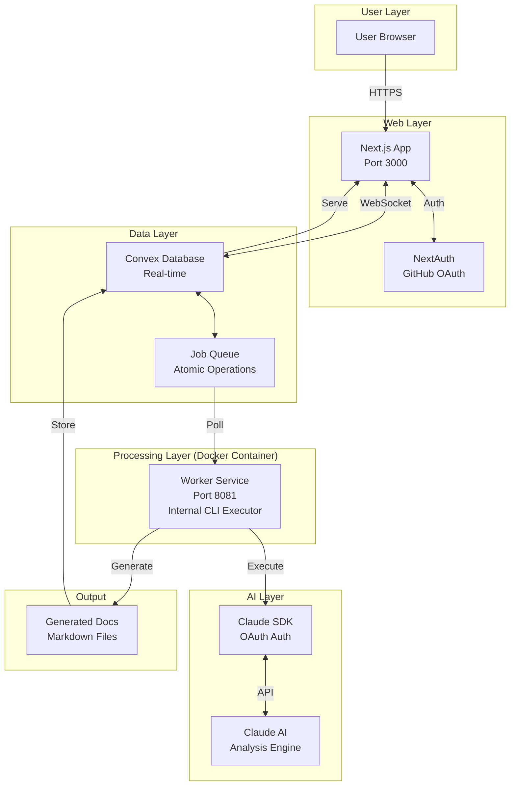

# Architecture Overview

Fondation is a monorepo-based system that transforms GitHub repositories into AI-generated educational content.

## System Architecture Diagram



## Data Flow Sequence


## Package Structure

```
fondation/                      # Root monorepo
├── convex/                     # Shared database (consolidated)
│   ├── _generated/            # Auto-generated types
│   ├── jobs.ts                # Job management
│   ├── queue.ts               # Atomic job queue
│   ├── repositories.ts        # Repository data
│   ├── users.ts               # User management
│   └── docs.ts                # Document storage
│
├── packages/
│   ├── web/                   # Next.js frontend
│   │   ├── src/
│   │   │   ├── app/          # App router pages
│   │   │   ├── components/   # React components
│   │   │   ├── hooks/        # Custom hooks
│   │   │   └── lib/          # Utilities
│   │   └── public/           # Static assets
│   │
│   ├── worker/                # Job processor
│   │   └── src/
│   │       ├── worker.ts     # Main worker loop
│   │       ├── cli-executor.ts # Internal CLI executor
│   │       └── config.ts     # Configuration
│   │
│   ├── cli/                   # Fondation analyzer
│   │   ├── src/
│   │   │   ├── cli.ts        # CLI entry
│   │   │   ├── analyze.ts    # Main analyzer
│   │   │   └── prompts/      # AI prompts
│   │   └── dist/
│   │       └── cli.bundled.mjs # Bundled CLI
│   │
│   └── shared/                # Shared types
│       └── src/
│           ├── schemas.ts     # Zod schemas
│           └── types.ts       # TypeScript types
│
├── docs/                      # Documentation
├── biome.json                # Linting config
├── tsconfig.json             # TypeScript config
└── package.json              # Root scripts
```

## Import Alias System

The monorepo uses standardized import aliases for clean imports:

```typescript
// ❌ Old way - fragile relative imports
import { api } from '../../../../../../../../convex/_generated/api';

// ✅ New way - standardized aliases
import { api } from '@convex/generated/api';
```

### Available Aliases

| Alias | Maps To | Used For |
|-------|---------|----------|
| `@convex/*` | `/convex/*` | Database functions |
| `@convex/generated/*` | `/convex/_generated/*` | Generated types |
| `@fondation/shared/*` | `/packages/shared/src/*` | Shared utilities |
| `@fondation/web/*` | `/packages/web/src/*` | Web components |
| `@fondation/worker/*` | `/packages/worker/src/*` | Worker logic |
| `@fondation/cli/*` | `/packages/cli/src/*` | CLI utilities |
| `@/*` | Package-specific src | Local imports |

## TypeScript Project References

The monorepo uses TypeScript project references for proper build ordering:

```json
// Root tsconfig.json
{
  "references": [
    { "path": "./packages/shared" },
    { "path": "./packages/cli" },
    { "path": "./packages/web" },
    { "path": "./packages/worker" }
  ]
}
```

Build order: `shared` → `cli` → `web`/`worker` (parallel)

## Component Architecture

### Web Package (Next.js 15)
- **Framework**: Next.js 15 with App Router
- **Auth**: NextAuth with GitHub OAuth
- **UI**: React 19, Tailwind CSS, Radix UI
- **State**: Convex real-time subscriptions
- **Type Safety**: Strict TypeScript with Zod validation

### Worker Package (Docker Container)
- **Purpose**: Job processing and orchestration
- **Pattern**: Polling with lease-based claiming
- **Execution**: Runs inside Docker container with internal CLI
- **Monitoring**: Health checks on port 8081
- **Scaling**: Configurable concurrent job limit
- **Architecture**: Enforced container execution (no external Docker spawning)

### CLI Package (Bundled Node.js)
- **Build**: Custom esbuild bundler
- **Size**: ~476KB bundled (Claude SDK external)
- **Auth**: OAuth-based (no API keys)
- **Steps**: 6-phase analysis pipeline
- **Output**: Markdown documents

### Shared Package (TypeScript Library)
- **Purpose**: Shared types and schemas
- **Validation**: Zod schemas for runtime safety
- **Types**: Common interfaces across packages

## Docker Architecture

### CLI Container Structure
```dockerfile
FROM node:20-alpine
├── Install dependencies (bash, git, curl)
├── Copy bundled CLI (dist/cli.bundled.mjs)
├── Copy prompts directory
├── Install Claude SDK separately (external)
└── Authenticate via OAuth (interactive)
```

### Why External Claude SDK?
- **Size**: Keeps bundle small (~476KB vs 2MB+)
- **Authentication**: OAuth flow requires spawn
- **Updates**: SDK can update independently
- **Security**: Credentials isolated in container

## Database Schema (Convex)

### Core Tables
```typescript
// users - GitHub authenticated users
{
  _id: Id<"users">,
  githubId: string,
  username: string,
  email?: string,
  avatarUrl?: string,
  githubAccessToken?: string
}

// repositories - Analyzed repositories
{
  _id: Id<"repositories">,
  userId: Id<"users">,
  githubRepoId: string,
  fullName: string,  // "owner/repo"
  languages: { primary: string, all: Language[] }
}

// jobs - Analysis jobs
{
  _id: Id<"jobs">,
  userId: Id<"users">,
  repositoryId: Id<"repositories">,
  status: JobStatus,
  prompt: string,
  progress?: string,
  result?: JobResult
}

// documents - Generated content
{
  _id: Id<"documents">,
  jobId: Id<"jobs">,
  type: "chapter" | "tutorial",
  content: string,
  metadata: object
}
```

## Security Architecture

### Authentication Flow
1. User clicks "Sign in with GitHub"
2. NextAuth redirects to GitHub OAuth
3. GitHub validates and returns token
4. Token stored encrypted in Convex
5. Worker uses token for repository access

### Security Measures
- No API keys in code (OAuth only)
- Encrypted GitHub tokens
- Signed session cookies
- CSRF protection
- Rate limiting on API routes
- Docker isolation for execution

## Performance Optimizations

### Caching Strategy
- Next.js: ISR for static pages
- Convex: Built-in query caching
- Docker: Layer caching for builds
- CLI: Prompt file caching

### Scaling Approach
- **Vertical**: Increase worker resources
- **Horizontal**: Multiple worker instances
- **Database**: Convex auto-scales
- **CDN**: Static assets via Vercel

## Configuration Management

### Environment Variables
- **Root**: Single `.env.example` source of truth
- **Hierarchy**: Root → Package overrides
- **Secrets**: Never in code, always in env
- **Documentation**: All vars documented

### Dependency Management
- **Package Manager**: Bun (fast, consistent)
- **Versions**: Aligned across packages
- **Lock File**: Single `bun.lockb`
- **Updates**: Coordinated via root

## Monitoring & Observability

### Health Checks
```typescript
// Worker health endpoint
GET http://localhost:8080/health
{
  "status": "healthy",
  "uptime": 3600,
  "activeJobs": 2,
  "version": "1.0.0"
}
```

### Logging
- **Web**: Browser console + Vercel logs
- **Worker**: Structured JSON logs
- **CLI**: Piped to worker logs
- **Database**: Convex dashboard

## Architectural Compliance

### Single Execution Path Enforcement
The system enforces a **single, consistent execution path** to prevent architectural violations:

```typescript
// Worker validates container environment on startup
if (!isInsideDocker) {
  throw new Error("Worker must run inside Docker container");
}
```

### Eliminated Anti-Patterns
- ❌ **External Docker Spawning**: Removed worker spawning separate containers
- ❌ **Parallel Job Systems**: Eliminated dual job creation paths
- ❌ **Silent Failures**: All errors now logged with proper context
- ❌ **Status Inconsistencies**: Unified status handling across all components

### Architecture Flow Validation
```
✅ CORRECT: UI → jobs.create → Queue → Worker (Docker) → CLI (Internal) → Complete
❌ REMOVED: UI → startAnalysis → Convex Scheduler → Mock Execution
❌ REMOVED: Worker → External Docker Spawn → CLI (Separate Container)
```

## Key Design Decisions

1. **Monorepo**: Simplified dependency management
2. **TypeScript**: Type safety across packages
3. **Convex**: Real-time without WebSocket complexity
4. **Docker**: Consistent execution environment (enforced)
5. **OAuth**: No API key management
6. **Biome**: Fast, consistent linting
7. **Bun**: Fast package management
8. **Single Container**: All processing within one Docker container

---

For implementation details, see [Development Guide](./DEVELOPMENT.md).
For deployment instructions, see [Deployment Guide](./DEPLOYMENT.md).