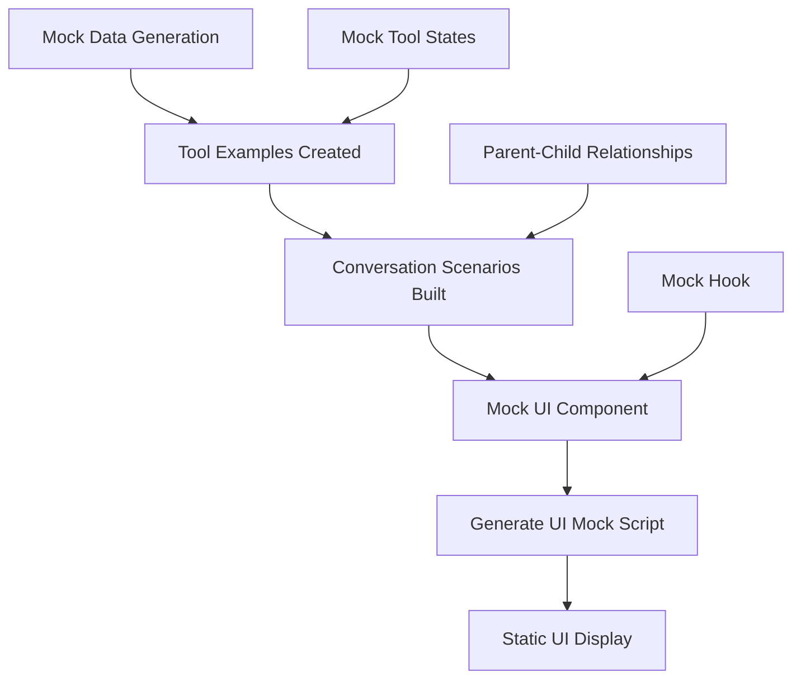

# Chapter 10: Mock and Testing Infrastructure

When building a complex UI like a chat interface with multiple tool integrations, you need a way to test and preview how everything looks without actually running the full system. Think of it like a movie set – you want to see how the actors look on stage, how the lighting works, and how all the props fit together before filming the actual movie.

The proto project includes a comprehensive mock and testing infrastructure that serves as your "rehearsal stage" for the chat interface. This system lets you simulate every possible UI state, tool interaction, and conversation scenario without making real API calls or executing actual commands.

## The Heart of the Mock System

At the center of this infrastructure is the mock data generator in `src/utils/mockData.ts`. This file contains the recipe for creating realistic chat conversations, tool interactions, and UI states:

```typescript
const createMessage = (
  role: Message['role'],
  content: string,
  toolUse?: Message['toolUse'],
  parentToolUseId?: string,
): Message => ({
  id: (messageIdCounter++).toString(),
  role,
  content,
  timestamp: new Date(Date.now() - Math.random() * 3600000),
  toolUse,
  parentToolUseId,
});
```

This factory function creates messages that look and feel like real chat interactions. The timestamp is randomized within the last hour to make conversations feel natural, and each message gets a unique ID just like in the real system.

## Creating Realistic Tool Interactions

The mock system shines when it comes to simulating tool usage. Instead of actually reading files or running commands, it creates realistic mock responses:

```typescript
const createToolMessage = (
  name: string,
  input: unknown,
  result?: string,
  status: ToolStatus = 'completed',
  error?: boolean,
): Message => {
  const baseToolUse = {
    name,
    input,
    status,
  };

  if (error) {
    return createMessage('tool', `Error using tool: ${name}`, {
      ...baseToolUse,
      result: 'Error: Operation failed',
      status: 'completed',
    });
  }

  return createMessage('tool', `Using tool: ${name}`, {
    ...baseToolUse,
    result: result || undefined,
  });
};
```

This function can simulate any tool in any state – whether it's still running, completed successfully, or failed with an error. The mock system includes examples for every tool type used in the application.

## A Library of UI States

The mock data includes comprehensive examples for all tool types, from simple file operations to complex web searches:

```typescript
export const mockToolExamples = {
  Read: [
    createToolMessage(
      'Read',
      { file_path: '/path/to/file.ts' },
      "1→import React from 'react';\n2→import { Box } from 'ink';\n3→\n4→export const Component = () => {\n5→  return <Box>Hello World</Box>;\n6→};"
    ),
  ],
  Bash: [
    createToolMessage(
      'Bash',
      { command: 'npm test' },
      '✓ All tests passed\n\nTest Suites: 12 passed, 12 total\nTests: 48 passed, 48 total'
    ),
  ],
  // ... examples for all 12+ tool types
};
```

These examples showcase realistic inputs and outputs for each tool, helping developers understand how the UI will render different types of content.

## Simulating Real Conversations

Beyond individual tool examples, the mock system provides complete conversation scenarios that demonstrate how the chat interface handles complex workflows:

```typescript
export const mockConversations: MockConversation[] = [
  {
    title: 'Development Workflow',
    messages: [
      createMessage('user', 'Help me set up a new React component with TypeScript'),
      createMessage('assistant', "I'll help you create a new React component..."),
      ...mockToolExamples.LS,
      ...mockToolExamples.Write,
      ...mockToolExamples.Edit,
      // ... complete conversation flow
    ],
  },
  // ... more scenarios
];
```

These pre-built conversations cover common use cases like debugging sessions, code reviews, project management, and research tasks.

## The Mock UI Component

The mock infrastructure culminates in a dedicated UI component that displays all these states:

```typescript
export async function generateUIMock() {
  const { unmount } = render(<ChatAppMock />, {
    patchConsole: false,
  });

  await new Promise((resolve) => setTimeout(resolve, 500));
  
  unmount();
  process.exit(0);
}
```

This script from `scripts/generate-ui-mock.tsx` renders the complete mock UI, waits for it to render, then exits while leaving the output visible. It's like taking a snapshot of your UI in all possible states.

## Mock Hook Implementation

The mock system even includes a mock version of the Claude query hook used by the real UI:

```typescript
export function useClaudeQuery({
  onComplete,
}: UseClaudeQueryOptions) {
  const processQuery = useCallback(
    async (_userMessage: string) => {
      // Mock implementation - no actual processing
      onComplete();
    },
    [onComplete],
  );

  return {
    processQuery,
    abort: () => {},
  };
}
```

This mock hook from `src/ui/hooks/useClaudeQuery.mock.ts` provides the same interface as the real hook but without any actual Claude API calls. It immediately completes any query, perfect for static UI demonstration.

## Under the Hood: Mock System Flow



When you run the mock UI, here's what happens:

1. **Mock data generators** create realistic messages and tool interactions
2. **Tool examples** provide content for each tool type in various states
3. **Conversation scenarios** combine multiple interactions into realistic workflows
4. **Mock UI component** uses the mock hook and displays all the generated content
5. **Generation script** renders everything and creates a static display

## Integration with Testing

This mock infrastructure integrates seamlessly with the broader testing strategy. The mock data can be used in:

- **Unit tests** for individual UI components
- **Integration tests** for conversation flows
- **Visual regression tests** to ensure UI consistency
- **Manual testing** and design reviews

The mock system provides a controlled environment where every edge case can be tested without the complexity of real API interactions.

## Running the Mock UI

To see the complete mock system in action, you can run:

```bash
bun run mock-ui
```

This command executes the mock generation script and displays a comprehensive demonstration of all UI states, tool interactions, and conversation scenarios. It's like having a catalog of every possible state your chat interface can display.

The mock and testing infrastructure transforms what could be a complex testing challenge into a straightforward development tool. By providing realistic data, comprehensive examples, and easy ways to preview UI states, it ensures that the chat interface can handle any scenario gracefully.

Next, we'll explore how all these components work together in the complete application architecture, bringing together the workflow orchestration, UI components, and testing infrastructure into a cohesive development experience.