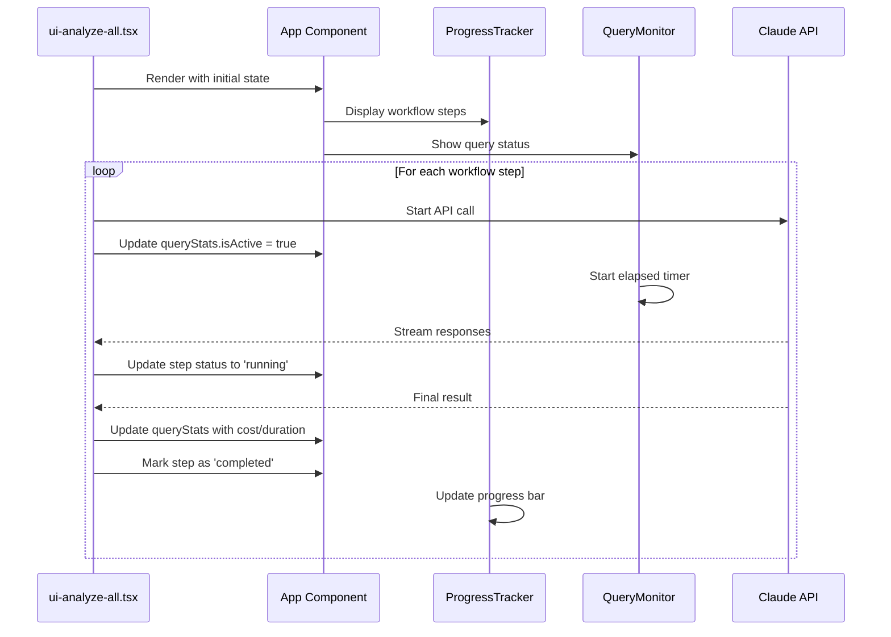

# Chapter 1: React-based Terminal UI

## Introduction

Imagine trying to follow a complex recipe with dozens of ingredients and steps, but your cookbook only shows you one line at a time. You'd have no idea if you're running behind schedule, how much longer it will take, or whether something went wrong three steps back. That's exactly what most command-line tools feel like - you run a command and sit in the dark waiting for it to finish.

The React-based Terminal UI in the proto project solves this problem by creating a sophisticated dashboard that runs right in your terminal. Instead of staring at a blank prompt, you get real-time progress bars, status indicators, cost tracking, and live logs - all updating dynamically as your workflow runs.

## The Problem: Terminal Black Holes

Traditional CLI tools are like black holes for user feedback. When you run a complex analysis that takes several minutes, you're left wondering:
- Is it actually doing anything?
- How much progress has been made?
- How much will this cost me in API calls?
- What if something goes wrong halfway through?

In the proto project, this problem is especially acute because workflows can involve multiple steps of AI-powered analysis, each taking considerable time and costing real money.

## Basic Usage

At its simplest, the React-based Terminal UI displays a comprehensive dashboard when you run the analyze-all command:

```tsx
// From src/ui-analyze-all.tsx:543
render(<AnalyzeAllApp projectDir={projectDir} outputDir={outputDir} overwrite={overwrite} />);
```

This creates a live, updating interface that shows:
- Current command and project paths
- Overall progress bar with percentage
- Step-by-step workflow progress
- Real-time Claude API monitoring
- Recent logs and error handling

The interface updates automatically as your workflow progresses, giving you complete visibility into what's happening behind the scenes.

## Key Components

### The Main Dashboard (App.tsx)

The heart of the system is the `App` component, which orchestrates the entire interface layout:

```tsx
// From src/ui/components/App.tsx:58-87
return (
  <Box flexDirection="column" minWidth={60}>
    {/* Header with command info and timestamp */}
    <Box borderStyle="round" borderColor="blue" padding={1}>
      <Text bold color="blue">Claude Prompts CLI Tool</Text>
      <Text>Command: <Text color="cyan">{command}</Text></Text>
      <Text dimColor>{currentTime.toLocaleTimeString()}</Text>
    </Box>
    
    {/* Error display if something goes wrong */}
    {error && <ErrorSection />}
    
    {/* Two-column layout */}
    <Box flexDirection="row">
      <LeftColumn />  {/* Progress and status */}
      <RightColumn /> {/* Query monitor and logs */}
    </Box>
  </Box>
);
```

Think of this like the cockpit of an airplane - everything important is visible at a glance, organized logically, and updates in real-time.

### Progress Tracking (ProgressTracker.tsx)

The `ProgressTracker` component shows both high-level progress and detailed step information:

```tsx
// From src/ui/components/ProgressTracker.tsx:60-66
<Box flexDirection="column">
  <Text bold>Overall Progress ({Math.round(overallProgress * 100)}%)</Text>
  <Text color="green">{createProgressBar(overallProgress)}</Text>
  
  {/* Individual steps with status icons */}
  {steps.map((step, index) => (
    <Text color={getStepColor(step, index)}>
      {getStepIcon(step, index)} {step.name}
    </Text>
  ))}
</Box>
```

Each step gets a visual indicator: `[>>]` for current, `[DONE]` for completed, `[FAIL]` for errors, and `[...]` for pending. Colors change accordingly - green for success, red for errors, yellow for active.

### Real-time Query Monitor (QueryMonitor.tsx)

The `QueryMonitor` tracks Claude API calls with cost and performance metrics:

```tsx
// From src/ui/components/QueryMonitor.tsx:105-120
{stats.isActive && (
  <Box flexDirection="column">
    <Text>Duration: <Text color="cyan">{formatDuration(elapsedTime)}</Text></Text>
    <Text>Turns: <Text color="magenta">{stats.numTurns}</Text></Text>
    <Text>Cost: <Text color="green">${stats.totalCost.toFixed(4)}</Text></Text>
    
    {isStuckWarning && (
      <Text color="yellow">
        [WARNING] Query taking longer than expected
      </Text>
    )}
  </Box>
)}
```

This component even includes smart warnings - if a query runs longer than 30 seconds, it shows a yellow warning that it might be processing something complex.

## Under the Hood: The Data Flow

Here's how the system works internally:



The key insight is that the UI components are reactive - they automatically update whenever the underlying state changes. The main application (`ui-analyze-all.tsx`) manages the workflow logic and updates the state, while the UI components just render the current state.

### State Management Pattern

The system uses a centralized state approach with callback-based updates:

```tsx
// From src/ui-analyze-all.tsx:100-112
const addLog = useCallback((message: string) => {
  setState(prev => ({
    ...prev,
    logs: [...prev.logs, `${new Date().toLocaleTimeString()}: ${message}`]
  }));
}, []);

const updateQueryStats = useCallback((updates: Partial<QueryStats>) => {
  setState(prev => ({
    ...prev,
    queryStats: { ...prev.queryStats, ...updates }
  }));
}, []);
```

This pattern ensures that any component can trigger updates, and all relevant UI components will re-render automatically.

## Integration with Workflow Orchestration

The React-based Terminal UI integrates seamlessly with the workflow orchestration system. When you run `analyze-all`, the UI automatically:

1. **Initializes** with the complete workflow steps predefined
2. **Tracks progress** through each major phase (abstractions, relationships, ordering, generation, review, tutorials)
3. **Updates in real-time** as each step completes
4. **Handles errors gracefully** with specific error types and recovery suggestions
5. **Provides cost visibility** so you know exactly what each operation costs

The workflow steps are defined upfront and passed to the UI:

```tsx
// From src/ui-analyze-all.tsx:37-74
const WORKFLOW_STEPS: WorkflowStep[] = [
  { id: 'abstractions', name: 'Extract Core Abstractions', description: '...', status: 'pending' },
  { id: 'relationships', name: 'Analyze Relationships', description: '...', status: 'pending' },
  { id: 'order', name: 'Order Chapters', description: '...', status: 'pending' },
  { id: 'generate', name: 'Generate Chapters', description: '...', status: 'pending' },
  { id: 'review', name: 'Review Chapters', description: '...', status: 'pending' },
  { id: 'tutorials', name: 'Generate Tutorials', description: '...', status: 'pending' },
];
```

This creates a predictable, transparent experience where users always know where they are in the process.

## Conclusion

The React-based Terminal UI transforms what could be an anxiety-inducing black box into a transparent, informative dashboard. By providing real-time feedback on progress, costs, and system status, it makes complex AI-powered workflows feel controllable and professional.

The system demonstrates how modern React patterns can be applied to terminal interfaces using Ink, creating rich, interactive experiences that rival web applications while staying true to the command-line environment.

Next, we'll explore how the [Claude SDK Integration](chapter-2-claude-sdk-integration.md) powers the AI queries that this UI monitors so effectively.