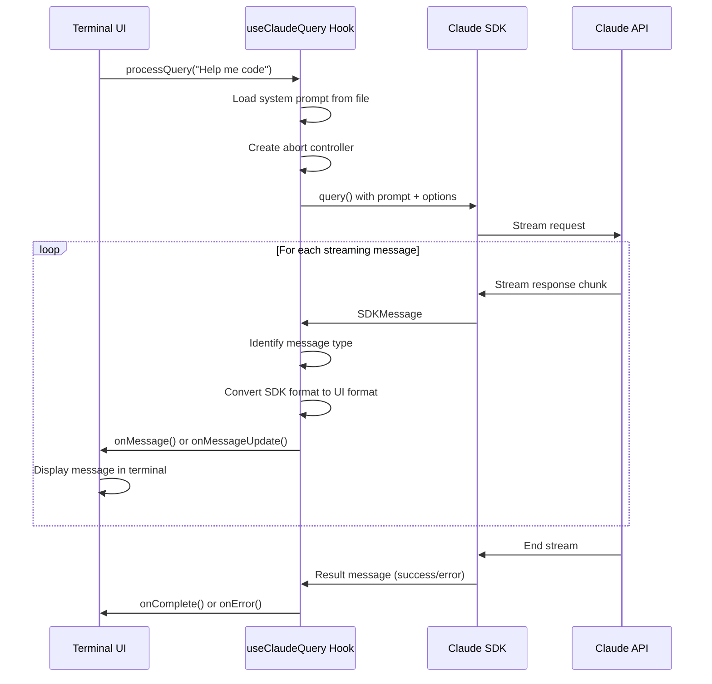

# Chapter 2: Claude SDK Integration

Building on Chapter 1's React-based Terminal UI, we now explore the heart of the application: how it communicates with Claude through the SDK integration layer. Think of this as the universal translator between your user interface and Claude's AI brain.

## The Translation Problem

Imagine you're ordering food at a restaurant where the menu is in a language you don't speak, and the waiter only speaks that language. You need a translator who can:
- Take your English order and convert it to the local language
- Listen to the waiter's responses and translate them back to English
- Handle interruptions (like changing your order mid-conversation)
- Remember the conversation context so you don't repeat yourself

This is exactly what the Claude SDK Integration does - it translates between your terminal UI and Claude's API, managing the complex conversation flow in between.

## Basic Usage

The simplest way to understand this integration is through its main hook, `useClaudeQuery`. Here's how the chat application uses it:

```typescript
const { processQuery } = useClaudeQuery({
  onMessage: addMessage,
  onMessageUpdate: updateMessage,
  onAssistantUpdate: updateLastAssistantMessage,
  onComplete: () => setProcessing(false),
  onError: (error) => setError(error.message),
});

// When user types something, send it to Claude
processQuery("Help me write a Python script");
```

As seen in `src/ui/components/chat/ChatApp.tsx:31-44`, the integration expects callback functions that handle different types of responses. When you call `processQuery`, it:
1. Sends your message to Claude
2. Streams back the response in real-time
3. Calls your callbacks as different types of messages arrive
4. Handles tool usage (like file operations) automatically

## Key Concepts

### Message Flow Architecture

The integration handles four distinct types of messages from Claude's SDK:

```typescript
// System messages - initialization and setup
if (isSystemMessage(message)) {
  // Handle system initialization
}
// User messages - typically tool results  
else if (isUserMessage(message)) {
  // Process tool results and update UI
}
// Assistant messages - Claude's responses
else if (isAssistantMessage(message)) {
  // Convert and display Claude's text/tool usage
}
// Result messages - completion status
else if (isResultMessage(message)) {
  // Handle success, errors, or max turns reached
}
```

### Session Management

Unlike a simple API call, Claude conversations maintain context across multiple exchanges. The integration handles this through session persistence:

```typescript
const sessionIdRef = useRef<string | null>(null);

// Capture session ID from first message
if (!sessionIdRef.current && 'session_id' in message) {
  sessionIdRef.current = message.session_id;
}

// Resume existing conversations
...(sessionIdRef.current && { resume: sessionIdRef.current })
```

### Tool Usage Tracking

When Claude uses tools (like reading files or running commands), the integration maps tool requests to UI messages and tracks their results:

```typescript
const toolUseToMessageIdRef = useRef<Map<string, string>>(new Map());

// Store mapping when tool is used
toolUseToMessageId.set(uiMessage.id, uiMessage.id);

// Update message when tool completes
onMessageUpdate(existingMessageId, {
  toolUse: {
    result: formattedContent,
    status: 'completed',
  },
});
```

## Under the Hood

Here's the complete flow when you send a message to Claude:



The core query loop in `src/ui/hooks/useClaudeQuery.ts:66-93` configures Claude with specific tools and settings:

```typescript
for await (const message of query({
  prompt: userMessage,
  abortController: abortControllerRef.current,
  options: {
    customSystemPrompt: systemPrompt,
    allowedTools: ['Write', 'Read', 'LS', 'Glob', /* ... */],
    cwd: process.cwd(),
    model: modelConfig.model,
    ...(sessionIdRef.current && { resume: sessionIdRef.current }),
  },
}))
```

Each streaming message gets processed through type-safe adapters (as defined in `src/types/adapters.ts:19-32`) that convert Claude's SDK format into the terminal UI's message format.

## Configuration Layer

The integration relies on a configuration system that manages model selection and environment variables:

```typescript
// src/config.ts:17-22
export function getModelConfig(): ModelConfig {
  return {
    ...DEFAULT_MODEL_CONFIG,
    model: env.CLAUDE_MODEL, // From environment variables
  };
}
```

Environment configuration uses Zod validation (`src/env.ts:4-20`) to ensure proper model names and settings are provided, with sensible defaults for development.

## Integration with Other Components

The Claude SDK Integration serves as the bridge between several other system components:

- **[Chapter 1: React-based Terminal UI](./chapter-1.md)** - Receives callbacks to update the terminal display
- **Chapter 3: Schema Validation Framework** - Uses schemas to validate and format tool results  
- **Chapter 4: Message and Chat System** - Converts between SDK message format and UI message format
- **Chapter 5: Tool Integration Layer** - Manages the allowed tools Claude can use

The integration imports message adapters, tool result schemas, and logging utilities, creating a cohesive system where each component has a clear responsibility.

## Conclusion

The Claude SDK Integration acts as the sophisticated translator and session manager that makes natural conversation with Claude possible. It handles the complex streaming protocol, manages conversation context, tracks tool usage, and provides clean callbacks for the UI layer.

This abstraction allows the terminal interface to focus purely on display logic while the integration handles all the intricacies of AI communication. In **Chapter 3: Schema Validation Framework**, we'll explore how the system ensures all data flowing through these integrations maintains the correct structure and format.