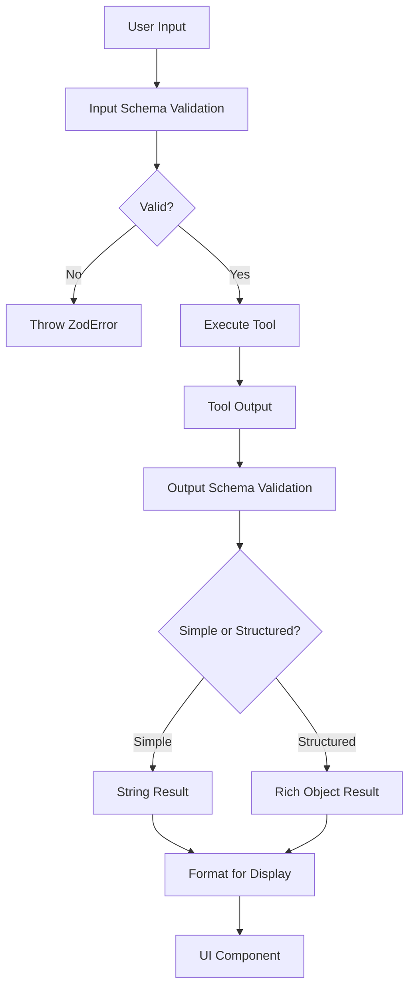

# Chapter 3: Schema Validation Framework

Building on our [React-based Terminal UI](chapter-2.md), we now need to ensure that all the data flowing through our application is correct and consistent. This is where the Schema Validation Framework comes in - it's like having a quality control inspector that checks every piece of data before it gets processed.

## The Problem: Data Integrity Chaos

Imagine you're running a restaurant kitchen. Without proper quality control, you might serve undercooked chicken, spoiled vegetables, or dishes missing key ingredients. Your customers would get sick, and your restaurant would fail. In software applications, unvalidated data creates similar chaos - tools crash with unexpected inputs, malformed results break the UI, and debugging becomes a nightmare.

The proto project handles complex data structures from multiple sources:
- Tool inputs that must match exact formats (`file_path` as string, `timeout` as number)
- Tool results with varying structures (strings, objects, arrays)
- YAML configurations that define abstractions and relationships
- User interactions that could send any type of data

Without validation, any of these could break the entire system.

## Basic Usage: Your First Schema

Let's start with the simplest possible example from `src/schemas/tools.ts:20`:

```typescript
import { z } from 'zod';

// Define what a valid Read tool input looks like
const ReadToolSchema = z.object({
  file_path: z.string().describe('The absolute path to the file to read'),
  limit: z.number().optional().describe('The number of lines to read'),
  offset: z.number().optional().describe('The line number to start reading from'),
});

// Now we can validate any data against this schema
const userInput = { file_path: "/Users/me/file.txt", limit: 10 };
const result = ReadToolSchema.parse(userInput); // ✅ Valid - returns typed data
```

If the data doesn't match, Zod throws a detailed error:

```typescript
const badInput = { file_path: 123, limit: "ten" }; // Wrong types!
ReadToolSchema.parse(badInput); // ❌ Throws ZodError with specific details
```

This simple pattern prevents runtime crashes and provides instant feedback about what went wrong.

## Key Concepts: The Three-Layer Validation System

The Schema Validation Framework operates at three distinct layers, each serving a specific purpose:

### Layer 1: Input Validation (Tools Schema)

This layer validates data going *into* tools. From `src/schemas/tools.ts:134`:

```typescript
export const ToolSchemas = {
  LS: LSToolSchema,
  Bash: BashToolSchema,
  Read: ReadToolSchema,
  Write: WriteToolSchema,
  // ... more tool schemas
} as const;
```

Each tool has strict requirements. The Bash tool schema from `src/schemas/tools.ts:10` shows how complex validation can be:

```typescript
const BashToolSchema = z.object({
  command: z.string().describe('The command to execute'),
  description: z.string().optional().describe('Clear, concise description'),
  timeout: z.number().max(600000).optional().describe('Optional timeout in milliseconds'),
});
```

Notice the `max(600000)` constraint - this prevents users from setting absurdly long timeouts that could hang the system.

### Layer 2: Output Validation (Simple Results)

This layer handles basic string outputs from tools. From `src/schemas/toolResults.ts:35`:

```typescript
export const toolResultSchemas = {
  Bash: BashResultSchema,    // z.string()
  Read: ReadResultSchema,    // z.string()
  Write: WriteResultSchema,  // z.string()
  // ... more schemas
} as const;
```

Most tools return simple strings, but the Task tool is special - it can return complex structures using a union type from `src/schemas/toolResults.ts:25`:

```typescript
export const TaskResultSchema = z.union([
  z.string(),                    // Simple text response
  z.object({                     // Structured response
    description: z.string().optional(),
    result: z.unknown(),
  }),
  z.unknown(),                   // Fallback for anything else
]);
```

### Layer 3: Structured Validation (Rich Results)

This layer provides detailed, structured data for the UI. From `src/schemas/toolResultsStructured.ts:34`:

```typescript
const BashToolResultSchema = z.object({
  stdout: z.string(),
  stderr: z.string(),
  exitCode: z.number(),
  executionTime: z.number(),
});
```

This transforms a simple string output into rich, queryable data that the UI can use for better error handling and user feedback.

## Under the Hood: The Validation Flow

Here's how data flows through the validation system:



Let's trace through a real example from `src/ui/hooks/useClaudeQuery.ts:125`:

```typescript
// Step 1: Parse raw tool result content
const parsed = parseToolResultContent('', toolResult.content);

// Step 2: Format for display with length limits
const formattedContent = formatToolResultContent(parsed.data);

// Step 3: Update UI with validated data
onMessageUpdate(existingMessageId, {
  toolUse: {
    result: formattedContent,
    status: 'completed',
  },
});
```

The `parseToolResultContent` function from `src/schemas/toolResults.ts:64` demonstrates safe parsing:

```typescript
export function parseToolResultContent(
  toolName: string,
  content: unknown,
): { success: boolean; data: unknown; error?: z.ZodError } {
  const schema = toolResultSchemas[toolName as ToolName];
  
  if (!schema) {
    return { success: true, data: content }; // Unknown tool, pass through
  }
  
  const result = schema.safeParse(content);
  if (result.success) {
    return { success: true, data: result.data };
  }
  return { success: false, data: content, error: result.error };
}
```

Notice the `safeParse` method - this never throws exceptions, allowing graceful error handling.

## Integration with Other Systems

The Schema Validation Framework connects deeply with other parts of the application:

### Tool Integration Layer
As we'll see in [Chapter 5: Tool Integration Layer](chapter-5.md), every tool call goes through schema validation before execution.

### UI Components
The structured parsers in `src/ui/components/tools/parsers/index.ts:18` transform validated data into UI-friendly formats:

```typescript
export function parseReadResult(rawResult: string): ReadToolResult | undefined {
  if (!rawResult) return undefined;
  
  const lines = rawResult.split('\n');
  return {
    content: rawResult,
    lineCount: lines.length,
    charCount: rawResult.length,
    encoding: 'utf-8',
    truncated: false,
  };
}
```

### Content Analysis Framework
Chapter generation uses strict schema validation for YAML configuration files, as seen in `src/chapter-generator.ts:16`:

```typescript
const AbstractionSchema = z.object({
  name: z.string(),
  description: z.string(),
  file_paths: z.array(z.string()),
});
```

This ensures that configuration files are always valid before processing begins.

## Conclusion

The Schema Validation Framework acts as the guardian of data integrity throughout the proto application. It catches errors early, provides clear feedback, and ensures that every component receives exactly the data it expects. This foundation of trust allows other systems to operate confidently, knowing their inputs are always valid.

In the next chapter, we'll explore the [Message and Chat System](chapter-4.md) that relies heavily on this validation framework to ensure reliable communication between users and the AI assistant.