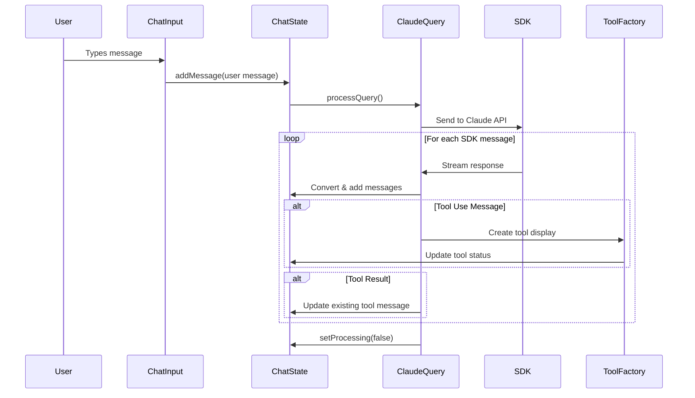

# Chapter 4: Message and Chat System

Think of the Message and Chat System as the sophisticated brain of a conversation - like a skilled moderator in a complex discussion who tracks who said what, when they said it, manages interruptions from tools, and maintains the flow of dialogue while everyone stays synchronized.

## The Conversation Problem

Imagine you're building a chat application where users talk to Claude, but it's not just simple back-and-forth messaging. When Claude needs to use tools like reading files or running commands, these tool operations need to be seamlessly woven into the conversation flow. The system needs to track:

- Who's speaking (user, assistant, system, or tool)
- What tools are being used and their current status
- Real-time updates as tools execute
- Conversation history with proper ordering
- Input handling with rich keyboard shortcuts

This system solves the challenge of orchestrating a complex conversation where multiple actors (user, Claude, and tools) participate in a structured dialogue.

## Basic Usage

At its core, the system starts with simple message creation as seen in `src/types/chat.ts:10`:

```typescript
interface Message {
  id: string;
  role: 'user' | 'assistant' | 'system' | 'tool';
  content: string;
  timestamp: Date;
  toolUse?: ToolUse;
  parentToolUseId?: string;
}
```

Here's how a basic conversation flows in `src/ui/components/chat/ChatApp.tsx:16`:

```typescript
const handleSubmit = useCallback(
  async (userMessage: string) => {
    addMessage({ role: 'user', content: userMessage });
    setProcessing(true);
    setError(undefined);
  },
  [addMessage, setProcessing, setError],
);
```

The system immediately adds the user's message to the conversation and begins processing.

## Key Concepts

### Message Roles and Types

The system recognizes four distinct conversation participants as defined in `src/types/chat.ts:12`:

- **User**: Human input messages
- **Assistant**: Claude's responses 
- **System**: Internal status and error messages
- **Tool**: Tool execution notifications and results

### Tool Integration

When Claude needs to use a tool, the system creates special tool messages with tracking information from `src/types/chat.ts:3`:

```typescript
interface ToolUse {
  name: string;
  input?: unknown;
  result?: string;
  status?: ToolStatus; // 'pending' | 'in_progress' | 'completed'
}
```

### State Management

The chat state encompasses the entire conversation context as shown in `src/types/chat.ts:19`:

```typescript
interface ChatState {
  messages: Message[];
  currentInput: string;
  isProcessing: boolean;
  error?: string;
  cursorPosition: number;
}
```

## Under the Hood

The system operates through a sophisticated message flow that handles real-time conversation updates:



The core state management happens in `src/ui/hooks/useChatState.ts:21` with the `addMessage` function:

```typescript
const addMessage = useCallback(
  (message: Omit<Message, 'timestamp'> | Omit<Message, 'id' | 'timestamp'>) => {
    const messageId = 'id' in message ? message.id : Date.now().toString();
    const newMessage: Message = {
      id: messageId,
      role: message.role,
      content: message.content,
      timestamp: new Date(),
    };
    
    setState((prev) => ({
      ...prev,
      messages: [...prev.messages, newMessage],
    }));
  },
  [],
);
```

### Message Adaptation

The system uses sophisticated adapters to convert between SDK message formats and UI message formats. The `sdkMessageToUIMessage` function in `src/types/adapters.ts:19` handles this conversion:

```typescript
export function sdkMessageToUIMessage(sdkMessage: SDKMessage): Message | Message[] | null {
  switch (sdkMessage.type) {
    case 'assistant':
      return convertAssistantMessage(sdkMessage);
    case 'user':
      return convertUserMessage(sdkMessage);
    // ... other cases
  }
}
```

### Advanced Input Handling

The input system provides rich text editing capabilities with platform-specific keyboard shortcuts in `src/ui/hooks/useChatInput.ts:98`:

```typescript
useInput((input, key) => {
  // Handle clipboard operations
  const isClipboardModifier = isMacOS ? key.meta : key.ctrl;
  
  if (isClipboardModifier && input === 'v') {
    // Paste from clipboard
    const clipboardText = pasteFromClipboard();
    const newValue = state.value.slice(0, state.cursorPosition) + 
                    clipboardText + 
                    state.value.slice(state.cursorPosition);
    updateInput(newValue, state.cursorPosition + clipboardText.length);
  }
});
```

## Integration

The Message and Chat System integrates tightly with other system components:

- **Schema Validation Framework** (Chapter 3): Validates message structure and tool inputs
- **Tool Integration Layer** (Chapter 5): Manages tool execution states and results  
- **React-based Terminal UI** (Chapter 1): Renders messages with appropriate formatting

The system brings these components together in `src/ui/components/chat/ChatApp.tsx:47`:

```typescript
React.useEffect(() => {
  const lastMessage = state.messages[state.messages.length - 1];
  if (lastMessage?.role === 'user' && state.isProcessing) {
    processQuery(lastMessage.content);
  }
}, [state.messages, state.isProcessing, processQuery]);
```

## Conclusion

The Message and Chat System serves as the central nervous system for human-AI conversation, elegantly handling the complexity of multi-participant dialogue with tool integration. It transforms what could be chaotic message streams into structured, trackable conversations where every interaction - whether human input, AI response, or tool execution - has its proper place and timing.

This foundation enables the Tool Integration Layer (Chapter 5) to seamlessly execute and display tool operations within the conversation flow, creating a unified experience where tools feel like natural participants in the dialogue rather than external interruptions.