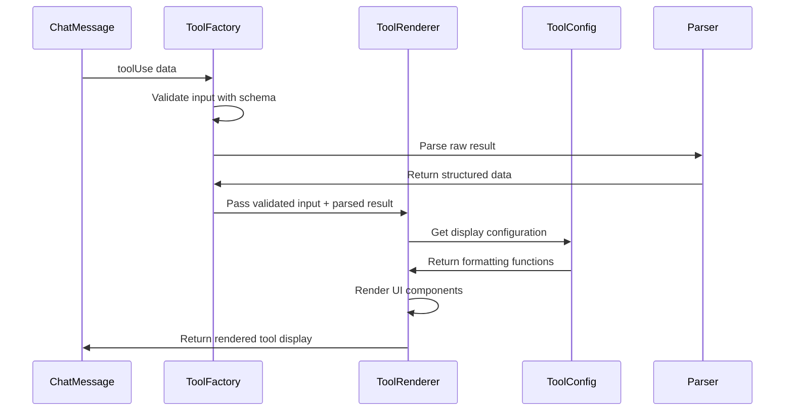

# Chapter 5: Tool Integration Layer

Think of the Tool Integration Layer as a universal translator and display manager for Claude's toolbox. Just like how a mechanic's toolbox contains various tools (wrench, screwdriver, hammer), Claude has different capabilities (reading files, running commands, searching code) - and each tool works differently and produces different output formats. The Tool Integration Layer creates a consistent way to handle all these tools, making sure they're displayed properly and their results are parsed correctly.

## The Problem: Tool Chaos

Without a tool integration system, displaying tool usage would be messy. Consider what happens when Claude uses the `Read` tool versus the `Bash` tool:

- `Read` returns file content with line numbers
- `Bash` returns command output with exit codes
- Both need different formatting and parsing logic

The Tool Integration Layer solves this by providing:
- **Consistent UI rendering** for all tools
- **Type-safe input validation** using Zod schemas
- **Smart result parsing** that extracts meaningful data
- **Unified status tracking** (pending, in progress, completed)

## Basic Usage

Here's how a tool gets rendered when Claude reads a file:

```tsx
// From ChatMessage.tsx:44
<ToolFactory
  toolUse={message.toolUse}
  startTime={message.timestamp}
  isExpanded={shouldAutoExpand}
/>
```

The `ToolFactory` acts like a smart factory that:
1. Identifies the tool type (`Read`, `Bash`, `Edit`, etc.)
2. Validates the input using the appropriate schema
3. Parses the result using tool-specific logic
4. Renders it with the right UI components

## Key Concepts

### Tool Configuration

Each tool has a configuration that defines how it behaves:

```tsx
// From toolConfigs.tsx:56
Read: {
  name: 'Read',
  autoExpand: true,
  formatInput: (input) => getRelativePath(input.file_path),
  getSummary: (_input, result, parsedResult) => {
    return `Read ${parsedResult.lineCount} lines (${formatBytes(parsedResult.charCount)})`;
  },
  renderResult: (rawResult) => <CodeBlock content={rawResult} />
}
```

This configuration tells the system:
- **autoExpand**: Show the full content automatically
- **formatInput**: Display `./src/file.ts` instead of the full path
- **getSummary**: Show "Read 45 lines (2.1KB)" as a summary
- **renderResult**: Display the content in a syntax-highlighted code block

### Schema Validation

Every tool input is validated using Zod schemas:

```tsx
// From ToolFactory.tsx:35
const result = schema.safeParse(toolUse.input);
if (result.success) {
  validatedInput = result.data;
} else {
  validationError = result.error;
}
```

This ensures type safety and catches invalid inputs before they reach the tool renderer.

### Result Parsing

Raw tool results get parsed into structured data:

```tsx
// From parsers/index.ts:19
export function parseReadResult(rawResult: string) {
  const lines = rawResult.split('\n');
  return {
    content: rawResult,
    lineCount: lines.length,
    charCount: rawResult.length,
    truncated: false
  };
}
```

This transforms raw text into useful metadata that the UI can display meaningfully.

## Under the Hood

The Tool Integration Layer follows this sequence:



Here's what happens step by step:

1. **Tool Recognition**: `ToolFactory` checks if the tool name exists in `ToolSchemas` (src/ui/components/tools/ToolFactory.tsx:24)
2. **Input Validation**: The tool's input gets validated against its Zod schema (src/ui/components/tools/ToolFactory.tsx:35)
3. **Result Parsing**: If there's a custom parser, it transforms the raw result into structured data (src/ui/components/tools/ToolFactory.tsx:46)
4. **Configuration Lookup**: `ToolRenderer` gets the tool's display configuration (src/ui/components/tools/ToolRenderer.tsx:34)
5. **UI Rendering**: The tool gets rendered with status indicators, summaries, and formatted content (src/ui/components/tools/ToolRenderer.tsx:84)

## Integration with Other Systems

The Tool Integration Layer connects to several other abstractions:

- **[Schema Validation Framework](#)**: Uses Zod schemas from `src/schemas/tools.ts` to validate tool inputs
- **[React-based Terminal UI](#)**: Renders tools using Ink components with consistent styling
- **[Message and Chat System](#)**: Receives tool usage data through the chat message flow

The system is designed to be extensible - adding a new tool requires:
1. Creating a schema in `src/schemas/tools.ts`
2. Adding a configuration in `src/ui/components/tools/toolConfigs.tsx`
3. Optionally creating a custom parser in `src/ui/components/tools/parsers/index.ts`

## Conclusion

The Tool Integration Layer transforms chaotic tool outputs into a consistent, beautiful terminal interface. It handles the complexity of different tool types while providing type safety and extensibility. This abstraction ensures that whether Claude is reading files, running commands, or searching code, users see a unified and informative display.

Next, we'll explore the **[Content Analysis Framework](#)** which analyzes and processes the data that flows through these tool integrations.