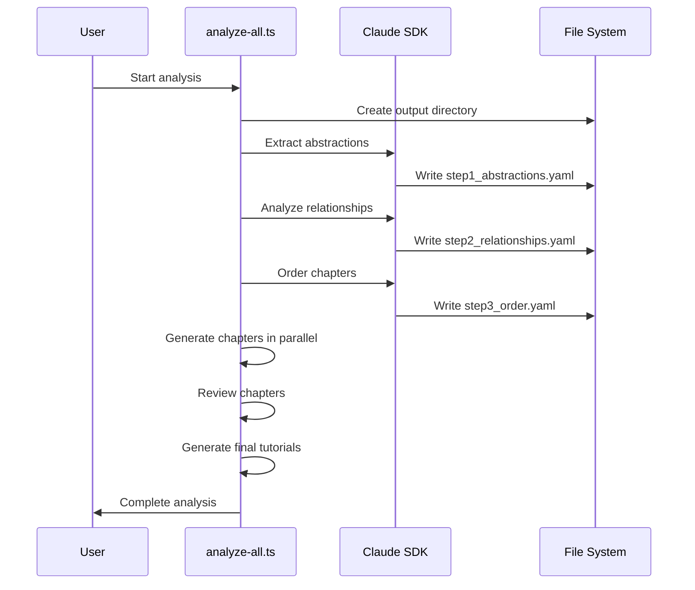

# Chapter 6: Content Analysis Framework

Building on the [Tool Integration Layer](chapter-5.md) that handles external tool interactions, we now explore the Content Analysis Framework - the intelligent system that excavates meaning from codebases like an archaeological expedition.

## The Problem: Making Sense of Complex Code

Imagine you're a detective trying to solve a mystery in a vast library. The books are scattered everywhere, written in different languages, and contain interconnected clues. You need to find the most important pieces, understand how they relate to each other, and determine the best order to present them to someone else. This is exactly what the Content Analysis Framework does for codebases.

In `src/analyze-all.ts:78-84`, we see the framework's first phase - extracting core abstractions:

```typescript
// Step 1: Extract core abstractions
console.log("\n=== Step 1/5: Extracting Core Abstractions ===");
const abstractionsPrompt = resolve(process.cwd(), "prompts/1-abstractions.md");
const abstractionsOutput = join(outputDir, "step1_abstractions.yaml");
await runPrompt(abstractionsPrompt, projectDir, {
  OUTPUT_PATH: abstractionsOutput
});
```

## Basic Usage

The simplest way to see the Content Analysis Framework in action is through the main entry point:

```typescript
import { runPrompt } from './analyze-all.js';

// Analyze a project's abstractions
await runPrompt(
  'prompts/1-abstractions.md',
  '/path/to/project',
  { OUTPUT_PATH: 'output/abstractions.yaml' }
);
```

This single function call triggers the framework to examine your entire codebase, identify the most important concepts, and save them in a structured format. The output will be a YAML file containing 5-15 core abstractions that newcomers need to understand.

## Key Concepts

### 1. Multi-Phase Analysis Pipeline

The framework operates through six distinct phases, each building on the previous one:

```typescript
// As seen in src/analyze-all.ts:78-157
// Phase 1: Extract abstractions
// Phase 2: Analyze relationships  
// Phase 3: Order chapters
// Phase 4: Generate chapters
// Phase 5: Review chapters
// Phase 6: Generate tutorials
```

Think of this like an assembly line where each station adds more intelligence to the analysis.

### 2. Abstraction Schema Validation

The framework uses strongly-typed schemas to ensure data quality:

```typescript
// From src/chapter-generator.ts:16-20
const AbstractionSchema = z.object({
  name: z.string(),
  description: z.string(),
  file_paths: z.array(z.string()),
});
```

This acts like a quality control checkpoint, ensuring every abstraction has a name, description, and associated file paths.

### 3. Dynamic Prompt Interpolation

The framework dynamically customizes prompts with project-specific variables:

```typescript
// From src/chapter-generator.ts:204-216
const prompt = promptTemplate
  .replace(/{project_name}/g, projectName)
  .replace(/{abstraction_name}/g, abstraction.name.trim())
  .replace(/{chapter_num}/g, chapterNum.toString())
  .replace(/{abstraction_description}/g, abstraction.description.trim());
```

This is like having a template letter that automatically fills in the recipient's name and details.

## Under the Hood

The Content Analysis Framework follows this sequence:



The core intelligence happens in the `runPrompt` function (src/analyze-all.ts:11-43), which:

1. **Loads prompt templates** from markdown files
2. **Interpolates variables** like project paths and output locations
3. **Invokes Claude SDK** with specific tool permissions
4. **Monitors progress** and costs throughout the process

Each phase has specific tools enabled - for example, the abstraction extraction phase allows "Write", "Read", "LS", "Glob", "Grep", "Edit", and "Bash" tools, giving Claude the ability to explore the codebase thoroughly.

## Integration with Other Systems

The Content Analysis Framework seamlessly connects with other abstractions:

- **Chapter Generator** (`src/chapter-generator.ts`): Consumes the analysis outputs to generate educational content
- **Message Logger** (`src/utils/messageLogger.ts`): Records all SDK interactions for debugging and analysis
- **Tool Integration Layer**: Uses the same tool framework to enable codebase exploration

The framework outputs structured YAML files that serve as the foundation for the entire tutorial generation pipeline:

```typescript
// From src/chapter-generator.ts:151-154
private async readAbstractions(): Promise<z.infer<typeof AbstractionsYamlSchema>> {
  const content = await readFile(this.options.abstractionsPath, 'utf-8');
  const data = yaml.parse(content);
  return AbstractionsYamlSchema.parse(data);
}
```

## Conclusion

The Content Analysis Framework transforms the overwhelming task of understanding complex codebases into a systematic, intelligent process. By breaking down analysis into phases and leveraging AI to identify patterns and relationships, it creates the foundation for effective learning materials.

This framework demonstrates how AI can be used not just to generate content, but to analyze and structure information in ways that make complex systems more accessible to newcomers. In the next chapter, we'll explore the [Prompt Template System](chapter-7.md) that powers these AI interactions.