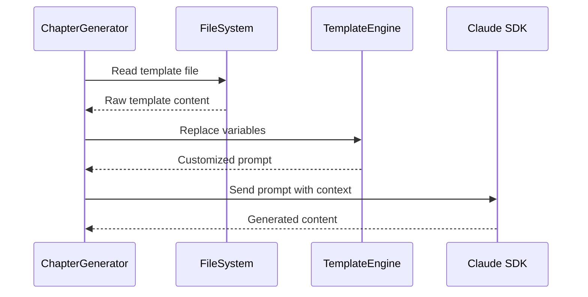

# Chapter 7: Prompt Template System

In [Chapter 6: Content Analysis Framework](chapter_6_content_analysis_framework.md), we explored how the project analyzes codebases to extract meaningful abstractions and relationships. Now we'll discover how this system orchestrates AI-powered content generation through a sophisticated prompt template system.

## The Recipe Book Problem

Imagine you're running a busy restaurant with multiple chefs who need to create different types of dishes throughout the day. Each chef needs precise, detailed instructions for their specific phase of cooking - one for prep work, another for main course preparation, another for dessert, and so on. You can't just give them a generic "cook food" instruction; each phase requires its own carefully crafted recipe with specific ingredients, techniques, and timing.

This is exactly the challenge this project faces when generating tutorial content. The system needs to guide Claude through six distinct phases of tutorial creation, each requiring different types of analysis, different outputs, and different levels of detail. The Prompt Template System solves this by providing a structured, modular approach to managing AI prompts across the entire workflow.

## Basic Usage

The simplest way to see the prompt template system in action is through the chapter generation process:

```typescript
// Read the prompt template
const promptTemplate = await readFile('prompts/4-write-chapters.md', 'utf-8');

// Interpolate variables into the template
const prompt = promptTemplate
  .replace(/{project_name}/g, 'proto')
  .replace(/{abstraction_name}/g, 'Prompt Template System')
  .replace(/{chapter_num}/g, '7')
  .replace(/{abstraction_description}/g, 'Manages AI prompts across workflow phases');
```

This example shows how the system takes a template file and dynamically replaces placeholders with actual project data, creating a customized prompt for each specific generation task.

## Key Concepts

### Template Structure

Each prompt template follows a consistent structure with variable placeholders:

```markdown
# {abstraction_name} Analysis

## Project Context
- **Project**: {project_name}
- **Location**: {project_root_path}
- **Chapter**: {chapter_num}
```

The system uses curly brace notation `{variable_name}` to mark interpolation points that get replaced with actual values during generation.

### Variable Interpolation

The core of the system is the variable replacement mechanism found in `src/chapter-generator.ts:204-216`:

```typescript
const prompt = promptTemplate
  .replace(/{project_name}/g, projectName)
  .replace(/{abstraction_name}/g, abstraction.name.trim())
  .replace(/{chapter_num}/g, chapterNum.toString())
  .replace(/{project_root_path}/g, projectRootPath)
  .replace(/{abstraction_description}/g, abstraction.description.trim());
```

This pattern ensures that every generated prompt is customized with the specific context needed for that particular generation task.

### Template Specialization

Different workflow phases use specialized templates:

- **Phase 1**: `prompts/1-abstractions.md` - Focuses on codebase analysis
- **Phase 4**: `prompts/4-write-chapters.md` - Emphasizes tutorial writing
- **Phase 5**: `prompts/5-review-chapters.md` - Concentrates on content improvement
- **Phase 6**: `prompts/6-tutorials.md` - Generates interactive exercises

Each template contains phase-specific instructions, output requirements, and examples tailored to that stage of the workflow.

## Under the Hood

The prompt template system operates through a carefully orchestrated sequence:



Let's trace through what happens when generating a chapter:

1. **Template Loading**: The system reads the appropriate template file from the `prompts/` directory
2. **Context Preparation**: It gathers all necessary variables like project name, abstraction details, and chapter information
3. **Variable Replacement**: Using regex patterns, it replaces all `{variable_name}` placeholders with actual values
4. **Prompt Delivery**: The customized prompt is sent to Claude with appropriate tool permissions and working directory context

The most sophisticated part is the variable preparation logic in `src/chapter-generator.ts:177-216`, which handles complex contextual information like previous chapter summaries and full chapter listings.

## Integration

The Prompt Template System serves as the central nervous system connecting all other components:

- **[Chapter 0: Workflow Orchestration](chapter_0_workflow_orchestration.md)** - Coordinates which templates to use for each phase
- **[Chapter 2: Claude SDK Integration](chapter_2_claude_sdk_integration.md)** - Delivers the interpolated prompts to Claude
- **[Chapter 3: Schema Validation Framework](chapter_3_schema_validation_framework.md)** - Ensures template variables match expected data structures
- **[Chapter 9: File Generation Utilities](chapter_9_file_generation_utilities.md)** - Manages template file paths and output locations

The system is designed for modularity, allowing each generator class to customize its template interpolation while maintaining consistent patterns. For example, both `ChapterGenerator` and `TutorialGenerator` share similar variable replacement logic but with different sets of variables appropriate to their specific tasks.

## Conclusion

The Prompt Template System demonstrates how complex AI workflows can be managed through modular, reusable components. By separating the prompt content from the generation logic, the system achieves both flexibility and consistency across all phases of tutorial creation. This approach allows each phase to have precisely tailored instructions while maintaining a unified architecture.

Understanding this system prepares you for [Chapter 8: Chapter Generation Pipeline](chapter_8_chapter_generation_pipeline.md), where we'll see how these templates are used to orchestrate the parallel generation of multiple tutorial chapters.