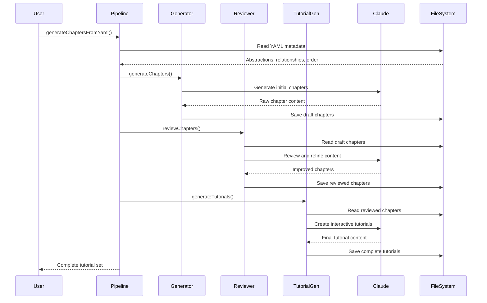

# Chapter 8: Chapter Generation Pipeline

Building on the [Prompt Template System](chapter_7_prompt_template_system.md), the next critical piece of our tutorial generation workflow is the Chapter Generation Pipeline. Think of this as the beating heart of educational content creation - a sophisticated assembly line that transforms raw code abstractions into structured, beginner-friendly tutorial chapters.

## The Assembly Line Analogy

Imagine a car manufacturing plant where raw materials enter one end and finished vehicles emerge from the other. The Chapter Generation Pipeline works similarly, but instead of steel and rubber, it processes code abstractions and metadata to produce educational content.

Here's what flows through our pipeline:
- **Raw Materials**: YAML files containing abstractions, relationships, and chapter ordering
- **Template**: Prompt templates that define the structure and style
- **AI Processing**: Claude SDK integration for intelligent content generation
- **Quality Control**: File existence checks and parallel processing management
- **Final Product**: Structured markdown tutorial chapters

## Basic Usage

Let's start with the simplest possible example from `src/chapter-generator.ts:252`:

```typescript
import { generateChaptersFromYaml } from './chapter-generator';

await generateChaptersFromYaml(
  'abstractions.yaml',     // Input: code abstractions
  'relationships.yaml',    // Input: how they connect
  'chapter_order.yaml',   // Input: tutorial sequence
  './output/chapters',    // Output: where to save chapters
  'chapter_template.md',  // Template: how to structure content
  '/path/to/project'     // Context: project root for code analysis
);
```

This single function call orchestrates the entire chapter generation process. The pipeline reads your project metadata, applies intelligent templating, and produces a complete set of tutorial chapters ready for learners.

## Key Concepts

### The Three-Stage Pipeline

The Chapter Generation Pipeline actually consists of three interconnected processors, each handling a different phase of content creation:

#### 1. Initial Generation (ChapterGenerator)
The `ChapterGenerator` class reads abstractions and creates the first draft of each chapter. As seen in `src/chapter-generator.ts:57`, it operates like a content factory:

```typescript
export class ChapterGenerator {
  async generateChapters(): Promise<void> {
    const abstractions = await this.readAbstractions();
    const chapterOrder = await this.readChapterOrder();
    
    // Generate all chapters in parallel
    const chapterPromises = sortedChapters.map(async (chapter) => {
      const chapterContent = await this.generateChapter(
        abstraction, chapterNum, abstractions, 
        chapterOrder, [], promptTemplate
      );
      await writeFile(chapterPath, chapterContent, 'utf-8');
    });
  }
}
```

#### 2. Quality Review (ChapterReviewer)
The `ChapterReviewer` class takes generated chapters and refines them for clarity and accuracy. From `src/chapter-reviewer.ts:43`, it acts as an editorial layer:

```typescript
export class ChapterReviewer {
  async reviewChapters(): Promise<void> {
    const chapterFiles = await this.getChapterFiles();
    
    // Review all chapters in parallel
    const reviewPromises = chapterFiles.map(async (chapterFile) => {
      const originalContent = await readFile(originalChapterPath, 'utf-8');
      const reviewedContent = await this.reviewChapter(
        abstraction, chapterNum, originalContent, 
        fullChapterListing, promptTemplate
      );
    });
  }
}
```

#### 3. Tutorial Generation (TutorialGenerator)
The `TutorialGenerator` class transforms reviewed chapters into interactive, hands-on tutorials. Looking at `src/tutorial-generator.ts:44`, it adds the final interactive layer:

```typescript
export class TutorialGenerator {
  async generateTutorials(): Promise<void> {
    const reviewedChapterContent = await readFile(reviewedChapterPath, 'utf-8');
    const tutorialContent = await this.generateTutorial(
      abstraction, chapterNum, reviewedChapterContent,
      fullChapterListing, promptTemplate
    );
  }
}
```

### Template Interpolation Magic

Each stage uses sophisticated template interpolation to customize content. From `src/chapter-generator.ts:203`, the system replaces placeholders with project-specific data:

```typescript
const prompt = promptTemplate
  .replace(/{project_name}/g, projectName)
  .replace(/{abstraction_name}/g, abstraction.name.trim())
  .replace(/{chapter_num}/g, chapterNum.toString())
  .replace(/{abstraction_description}/g, abstraction.description.trim())
  .replace(/{abstraction_file_paths}/g, abstraction.file_paths.join(', '));
```

This transforms generic templates into project-specific prompts that guide the AI to generate relevant, contextual content.

### Parallel Processing Architecture

One of the pipeline's most impressive features is its parallel processing capability. As demonstrated in `src/chapter-generator.ts:84`, it generates multiple chapters simultaneously:

```typescript
// Generate all chapters in parallel
const chapterPromises = sortedChapters.map(async (chapter) => {
  // Each chapter processes independently
  return this.generateChapter(abstraction, ...);
});

const chapterResults = await Promise.all(chapterPromises);
```

This approach dramatically reduces generation time while maintaining quality through careful resource management.

## Under the Hood

Let's trace through the complete pipeline flow:



### The Generation Process

Each chapter goes through a sophisticated generation process. Looking at `src/chapter-generator.ts:169`, the `generateChapter` method:

1. **Prepares Context**: Builds chapter listings and previous chapter summaries
2. **Interpolates Templates**: Injects project-specific variables into the prompt template
3. **Calls Claude SDK**: Uses the AI to generate content based on actual code analysis
4. **Handles Errors**: Manages abort controllers and cleanup for reliable operation

The AI has access to powerful tools like 'Read', 'LS', 'Glob', and 'Grep' to analyze your actual codebase while generating content, ensuring accuracy and relevance.

### File Management Strategy

The pipeline implements sophisticated file management through utilities in `src/utils/file-generation.ts:14`. The `checkFileExists` function prevents unnecessary regeneration:

```typescript
export function checkFileExists(filePath: string, options: FileGenerationOptions): FileExistenceCheck {
  const exists = existsSync(filePath);
  const shouldSkip = exists && !options.overwrite && !options.force;
  return { exists, path: filePath, shouldSkip };
}
```

This allows developers to run the pipeline repeatedly without wasting time regenerating unchanged content.

## Integration

The Chapter Generation Pipeline integrates seamlessly with other system components. From the main workflow in `src/analyze-all.ts:122`, you can see how it fits into the broader tutorial creation process:

```typescript
// Step 4: Generate chapters
await generateChaptersFromYaml(
  abstractionsOutput,     // From abstraction analysis
  relationshipsOutput,    // From relationship mapping  
  chapterOrderOutput,     // From chapter ordering
  chaptersDir,           // Coordinated output structure
  promptTemplatePath,    // From prompt template system
  projectDir            // Project context
);
```

The pipeline consumes outputs from the [Content Analysis Framework](chapter_6_content_analysis_framework.md) and [Prompt Template System](chapter_7_prompt_template_system.md), then feeds its results to subsequent review and tutorial generation stages.

Progress tracking integrates with the [React-based Terminal UI](chapter_1_react_based_terminal_ui.md) through callback functions that provide real-time updates:

```typescript
onProgress?: (message: string, type: 'skip' | 'generate' | 'complete') => void
```

## Conclusion

The Chapter Generation Pipeline represents the sophisticated orchestration of AI, templates, and parallel processing to transform code analysis into educational content. It bridges the gap between technical documentation and beginner-friendly tutorials, creating a scalable system for generating high-quality learning materials.

This pipeline's three-stage approach (generation → review → tutorial creation) ensures content quality while its parallel processing architecture maintains performance. The template interpolation system provides flexibility, while the file management utilities offer practical workflow efficiency.

Next, we'll explore the [File Generation Utilities](chapter_9_file_generation_utilities.md) that provide the foundational infrastructure supporting this entire content creation pipeline.