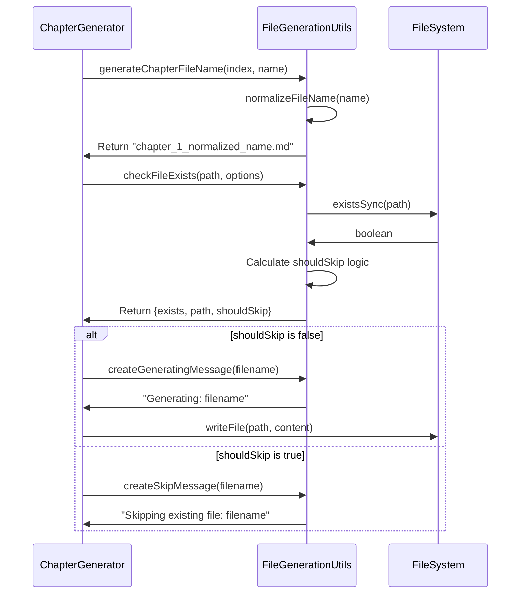

# Chapter 9: File Generation Utilities

Imagine you're organizing a massive digital library with thousands of books. You need a system that can automatically name books consistently, check if they already exist before creating duplicates, and manage different versions (original, reviewed, tutorial format). This is exactly what the File Generation Utilities do - they act as a smart librarian for our tutorial generation system.

## The Problem: File Management Chaos

When generating large numbers of tutorial files, several challenges emerge:

- **Inconsistent naming**: Chapter names like "React-based Terminal UI" vs "react_based_terminal_ui.md"
- **Accidental overwrites**: Losing hours of work by regenerating existing files
- **Manual directory management**: Creating folders and handling file existence checks
- **Version confusion**: Mixing up original chapters, reviewed versions, and final tutorials

As seen in `src/chapter-generator.ts:98`, the system needs to check file existence before generating content:

```typescript
const fileCheck = checkFileExists(chapterPath, this.options);
if (fileCheck.shouldSkip) {
  this.options.onProgress?.(createSkipMessage(chapterFileName), 'skip');
  return null;
}
```

## Basic Usage

The simplest file generation utility is filename normalization:

```typescript
import { normalizeFileName } from './utils/file-generation';

const messy = "React-based Terminal UI!";
const clean = normalizeFileName(messy);
// Result: "react_based_terminal_ui"
```

Here's what happens step by step:
1. Trim whitespace from both ends
2. Convert to lowercase
3. Replace spaces with underscores
4. Remove special characters (keeping only letters, numbers, underscores, hyphens)
5. Collapse multiple underscores into single ones

## Key Concepts

### File Existence Checking

The core safety mechanism prevents accidental overwrites:

```typescript
const fileCheck = checkFileExists('/path/to/file.md', { 
  overwrite: false,
  force: false 
});

if (fileCheck.shouldSkip) {
  console.log('File exists, skipping generation');
}
```

The `FileExistenceCheck` interface in `src/utils/file-generation.ts:8-12` returns three critical pieces of information:
- `exists`: Whether the file is already there
- `path`: The full file path being checked
- `shouldSkip`: The decision logic combining existence with user preferences

### Filename Generation Patterns

The system provides specialized generators for different content types:

```typescript
// Chapter files: chapter_1_react_based_terminal_ui.md
const chapterFile = generateChapterFileName(1, "React-based Terminal UI");

// Reviewed files: reviewed_chapter_1_react_based_terminal_ui.md  
const reviewedFile = generateReviewedChapterFileName(1, "React-based Terminal UI");

// Tutorial files: tutorial_1_react_based_terminal_ui.md
const tutorialFile = generateTutorialFileName(1, "React-based Terminal UI");
```

### Generation Metadata

The system tracks when and how files were created:

```typescript
const metadata = createMetadata("claude-3-sonnet", "v2.1");
// Result: {
//   generatedAt: "2024-01-15T10:30:00.000Z",
//   modelUsed: "claude-3-sonnet", 
//   promptVersion: "v2.1"
// }
```

## Under the Hood

The file generation process follows this sequence:



The normalization algorithm in `src/utils/file-generation.ts:28-35` transforms messy input into clean, filesystem-safe names:

```typescript
export function normalizeFileName(name: string): string {
  return name
    .trim()                           // Remove leading/trailing spaces
    .toLowerCase()                    // Convert to lowercase
    .replace(/\s+/g, '_')            // Spaces → underscores
    .replace(/[^a-z0-9_-]/g, '_')    // Special chars → underscores
    .replace(/_+/g, '_');            // Collapse multiple underscores
}
```

## Integration

The File Generation Utilities integrate seamlessly with the [Chapter Generation Pipeline](chapter_8_chapter_generation_pipeline.md). Each generator class imports and uses these utilities:

```typescript
import {
  checkFileExists,
  createGeneratingMessage,
  createSkipMessage,
  generateChapterFileName,
} from './utils/file-generation';
```

The tutorial generation system in `src/tutorial-generator.ts:102` demonstrates the typical integration pattern:

```typescript
const tutorialFileName = generateTutorialFileName(chapterNum, abstraction.name);
const tutorialPath = resolve(this.options.outputDir, tutorialFileName);

const fileCheck = checkFileExists(tutorialPath, this.options);
if (fileCheck.shouldSkip) {
  this.options.onProgress?.(createSkipMessage(tutorialFileName), 'skip');
  return { index: chapterNum, filename: chapterFile, skipped: true };
}
```

This pattern ensures consistent behavior across all generators while providing user feedback through progress callbacks.

## Conclusion

File Generation Utilities solve the critical problem of managing large-scale content generation safely and consistently. By providing standardized filename generation, existence checking, and user-friendly messaging, they enable the tutorial generation system to run reliably without manual intervention or accidental data loss.

Next, we'll explore how [Mock and Testing Infrastructure](chapter_10_mock_and_testing_infrastructure.md) ensures the reliability of all these file operations through comprehensive testing scenarios.