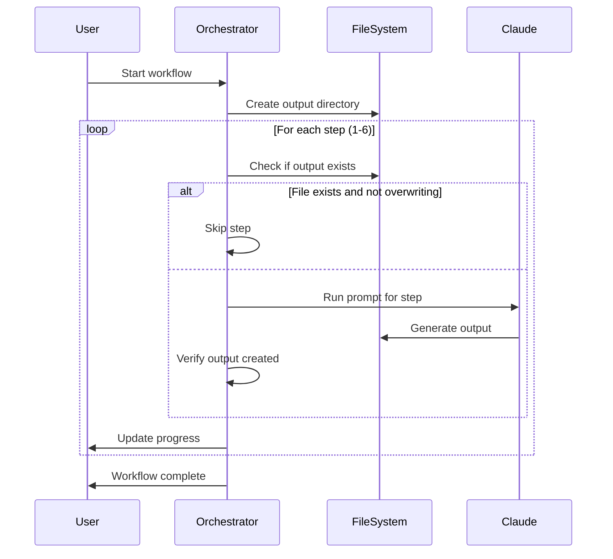

# Chapter 0: Workflow Orchestration

Think of workflow orchestration like a skilled conductor leading an orchestra. Just as a conductor ensures each musical section plays at the right time and in harmony, workflow orchestration coordinates multiple steps in a complex process to create a seamless, beautiful result.

## The Problem: Taming Complex Multi-Step Processes

Imagine you're teaching someone to cook a five-course meal. You wouldn't just hand them all the ingredients and say "good luck!" You'd break it down into steps: prep vegetables first, start the slow-cooking stew, prepare the salad while that simmers, and so on. Each step depends on the previous ones, and timing is everything.

The same challenge exists in software when you need to coordinate multiple operations that must happen in a specific order. In the `proto` project, this challenge manifests as a 6-step tutorial generation process that analyzes codebases and creates comprehensive learning materials.

## Basic Usage: The Simplest Example

The workflow orchestrator in `proto` starts with a simple command:

```typescript
// Command line parsing - src/analyze-all.ts:61
const projectDir = resolve(process.cwd(), args[0]);
const outputDir = resolve(projectDir, outputDirName);
```

This basic invocation kicks off a sophisticated 6-step process:

1. **Extract Core Abstractions** - Find the key concepts in your code
2. **Analyze Relationships** - Understand how these concepts connect  
3. **Order Chapters** - Determine the best learning sequence
4. **Generate Chapters** - Create detailed tutorial content
5. **Review Chapters** - Refine and improve the content
6. **Generate Tutorials** - Create interactive learning experiences

Each step produces output that becomes input for the next step, like an assembly line where each worker adds their expertise to create the final product.

## Key Concepts: Breaking Down the Orchestra

### State Management
The workflow maintains a central state that tracks progress, handles errors, and provides real-time feedback:

```typescript
// State definition - src/ui-analyze-all.tsx:18
interface AnalyzeAllState {
  currentStepIndex: number;
  overallProgress: number;
  statusMessage: string;
  workflowSteps: WorkflowStep[];
  error?: { message: string; type?: string };
}
```

This state acts like a project dashboard, showing exactly where you are in the process and what's happening next.

### Progress Tracking
Each workflow step has a clear identity and status:

```typescript
// Step definitions - src/ui-analyze-all.tsx:37
const WORKFLOW_STEPS: WorkflowStep[] = [
  {
    id: 'abstractions',
    name: 'Extract Core Abstractions',
    description: 'Analyzing codebase to identify key abstractions',
    status: 'pending',
  },
  // ... 5 more steps
];
```

Think of this like a checklist where each item can be pending, running, completed, or failed. The UI can show progress bars, status indicators, and estimated completion times.

### Error Handling
The orchestrator includes sophisticated error handling that distinguishes between different types of failures:

```typescript
// Error handling - src/ui-analyze-all.tsx:449
if (error.message.includes('Claude Code process exited')) {
  setState(prev => ({ ...prev, error: {
    message: 'Process was terminated unexpectedly',
    type: 'claude-process'
  }}));
}
```

This is like having a skilled project manager who can identify whether a delay is due to missing resources, technical issues, or external factors, and respond appropriately.

## Under the Hood: The Orchestration Algorithm

The workflow follows a careful sequence, like a recipe that must be followed precisely:



### The Core Loop

The heart of the orchestration is the `runWorkflow` function in `src/ui-analyze-all.tsx:235`. It follows this pattern for each step:

1. **Check Prerequisites** - Ensure previous steps completed successfully
2. **Skip if Possible** - Avoid redundant work if output already exists
3. **Execute Step** - Run the specific operation (analysis, generation, etc.)
4. **Verify Results** - Confirm the step produced expected output
5. **Update Progress** - Inform users and prepare for next step

### File-Based Communication

Steps communicate through files, like leaving notes for the next person:

```typescript
// Step 1 creates abstractions file - src/ui-analyze-all.tsx:257
await runPromptWithUI(
  abstractionsPrompt,
  projectDir,
  { OUTPUT_PATH: abstractionsOutput }, // Creates this file
  'abstractions'
);

// Step 2 reads Step 1's output - src/ui-analyze-all.tsx:288
await runPromptWithUI(
  relationshipsPrompt,
  projectDir,
  { 
    ABSTRACTIONS_PATH: abstractionsOutput, // Reads Step 1's file
    OUTPUT_PATH: relationshipsOutput 
  },
  'relationships'
);
```

This creates a clear dependency chain where each step builds on the previous one's work.

## Integration: Connecting the Pieces

The workflow orchestrator integrates with several other key abstractions:

- **[Chapter 1: React-based Terminal UI](chapter_1_react-based_terminal_ui.md)** - Provides real-time visual feedback during execution
- **[Chapter 2: Claude SDK Integration](chapter_2_claude_sdk_integration.md)** - Handles AI-powered analysis and generation steps  
- **[Chapter 9: File Generation Utilities](chapter_9_file_generation_utilities.md)** - Manages output creation and organization
- **[Chapter 6: Content Analysis Framework](chapter_6_content_analysis_framework.md)** - Powers the initial codebase analysis

The orchestrator acts as the central nervous system, coordinating these specialized components to achieve the overall goal.

### Two Flavors: Console and UI

The project provides both a simple console version (`analyze-all.ts`) and a rich UI version (`ui-analyze-all.tsx`):

```typescript
// Console version - simple and direct - src/analyze-all.ts:79
console.log("=== Step 1/6: Extracting Core Abstractions ===");
await runPrompt(abstractionsPrompt, projectDir);

// UI version - rich feedback and error handling - src/ui-analyze-all.tsx:257
updateWorkflowStep('abstractions', 'running');
await runPromptWithUI(abstractionsPrompt, projectDir, variables, 'abstractions');
```

Both follow the same orchestration pattern but provide different user experiences - like choosing between a basic progress bar and a detailed dashboard.

### Smart Skip Logic

The orchestrator is intelligent about avoiding redundant work:

```typescript
// Skip existing files - src/ui-analyze-all.tsx:243
if (existsSync(abstractionsOutput) && !state.overwrite) {
  updateWorkflowStep('abstractions', 'completed');
  addLog(`[SKIP] Using existing file: ${abstractionsOutput}`);
} else {
  // Run the step
}
```

This means you can restart the workflow after interruptions without losing progress - like bookmarking your place in a long book.

## Conclusion

Workflow orchestration transforms what could be a chaotic, error-prone manual process into a smooth, predictable, and recoverable automated system. By managing state, tracking progress, handling errors gracefully, and coordinating multiple specialized components, it ensures that complex multi-step operations complete successfully.

The orchestrator pattern is particularly powerful because it separates the "what" (the individual steps) from the "when" and "how" (the coordination logic). This makes the system more maintainable, testable, and adaptable to changing requirements.

Next, we'll explore how the **[Chapter 1: React-based Terminal UI](chapter_1_react-based_terminal_ui.md)** provides the rich visual feedback that makes this orchestration visible and understandable to users in real-time.