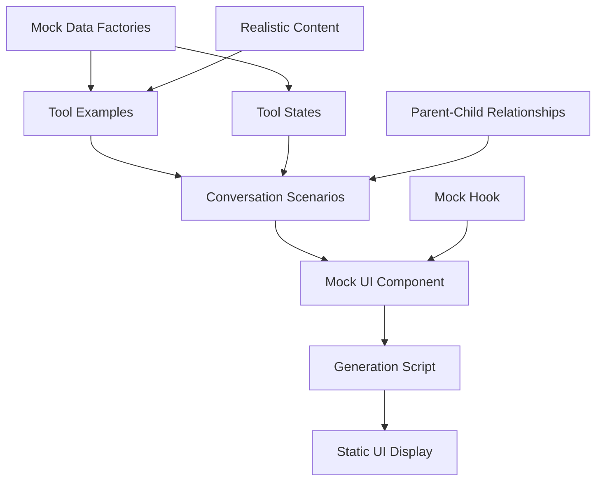

# Chapter 10: Mock and Testing Infrastructure

When building a complex chat interface with multiple tool integrations, you need a way to test and preview every possible state without actually calling the Claude API or executing real commands. Think of it like a movie rehearsal studio – you want to see how all the actors (UI components), props (tools), and scenes (conversations) work together before the real performance.

The proto project includes a comprehensive mock and testing infrastructure that serves as your "rehearsal studio." This system lets you simulate every possible UI state, tool interaction, and conversation scenario in a controlled environment, making development and testing much easier.

## Why Mock Infrastructure Matters

Before diving into the code, let's understand why this matters. In a real chat application, you might encounter:

- **Unpredictable timing**: Tools might take seconds or minutes to complete
- **External dependencies**: Network requests, file system operations, API calls
- **Rare edge cases**: Error states, timeout scenarios, empty responses
- **Development costs**: API usage during testing can be expensive

The mock system solves all these problems by providing instant, predictable responses for every scenario.

## The Foundation: Mock Data Factories

At the heart of the system is the message factory in `src/utils/mockData.ts:10-22`. This function creates realistic chat messages:

```typescript
const createMessage = (
  role: Message['role'],
  content: string,
  toolUse?: Message['toolUse'],
  parentToolUseId?: string,
): Message => ({
  id: (messageIdCounter++).toString(),
  role,
  content,
  timestamp: new Date(Date.now() - Math.random() * 3600000), // Random time in last hour
  ...(toolUse !== undefined && { toolUse }),
  ...(parentToolUseId !== undefined && { parentToolUseId }),
});
```

This factory creates messages that feel authentic. The randomized timestamp within the last hour makes conversations feel natural, and the optional `parentToolUseId` parameter enables parent-child tool relationships (more on this later).

## Tool Message Generation

Building on the base message factory, there's a specialized tool message creator at `src/utils/mockData.ts:24-49`:

```typescript
const createToolMessage = (
  name: string,
  input: unknown,
  result?: string,
  status: ToolStatus = 'completed',
  error?: boolean,
): Message => {
  if (error) {
    return createMessage('tool', `Error using tool: ${name}`, {
      ...baseToolUse,
      result: 'Error: Operation failed',
      status: 'completed',
    });
  }
  
  return createMessage('tool', `Using tool: ${name}`, {
    ...baseToolUse,
    ...(result !== undefined && { result }),
  });
};
```

This function can simulate any tool in any state – whether it's pending, running, completed successfully, or failed with an error. This versatility is crucial for testing how the UI handles different scenarios.

## Comprehensive Tool Library

The mock system includes realistic examples for every tool type at `src/utils/mockData.ts:52-205`. Here's how it covers different categories:

**File Operations** show realistic content with line numbers:
```typescript
Read: [
  createToolMessage(
    'Read',
    { file_path: '/path/to/file.ts' },
    "1→import React from 'react';\n2→import { Box } from 'ink';\n3→\n4→export const Component = () => {\n5→  return <Box>Hello World</Box>;\n6→};"
  ),
]
```

**Command Execution** includes realistic terminal outputs:
```typescript
Bash: [
  createToolMessage(
    'Bash',
    { command: 'npm test' },
    '✓ All tests passed\n\nTest Suites: 12 passed, 12 total\nTests: 48 passed, 48 total'
  ),
]
```

**Search Operations** demonstrate file matching patterns:
```typescript
Grep: [
  createToolMessage(
    'Grep',
    { pattern: 'useEffect', include: '*.tsx' },
    'src/components/Chat.tsx:12\nsrc/components/Input.tsx:8\nsrc/hooks/useChat.ts:25'
  ),
]
```

These examples help developers understand exactly how different tools will appear in the UI and what kind of content they need to handle.

## Tool State Simulation

Beyond basic tool examples, the system includes explicit state demonstrations at `src/utils/mockData.ts:207-218`:

```typescript
export const mockToolStates = {
  pending: createToolMessage('Read', { file_path: '/loading/file.ts' }, undefined, 'pending'),
  in_progress: createToolMessage('Bash', { command: 'npm run build' }, undefined, 'in_progress'),
  completed: createToolMessage('Write', { file_path: '/done.txt' }, 'Operation completed'),
  error: createToolMessage('Edit', { file_path: '/nonexistent.ts' }, undefined, 'completed', true),
};
```

This lets you see exactly how the UI renders tools in different states – a spinning loader for pending operations, progress indicators for running commands, success messages for completed tasks, and error styling for failed operations.

## Advanced Feature: Parent-Child Tool Relationships

One sophisticated feature is the ability to simulate grouped tool operations. The Task tool can spawn child tools, and the mock system handles this at `src/utils/mockData.ts:389-439`:

```typescript
export const createTaskWithChildren = (): Message[] => {
  const taskId = 'task_001';
  const taskMessage = createMessage('tool', 'Using tool: Task', {
    name: 'Task',
    input: { description: 'Search for config files' },
    status: 'in_progress',
  });
  
  const childMessages = [
    createMessage('tool', 'Using tool: Glob', {
      name: 'Glob',
      input: { pattern: '**/*.json' },
      result: 'package.json\ntsconfig.json',
      status: 'completed',
    }, taskId), // Parent-child relationship
  ];
  
  return [taskMessage, ...childMessages];
};
```

This demonstrates how the UI handles hierarchical tool operations, where one tool coordinates multiple sub-operations.

## Complete Conversation Scenarios

The mock system goes beyond individual tools to provide complete conversation flows at `src/utils/mockData.ts:221-386`. These scenarios demonstrate realistic workflows:

- **Development Workflow**: Creating components, running tests, fixing issues
- **Debugging Session**: Identifying problems, searching code, applying fixes
- **Code Review**: Reading files, suggesting improvements, refactoring
- **Project Management**: Organizing tasks, tracking progress
- **Research Tasks**: Web searches, documentation, architecture analysis

Each scenario shows how multiple tools work together in sequence, helping developers understand the full conversation flow.

## The Mock Hook Implementation

The real magic happens in the mock version of the Claude query hook at `src/ui/hooks/useClaudeQuery.mock.ts:15-42`:

```typescript
export function useClaudeQuery({
  onMessage: _onMessage,
  onMessageUpdate: _onMessageUpdate,
  onAssistantUpdate: _onAssistantUpdate,
  onComplete,
  onError: _onError,
}: UseClaudeQueryOptions) {
  const processQuery = useCallback(
    async (_userMessage: string) => {
      // Mock implementation - no actual processing
      // Simulate immediate completion for static display
      onComplete();
    },
    [onComplete],
  );

  return {
    processQuery,
    abort: () => {},
  };
}
```

This provides the same interface as the real hook but without any actual Claude API calls. It immediately completes any query, perfect for static UI demonstration. The interface includes callbacks for different stages of the conversation lifecycle.

## Mock UI Generation Script

The system culminates in a generation script at `scripts/generate-ui-mock.tsx:8-22`:

```typescript
export async function generateUIMock() {
  // Render the mock chat UI
  const { unmount } = render(<ChatAppMock />, {
    patchConsole: false,
  });

  // Wait a brief moment for render to complete
  await new Promise((resolve) => setTimeout(resolve, 500));

  // Unmount the app and exit
  unmount();
  process.exit(0);
}
```

This script renders the complete mock UI, waits for it to stabilize, then exits while leaving the output visible. It's like taking a snapshot of your UI in all possible states.

## System Architecture



The mock system works through this flow:

1. **Mock data factories** create base messages and tool interactions
2. **Tool examples** provide realistic content for each tool type
3. **Tool states** demonstrate different operation phases
4. **Conversation scenarios** combine tools into realistic workflows
5. **Mock UI component** uses the mock hook and displays all generated content
6. **Generation script** renders everything for static viewing

## Integration with Development Workflow

This mock infrastructure integrates seamlessly with the broader development process from [Chapter 0: Workflow Orchestration](chapter_0_workflow_orchestration.md). It provides controlled data for:

- **Unit tests** for individual UI components
- **Integration tests** for conversation flows  
- **Visual regression tests** to ensure UI consistency
- **Manual testing** and design reviews
- **Documentation** and training materials

The mock data works alongside the [React-based Terminal UI](chapter_1_react-based_terminal_ui.md) components and [Tool Integration Layer](chapter_5_tool_integration_layer.md) to provide comprehensive testing coverage.

## Running the Mock System

To see the complete mock system in action:

```bash
bun run mock-ui
```

This command executes the generation script and displays a comprehensive demonstration of every UI state, tool interaction, and conversation scenario. It's like having a complete catalog of your chat interface capabilities.

## Benefits for Development

The mock and testing infrastructure transforms complex UI testing into a straightforward development tool:

- **Predictable Testing**: Every scenario can be reproduced exactly
- **Comprehensive Coverage**: All edge cases and error states are included
- **Fast Iteration**: No waiting for real API calls or command execution
- **Cost Effective**: No API usage during development and testing
- **Documentation**: Visual examples of how every feature works

This infrastructure ensures that the chat interface built with the [Message and Chat System](chapter_4_message_and_chat_system.md) and [Claude SDK Integration](chapter_2_claude_sdk_integration.md) can handle any scenario gracefully, from simple file operations to complex multi-tool workflows.

The mock system represents the final piece in the proto architecture puzzle, providing the testing foundation that supports all the other components. Combined with the [Schema Validation Framework](chapter_3_schema_validation_framework.md) and other abstractions, it creates a robust, testable, and maintainable development environment for building sophisticated AI-powered chat interfaces.