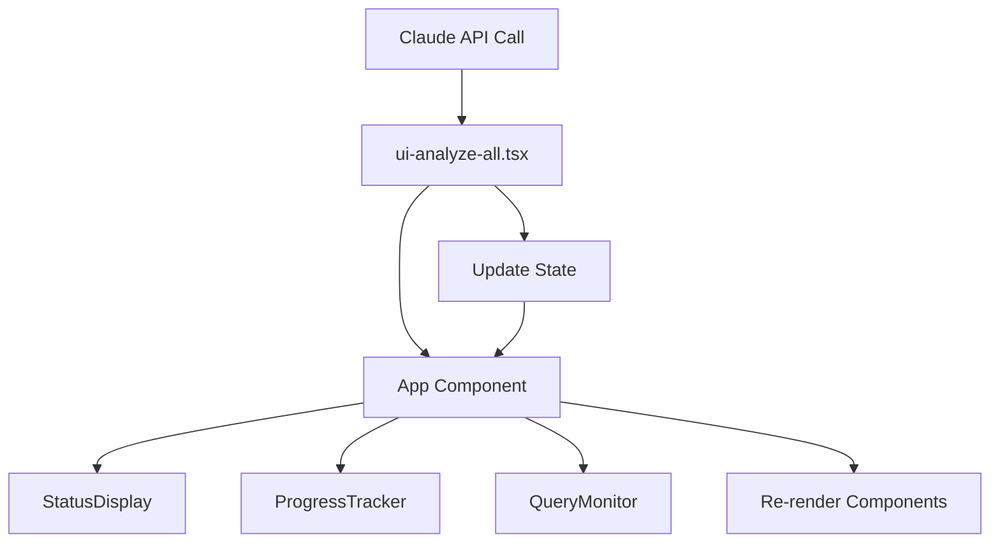

# Chapter 1: React-based Terminal UI

## Introduction

Imagine trying to follow a complex recipe with dozens of ingredients and steps, but your cookbook only shows you one line at a time. You'd have no idea if you're running behind schedule, how much longer it will take, or whether something went wrong three steps back. That's exactly what most command-line tools feel like - you run a command and sit in the dark waiting for it to finish.

The React-based Terminal UI in the proto project solves this problem by creating a sophisticated dashboard that runs right in your terminal. Instead of staring at a blank prompt, you get real-time progress bars, status indicators, cost tracking, and live logs - all updating dynamically as your workflow runs.

## The Problem: Terminal Black Holes

Traditional CLI tools are like black holes for user feedback. When you run a complex analysis that takes several minutes, you're left wondering:
- Is it actually doing anything?
- How much progress has been made?
- How much will this cost me in API calls?
- What if something goes wrong halfway through?

In the proto project, this problem is especially acute because workflows can involve multiple steps of AI-powered analysis, each taking considerable time and costing real money. The React-based Terminal UI transforms this anxiety-inducing experience into a transparent, professional dashboard.

## Basic Usage

The React-based Terminal UI automatically appears when you run the `analyze-all` command. Behind the scenes, it renders a comprehensive dashboard using React and Ink (a library that brings React components to the terminal):

```tsx
// From src/ui-analyze-all.tsx:543
render(<AnalyzeAllApp projectDir={projectDir} outputDir={outputDir} overwrite={overwrite} />);
```

This creates a live, updating interface that shows:
- Current command and project paths with timestamp
- Overall progress bar with percentage
- Step-by-step workflow progress with status icons
- Real-time Claude API monitoring with cost tracking
- Recent logs and comprehensive error handling

The interface updates automatically as your workflow progresses, giving you complete visibility into what's happening behind the scenes.

## Key Components Architecture

### The Main Dashboard (App.tsx)

The heart of the system is the `App` component, which orchestrates the entire interface layout. Think of it like the cockpit of an airplane - everything important is visible at a glance, organized logically, and updates in real-time.

```tsx
// From src/ui/components/App.tsx:8-24
export interface AppProps {
  command: string;
  projectPath?: string;
  outputPath?: string;
  workflowSteps?: WorkflowStep[];
  currentStepIndex?: number;
  overallProgress?: number;
  queryStats?: QueryStats;
  statusMessage?: string;
  logs?: string[];
  error?: { message: string; details?: string; type?: string };
}
```

The layout uses a two-column design implemented with Ink's Box components:

```tsx
// From src/ui/components/App.tsx:116-177
<Box flexGrow={1} flexDirection="row">
  {/* Left Column - Status & Progress */}
  <Box flexDirection="column" width="50%" marginRight={2}>
    <StatusDisplay status={status} message={statusMessage} />
    <ProgressTracker steps={workflowSteps} currentStepIndex={currentStepIndex} />
  </Box>
  
  {/* Right Column - Query Monitor & Logs */}  
  <Box flexDirection="column" width="50%">
    <QueryMonitor stats={queryStats} />
    {/* Recent logs display */}
  </Box>
</Box>
```

### Progress Tracking (ProgressTracker.tsx)

The `ProgressTracker` component provides both high-level progress and detailed step information. Each workflow step gets a visual indicator that makes it easy to see where you are:

```tsx
// From src/ui/components/ProgressTracker.tsx:54-58
const createProgressBar = (percent: number, width: number = 25) => {
  const filled = Math.round(percent * width);
  const empty = width - filled;
  return '='.repeat(filled) + '-'.repeat(empty);
};
```

The step status icons follow a clear pattern:
- `[DONE]` - Completed steps (green)
- `[FAIL]` - Error state (red)  
- `[RUN]` - Currently running (yellow)
- `[>>]` - Current step (cyan)
- `[...]` - Pending steps (dim)

### Real-time Query Monitor (QueryMonitor.tsx)

The `QueryMonitor` tracks Claude API calls with cost and performance metrics. This is crucial because AI API calls can be expensive, and users need visibility into what they're spending:

```tsx
// From src/ui/components/QueryMonitor.tsx:6-14
export interface QueryStats {
  isActive: boolean;
  startTime?: Date;
  duration: number; // in milliseconds
  totalCost: number; // in USD
  numTurns: number;
  lastMessage?: string;
  status: 'waiting' | 'processing' | 'completed' | 'error';
}
```

The component includes smart warnings - if a query runs longer than 30 seconds, it shows a yellow warning that it might be processing something complex:

```tsx
// From src/ui/components/QueryMonitor.tsx:122-129
{isStuckWarning && (
  <Text color="yellow">
    [WARNING] Query taking longer than expected
  </Text>
)}
```

### Status Display (StatusDisplay.tsx)

The `StatusDisplay` component provides clear visual feedback about the current system state:

```tsx
// From src/ui/components/StatusDisplay.tsx:11
export const StatusDisplay: React.FC<StatusDisplayProps> = ({ 
  status, 
  message, 
  details 
}) => {
  // Status types: 'idle', 'running', 'completed', 'error'
  // Each gets appropriate colors and icons
}
```

## Under the Hood: State Management and Data Flow

The system uses a centralized state management approach where the main `AnalyzeAllApp` component manages all state and passes it down to child components. This pattern ensures consistency and makes the UI predictable:

```tsx
// From src/ui-analyze-all.tsx:100-112
const addLog = useCallback((message: string) => {
  setState(prev => ({
    ...prev,
    logs: [...prev.logs, `${new Date().toLocaleTimeString()}: ${message}`]
  }));
}, []);

const updateQueryStats = useCallback((updates: Partial<QueryStats>) => {
  setState(prev => ({
    ...prev,
    queryStats: { ...prev.queryStats, ...updates }
  }));
}, []);
```

The data flow follows this pattern:



When a workflow step starts, the system:
1. Updates the current step status to 'running'
2. Starts the query timer in QueryMonitor
3. Executes the Claude API call
4. Updates cost and performance metrics in real-time
5. Marks the step as 'completed' or 'error' when finished

## Integration with Workflow Orchestration

The React-based Terminal UI integrates seamlessly with the [Workflow Orchestration](chapter_0_workflow_orchestration.md) system. The workflow steps are predefined and passed to the UI for tracking:

```tsx
// From src/ui-analyze-all.tsx:37-74
const WORKFLOW_STEPS: WorkflowStep[] = [
  { id: 'abstractions', name: 'Extract Core Abstractions', status: 'pending' },
  { id: 'relationships', name: 'Analyze Relationships', status: 'pending' },
  { id: 'order', name: 'Order Chapters', status: 'pending' },
  { id: 'generate', name: 'Generate Chapters', status: 'pending' },
  { id: 'review', name: 'Review Chapters', status: 'pending' },
  { id: 'tutorials', name: 'Generate Tutorials', status: 'pending' },
];
```

This creates a predictable, transparent experience where users always know:
- Which step is currently executing
- How much of the overall workflow is complete
- What's coming next
- Exactly how much each step costs in API calls

The UI also handles errors gracefully, with specific error types and recovery suggestions displayed prominently when things go wrong.

## Why This Matters

The React-based Terminal UI demonstrates a key principle: complex tools should provide proportional visibility. The more complex and time-consuming your workflow, the more important it becomes to give users insight into what's happening.

By applying modern React patterns to terminal interfaces using Ink, the system creates an experience that rivals web applications while staying true to the command-line environment. This approach makes AI-powered workflows feel controllable and professional, rather than mysterious and anxiety-inducing.

## Conclusion

The React-based Terminal UI transforms what could be an anxiety-inducing black box into a transparent, informative dashboard. By providing real-time feedback on progress, costs, and system status, it makes complex AI-powered workflows feel controllable and professional.

The system shows how modern React patterns can be effectively applied to terminal interfaces, creating rich, interactive experiences that keep users informed and confident throughout long-running operations.

Next, we'll explore how the [Claude SDK Integration](chapter_2_claude_sdk_integration.md) powers the AI queries that this UI monitors so effectively.