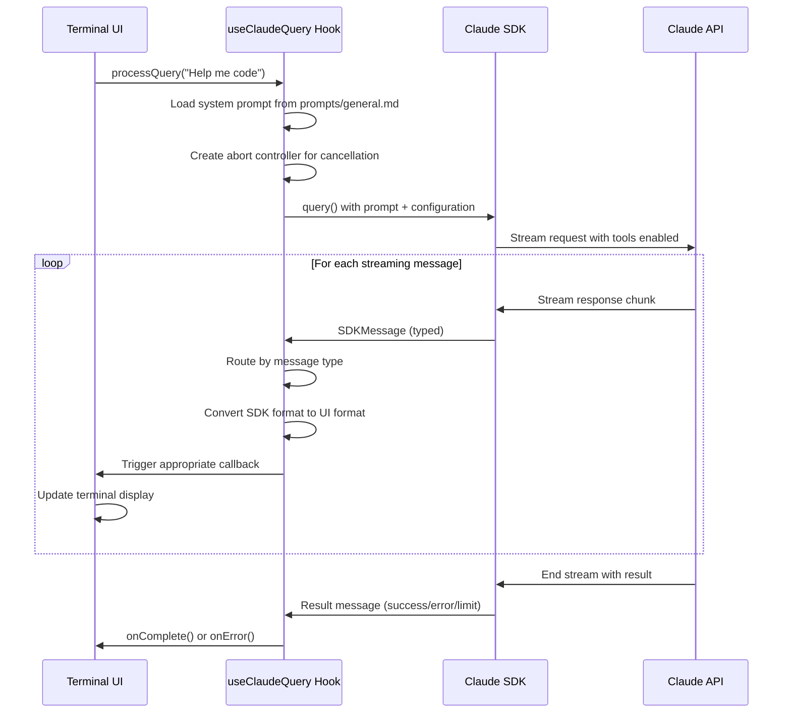

# Chapter 2: Claude SDK Integration

Building on [Chapter 1: React-based Terminal UI](chapter_1_react-based_terminal_ui.md)'s foundation, we now explore the application's core communication layer with Claude. Think of this as the smart translator that sits between your terminal interface and Claude's AI brain, handling all the complex conversation management behind the scenes.

## The Translation Challenge

Imagine you're at an international conference with a professional interpreter. The interpreter doesn't just translate words - they:
- Convert your English questions into the speaker's language
- Listen to streaming responses and translate them back in real-time  
- Handle interruptions when you want to ask follow-up questions
- Remember conversation context so you don't repeat yourself
- Coordinate when the speaker uses tools (like showing slides or demos)

This is exactly what the Claude SDK Integration does for your terminal application - it's the sophisticated interpreter managing all communication with Claude's API.

## Basic Usage

The integration centers around the `useClaudeQuery` hook. Here's how the chat application connects to Claude in `src/ui/components/chat/ChatApp.tsx:31-44`:

```typescript
const { processQuery } = useClaudeQuery({
  onMessage: addMessage,
  onMessageUpdate: updateMessage, 
  onAssistantUpdate: updateLastAssistantMessage,
  onComplete: () => setProcessing(false),
  onError: (error) => {
    setError(error.message);
    setProcessing(false);
  },
});

// When user submits input, send to Claude
processQuery(userMessage);
```

The hook expects callback functions for different response types. When you call `processQuery`, it starts a streaming conversation that handles text responses, tool usage, and errors automatically.

## Key Concepts

### Message Flow Architecture

The integration processes four distinct message types from Claude's SDK, each requiring different handling as seen in `src/ui/hooks/useClaudeQuery.ts:105-167`:

```typescript
// System messages - initialization 
if (isSystemMessage(message)) {
  // Handle system setup (typically invisible to users)
}
// User messages - often contain tool results
else if (isUserMessage(message)) {
  // Process and display tool execution results
}  
// Assistant messages - Claude's responses
else if (isAssistantMessage(message)) {
  // Convert and display Claude's text and tool requests
}
// Result messages - conversation completion
else if (isResultMessage(message)) {
  // Handle success, errors, or conversation limits
}
```

### Session Persistence

Unlike simple API calls, Claude conversations maintain context across multiple exchanges. The integration tracks this through session IDs in `src/ui/hooks/useClaudeQuery.ts:96-99`:

```typescript
// Capture session ID from first message for continuity
if (!sessionIdRef.current && 'session_id' in message) {
  sessionIdRef.current = message.session_id;
}

// Resume existing conversations in subsequent queries
...(sessionIdRef.current && { resume: sessionIdRef.current })
```

### Tool Execution Tracking

When Claude uses tools (like reading files or running commands), the integration maps tool requests to specific UI messages and updates them when results arrive, as implemented in `src/ui/hooks/useClaudeQuery.ts:119-148`:

```typescript
// Store mapping when Claude requests a tool
toolUseToMessageId.set(uiMessage.id, uiMessage.id);

// Update the message when tool execution completes
onMessageUpdate(existingMessageId, {
  toolUse: {
    result: formattedContent,
    status: 'completed',
  },
});
```

## Under the Hood

Here's the complete flow when you send a message to Claude:



The core streaming loop in `src/ui/hooks/useClaudeQuery.ts:66-93` configures Claude with extensive tool access:

```typescript
for await (const message of query({
  prompt: userMessage,
  abortController: abortControllerRef.current,
  options: {
    customSystemPrompt: systemPrompt,
    allowedTools: [
      'Write', 'Read', 'LS', 'Glob', 'Grep', 'Edit', 
      'MultiEdit', 'Bash', 'TodoRead', 'TodoWrite', 
      'Task', 'WebFetch', 'WebSearch', 'NotebookRead',
      'NotebookEdit', 'exit_plan_mode'
    ],
    cwd: process.cwd(),
    model: modelConfig.model,
    ...(sessionIdRef.current && { resume: sessionIdRef.current }),
  },
}))
```

Each streaming message gets processed through type-safe adapters from `src/types/adapters.ts:19-32` that convert Claude's SDK format into the terminal UI's message format.

## Configuration System

The integration relies on a layered configuration approach. Model settings are managed in `src/config.ts:17-22`:

```typescript
export function getModelConfig(): ModelConfig {
  return {
    ...DEFAULT_MODEL_CONFIG,
    model: env.CLAUDE_MODEL, // Environment-based model selection
  };
}
```

Environment validation happens through Zod schemas in `src/env.ts:4-20`, ensuring proper model names and settings with safe defaults:

```typescript
const envSchema = z.object({
  CLAUDE_MODEL: z
    .enum(['claude-sonnet-4-20250514', 'claude-opus-4-20250514'])
    .optional()
    .default('claude-sonnet-4-20250514'),
});
```

## Integration Points

The Claude SDK Integration serves as the central hub connecting multiple system components:

- **[Chapter 1: React-based Terminal UI](chapter_1_react-based_terminal_ui.md)** - Receives callbacks to update the terminal display in real-time
- **[Chapter 3: Schema Validation Framework](chapter_3_schema_validation_framework.md)** - Uses schemas to validate and format tool execution results
- **[Chapter 4: Message and Chat System](chapter_4_message_and_chat_system.md)** - Converts between SDK message formats and UI message formats  
- **[Chapter 5: Tool Integration Layer](chapter_5_tool_integration_layer.md)** - Manages the extensive tool suite Claude can access

The integration imports message adapters, tool result schemas, and logging utilities, creating a cohesive system where each component has clearly defined responsibilities.

## Error Handling and Resilience

The integration includes robust error handling for common failure scenarios:

```typescript
// Connection and parsing errors
catch (error) {
  onError(error instanceof Error ? error : new Error('Unknown error'));
}

// Claude service limits
else if (message.subtype === 'error_max_turns') {
  onError(new Error('Maximum conversation turns reached'));
}
```

The abort controller pattern allows users to cancel long-running queries, providing responsive interaction even during complex tool operations.

## Conclusion

The Claude SDK Integration acts as the sophisticated communication bridge that makes natural AI conversation possible in a terminal environment. It handles streaming protocols, maintains conversation context, coordinates tool usage, and provides clean separation between AI logic and UI concerns.

This abstraction enables the terminal interface to focus purely on display and interaction while the integration manages all the complexities of AI communication. In **[Chapter 3: Schema Validation Framework](chapter_3_schema_validation_framework.md)**, we'll explore how the system ensures all data flowing through these integrations maintains correct structure and type safety.