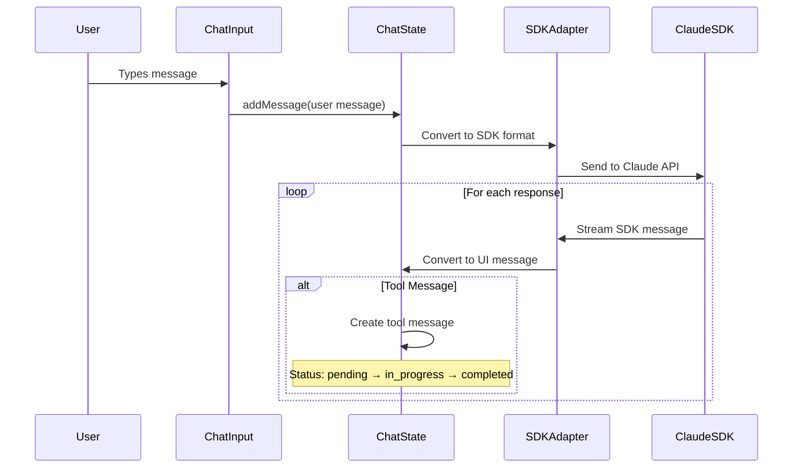

# Chapter 4: Message and Chat System

Think of the Message and Chat System as the sophisticated brain of a conversation - like a skilled moderator in a complex discussion who tracks who said what, when they said it, manages interruptions from tools, and maintains the flow of dialogue while everyone stays synchronized.

## The Conversation Problem

Building a chat application where users talk to Claude isn't just simple back-and-forth messaging. When Claude needs to use tools like reading files or running commands, these tool operations must be seamlessly woven into the conversation flow. The system needs to track:

- Who's speaking (user, assistant, system, or tool)
- What tools are being used and their current status
- Real-time updates as tools execute
- Conversation history with proper ordering
- Rich input handling with keyboard shortcuts

This system solves the challenge of orchestrating complex conversations where multiple actors participate in structured dialogue.

## Basic Message Structure

Every conversation starts with a simple message structure defined in `src/types/chat.ts:10`:

```typescript
interface Message {
  id: string;
  role: 'user' | 'assistant' | 'system' | 'tool';
  content: string;
  timestamp: Date;
  toolUse?: ToolUse;
  parentToolUseId?: string;
}
```

The four message roles each serve a specific purpose:
- **User**: Human input messages
- **Assistant**: Claude's text responses
- **System**: Internal status and error messages  
- **Tool**: Tool execution notifications and results

## Adding Messages to Conversation

New messages are added through the `addMessage` function in `src/ui/hooks/useChatState.ts:21`:

```typescript
const addMessage = useCallback(
  (message: Omit<Message, 'timestamp'> | Omit<Message, 'id' | 'timestamp'>) => {
    const messageId = 'id' in message ? message.id : Date.now().toString();
    const newMessage: Message = {
      id: messageId,
      role: message.role,
      content: message.content,
      timestamp: new Date(),
    };
    
    setState((prev) => ({
      ...prev,
      messages: [...prev.messages, newMessage],
    }));
  },
  [],
);
```

This function automatically generates IDs and timestamps, ensuring every message has proper tracking information.

## Tool Integration

When Claude uses tools, the system creates special tool-aware messages. The `ToolUse` interface in `src/types/chat.ts:3` tracks tool execution:

```typescript
interface ToolUse {
  name: string;
  input?: unknown;
  result?: string;
  status?: ToolStatus; // 'pending' | 'in_progress' | 'completed'
}
```

Tool messages start with `status: 'pending'` and update in real-time as tools execute, providing immediate feedback to users.

## Message Adaptation

The system uses adapters to convert between Claude SDK messages and UI messages. The main adapter function in `src/types/adapters.ts:19` handles this conversion:

```typescript
export function sdkMessageToUIMessage(sdkMessage: SDKMessage): Message | Message[] | null {
  switch (sdkMessage.type) {
    case 'assistant':
      return convertAssistantMessage(sdkMessage);
    case 'user':
      return convertUserMessage(sdkMessage);
    case 'system':
      return convertSystemMessage(sdkMessage);
    case 'result':
      return convertResultMessage(sdkMessage);
    default:
      return null;
  }
}
```

This adapter pattern allows the UI to work with consistent message formats while the SDK handles the complex API communication details.

## Rich Input Handling

The input system provides sophisticated text editing with platform-specific shortcuts. The `useChatInput` hook in `src/ui/hooks/useChatInput.ts:98` handles keyboard input:

```typescript
useInput((input, key) => {
  if (isProcessing) return;
  
  const isClipboardModifier = isMacOS ? key.meta : key.ctrl;
  
  if (isClipboardModifier && input === 'v') {
    // Paste from clipboard
    const clipboardText = pasteFromClipboard();
    const newValue = state.value.slice(0, state.cursorPosition) + 
                    clipboardText + 
                    state.value.slice(state.cursorPosition);
    updateInput(newValue, state.cursorPosition + clipboardText.length);
  }
});
```

The system automatically detects macOS vs other platforms and provides appropriate keyboard shortcuts (Cmd+V vs Ctrl+V for paste).

## Conversation State Management

The complete conversation state is managed through the `ChatState` interface in `src/types/chat.ts:19`:

```typescript
interface ChatState {
  messages: Message[];
  currentInput: string;
  isProcessing: boolean;
  error?: string;
  cursorPosition: number;
}
```

This state includes not just the messages but also the current input text, processing status, and even cursor position for smooth text editing.

## Message Flow Architecture

The system orchestrates message flow between multiple components:



This architecture ensures that whether Claude is sending text responses or using tools, everything flows through the same consistent message system.

## Integration with Other Systems

The Message and Chat System serves as the central hub connecting other abstractions:

- **[Schema Validation Framework](chapter_3_schema_validation_framework.md)**: Validates message structure and tool inputs before processing
- **[Tool Integration Layer](chapter_5_tool_integration_layer.md)**: Manages tool execution and feeds results back into the conversation
- **[React-based Terminal UI](chapter_1_react-based_terminal_ui.md)**: Renders messages with appropriate formatting and real-time updates

The system transforms what could be chaotic message streams into structured, trackable conversations where every interaction has its proper place and timing.

## Why This Matters

Without this system, conversations would be fragmented and confusing. Users wouldn't know when tools are running, tool results would be disconnected from their triggers, and the chat interface would feel unresponsive. The Message and Chat System creates the foundation for natural, flowing conversations between humans and AI.

This foundation enables the [Tool Integration Layer](chapter_5_tool_integration_layer.md) to seamlessly execute and display tool operations within the conversation flow, creating a unified experience where tools feel like natural participants in the dialogue rather than external interruptions.