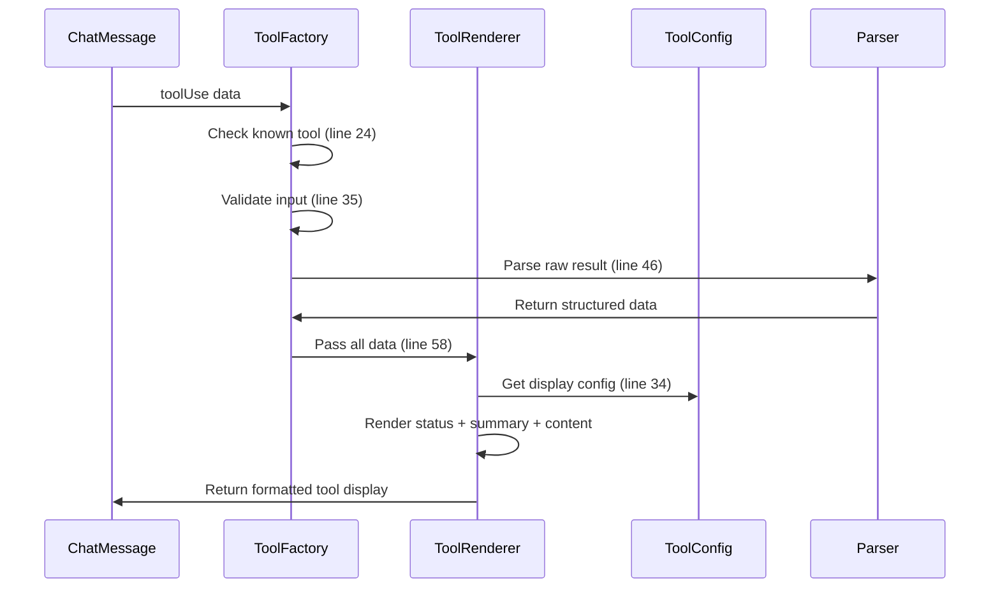

# Chapter 5: Tool Integration Layer

Think of the Tool Integration Layer as a universal translator and display manager for Claude's toolbox. Just like how a mechanic's toolbox contains various tools (wrench, screwdriver, hammer), Claude has different capabilities (reading files, running commands, searching code) - and each tool works differently and produces different output formats. The Tool Integration Layer creates a consistent way to handle all these tools, making sure they're displayed properly and their results are parsed correctly.

## The Problem: Tool Chaos

Without a tool integration system, displaying tool usage would be messy. Consider what happens when Claude uses different tools:

- `Read` returns file content with line numbers and needs syntax highlighting
- `Bash` returns command output with exit codes and execution time
- `Glob` returns file lists that should be formatted as clickable paths
- `TodoRead` returns JSON data that needs structured parsing

Each tool has different input formats, output types, and display requirements. The Tool Integration Layer solves this by providing:
- **Consistent UI rendering** for all 16+ supported tools
- **Type-safe input validation** using Zod schemas
- **Smart result parsing** that extracts meaningful metadata
- **Unified status tracking** (pending, in progress, completed)

## Basic Usage

Here's how a tool gets rendered when Claude reads a file:

```tsx
// From ChatMessage.tsx:44
<ToolFactory
  toolUse={message.toolUse}
  startTime={message.timestamp}
  isExpanded={shouldAutoExpand}
/>
```

The `ToolFactory` acts like a smart factory that:
1. Identifies the tool type from 16+ supported tools
2. Validates the input using the appropriate Zod schema
3. Parses the result using tool-specific logic
4. Renders it with consistent visual styling

## Key Concepts

### Tool Configuration

Each tool has a configuration that defines its behavior. Here's how the `Read` tool is configured:

```tsx
// From toolConfigs.tsx:56
Read: {
  name: 'Read',
  autoExpand: true,
  formatInput: (input) => getRelativePath(input.file_path),
  getSummary: (_input, result, parsedResult) => {
    if (parsedResult) {
      return `Read ${parsedResult.lineCount} lines (${formatBytes(parsedResult.charCount)})`;
    }
    return `Read ${result.split('\n').length} lines`;
  },
  renderResult: (rawResult) => <CodeBlock content={rawResult} />
}
```

This configuration tells the system:
- **autoExpand**: Show the full content automatically
- **formatInput**: Display `./src/file.ts` instead of the full path
- **getSummary**: Show "Read 45 lines (2.1KB)" as a summary
- **renderResult**: Display the content in a syntax-highlighted code block

### Schema Validation

Every tool input gets validated using Zod schemas defined in `src/schemas/tools.ts`:

```tsx
// From ToolFactory.tsx:35
const result = schema.safeParse(toolUse.input);
if (result.success) {
  validatedInput = result.data;
} else {
  validationError = result.error;
}
```

For example, the `Read` tool schema ensures the file path is provided:

```tsx
// From tools.ts:20
export const ReadToolSchema = z.object({
  file_path: z.string().describe('The absolute path to the file to read'),
  limit: z.number().optional(),
  offset: z.number().optional()
});
```

### Result Parsing

Raw tool results get parsed into structured data using custom parsers:

```tsx
// From parsers/index.ts:19
export function parseReadResult(rawResult: string) {
  const lines = rawResult.split('\n');
  return {
    content: rawResult,
    lineCount: lines.length,
    charCount: rawResult.length,
    truncated: false
  };
}
```

This transforms raw text into useful metadata that powers smart summaries like "Read 45 lines (2.1KB)".

## Under the Hood

The Tool Integration Layer follows this sequence:



Here's what happens step by step:

1. **Tool Recognition**: `ToolFactory` checks if the tool exists in `ToolSchemas` (src/ui/components/tools/ToolFactory.tsx:24)
2. **Input Validation**: The tool's input gets validated against its Zod schema (src/ui/components/tools/ToolFactory.tsx:35)
3. **Result Parsing**: Custom parsers transform raw results into structured data (src/ui/components/tools/ToolFactory.tsx:46)
4. **Configuration Lookup**: `ToolRenderer` gets the tool's display configuration (src/ui/components/tools/ToolRenderer.tsx:34)
5. **UI Rendering**: The tool gets rendered with status indicators, summaries, and formatted content

### Status Indicators and Execution Time

The system shows visual feedback for tool execution:

```tsx
// From ToolRenderer.tsx:36
const getStatusIndicator = () => {
  switch (status) {
    case 'completed': return <Text color="green">⏺</Text>;
    case 'in_progress': return <Text color="white">⏺</Text>;
    default: return <Spinner type="dots" />;
  }
};
```

Execution time is calculated and displayed when available (src/ui/components/tools/ToolRenderer.tsx:51).

## Supported Tools

The system supports 16+ tools out of the box, each with custom configuration:

- **File Operations**: `Read`, `Write`, `Edit`, `MultiEdit`
- **Search & Discovery**: `Glob`, `Grep`, `LS`
- **Command Execution**: `Bash`
- **Task Management**: `TodoRead`, `TodoWrite`, `Task`
- **Web Integration**: `WebSearch`, `WebFetch`
- **Notebook Support**: `NotebookRead`, `NotebookEdit`
- **Planning**: `exit_plan_mode`

Each tool can define:
- Custom input formatting
- Result parsing logic
- Summary generation
- Visual rendering components
- Auto-expand behavior

## Integration with Other Systems

The Tool Integration Layer connects to several other abstractions:

- **[Chapter 3: Schema Validation Framework](chapter_3_schema_validation_framework.md)**: Uses Zod schemas from `src/schemas/tools.ts` for type-safe input validation
- **[Chapter 1: React-based Terminal UI](chapter_1_react_based_terminal_ui.md)**: Renders tools using Ink components with consistent terminal styling
- **[Chapter 4: Message and Chat System](chapter_4_message_and_chat_system.md)**: Receives tool usage data through chat messages and displays them inline

The system is highly extensible - adding a new tool requires:
1. Creating a schema in `src/schemas/tools.ts`
2. Adding a configuration in `src/ui/components/tools/toolConfigs.tsx`
3. Optionally creating a custom parser in `src/ui/components/tools/parsers/index.ts`

## Conclusion

The Tool Integration Layer transforms chaotic tool outputs into a consistent, beautiful terminal interface. It handles the complexity of 16+ different tool types while providing type safety, smart parsing, and extensible configuration. This abstraction ensures that whether Claude is reading files, running commands, or searching code, users see a unified and informative display with proper status indicators, execution times, and formatted results.

Next, we'll explore the **[Chapter 6: Content Analysis Framework](chapter_6_content_analysis_framework.md)** which analyzes and processes the data that flows through these tool integrations.