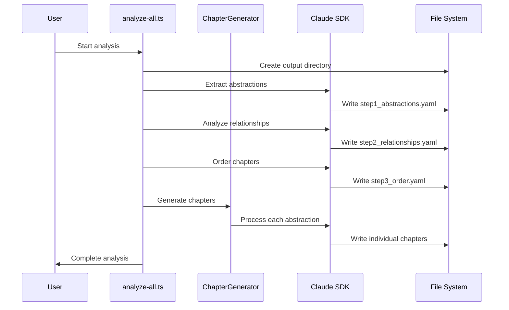

# Chapter 6: Content Analysis Framework

Building on the [Tool Integration Layer](chapter_5_tool_integration_layer.md) that handles external tool interactions, we now explore the Content Analysis Framework - the intelligent system that examines codebases like a skilled librarian organizing a vast collection.

## The Problem: Making Sense of Complex Code

Imagine walking into a massive library where books are scattered everywhere, written in different languages, with interconnected references. You need to identify the most important volumes, understand how they relate to each other, and create a logical reading order for newcomers. This is exactly what the Content Analysis Framework does for codebases.

The framework tackles three core challenges:
- **Information overload**: Large codebases contain thousands of files and concepts
- **Hidden relationships**: Important connections between components aren't obvious
- **Learning path optimization**: Determining the best order to teach concepts to beginners

## Basic Usage

The simplest way to see the Content Analysis Framework in action is through the main entry point in `src/analyze-all.ts:52-172`:

```typescript
// Run the complete analysis workflow
const projectDir = resolve(process.cwd(), args[0]);
const outputDir = resolve(projectDir, ".claude-tutorial-output");

// The framework runs automatically through 6 phases
await main();
```

This triggers the framework to examine your entire codebase and produce structured learning materials. The output includes YAML files with abstractions, relationships, and chapter ordering that serve as the foundation for tutorial generation.

## Key Concepts

### 1. Six-Phase Analysis Pipeline

The framework operates through six distinct phases, each building intelligence on the previous one:

```typescript
// From src/analyze-all.ts:78-157
// Phase 1: Extract core abstractions (5-15 key concepts)
// Phase 2: Analyze relationships (how concepts connect)  
// Phase 3: Order chapters (optimal learning sequence)
// Phase 4: Generate chapters (educational content)
// Phase 5: Review chapters (quality assurance)
// Phase 6: Generate tutorials (interactive materials)
```

Think of this like an assembly line where each station adds more intelligence to the analysis, transforming raw code into structured learning materials.

### 2. Schema-Driven Validation

The framework uses strongly-typed schemas to ensure data quality throughout the process:

```typescript
// From src/chapter-generator.ts:16-20
const AbstractionSchema = z.object({
  name: z.string(),                    // e.g., "React Terminal UI"
  description: z.string(),             // Detailed explanation
  file_paths: z.array(z.string()),     // Associated source files
});
```

This acts like quality control, ensuring every abstraction has a name, description, and file paths. The framework validates data at each phase to prevent errors from propagating downstream.

### 3. Dynamic Prompt Interpolation

The framework customizes AI prompts with project-specific information:

```typescript
// From src/chapter-generator.ts:204-216
const prompt = promptTemplate
  .replace(/{project_name}/g, projectName)
  .replace(/{abstraction_name}/g, abstraction.name.trim())
  .replace(/{chapter_num}/g, chapterNum.toString())
  .replace(/{abstraction_description}/g, abstraction.description.trim());
```

This is like having a template that automatically fills in project details, making each AI interaction contextually relevant to your specific codebase.

### 4. Intelligent Tool Selection

Different analysis phases use different tools based on their needs:

```typescript
// From src/analyze-all.ts:32
allowedTools: ["Write", "Read", "LS", "Glob", "Grep", "Edit", "Bash"]

// From src/chapter-generator.ts:229  
allowedTools: ['Read', 'LS', 'Glob', 'Grep']
```

The initial analysis gets full codebase access, while chapter generation uses read-only tools to ensure safety and focus.

## Under the Hood

The Content Analysis Framework follows this intelligent workflow:



The magic happens in the `runPrompt` function (`src/analyze-all.ts:11-43`), which:

1. **Loads prompt templates** from markdown files
2. **Interpolates variables** like `{{OUTPUT_PATH}}` with actual values  
3. **Invokes Claude SDK** with customized system prompts
4. **Monitors progress** and reports completion times and costs

Each phase produces structured YAML output that the next phase consumes, creating a data pipeline that transforms raw code into educational content.

### Parallel Chapter Generation

The framework optimizes performance through parallel processing:

```typescript
// From src/chapter-generator.ts:85-131
const chapterPromises = sortedChapters.map(async (chapter) => {
  // Generate each chapter independently
  const chapterContent = await this.generateChapter(/*...*/);
  return { index: chapter.index, content: chapterContent };
});

const chapterResults = await Promise.all(chapterPromises);
```

This parallel approach dramatically reduces total processing time while maintaining chapter order through index-based sorting.

## Integration with Other Systems

The Content Analysis Framework seamlessly connects with other abstractions in the system:

- **[Chapter Generation Pipeline](chapter_8_chapter_generation_pipeline.md)**: Consumes analysis outputs to create educational content
- **Message Logger** (`src/utils/messageLogger.ts:42-65`): Records all SDK interactions for debugging:

```typescript
// Message logging captures all AI interactions
await messageLogger.logSDKMessage(message, 'incoming');
await messageLogger.logUserPrompt(prompt);
```

- **[Claude SDK Integration](chapter_2_claude_sdk_integration.md)**: Uses the same query interface with customized tool permissions

The framework outputs structured YAML files that serve as the foundation for the entire tutorial generation pipeline:

```typescript
// From src/chapter-generator.ts:151-155
private async readAbstractions() {
  const content = await readFile(this.options.abstractionsPath, 'utf-8');
  const data = yaml.parse(content);
  return AbstractionsYamlSchema.parse(data); // Type-safe parsing
}
```

## Why This Matters

The Content Analysis Framework transforms the overwhelming task of understanding complex codebases into a systematic, reproducible process. By breaking down analysis into phases and leveraging AI to identify patterns and relationships, it creates the foundation for effective learning materials.

This framework demonstrates how AI can be used not just to generate content, but to analyze and structure information in ways that make complex systems accessible to newcomers. It's the difference between throwing someone into a codebase versus providing them with a guided tour.

## Conclusion

The Content Analysis Framework represents the intelligence layer that makes sense of code complexity. By combining structured data validation, intelligent prompt design, and parallel processing, it transforms chaotic codebases into organized learning experiences.

In the next chapter, we'll explore the [Prompt Template System](chapter_7_prompt_template_system.md) that powers these AI interactions and enables the framework to generate contextually relevant analysis.