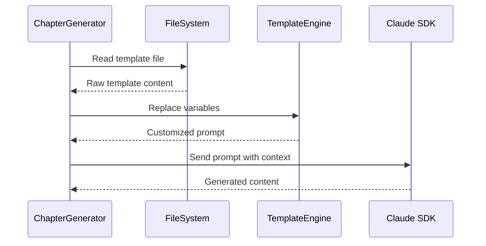

# Chapter 7: Prompt Template System

In [Chapter 6: Content Analysis Framework](chapter_6_content_analysis_framework.md), we explored how the project analyzes codebases to extract meaningful abstractions and relationships. Now we'll discover how this system orchestrates AI-powered content generation through a sophisticated prompt template system.

## The Recipe Book Problem

Imagine you're running a busy restaurant with multiple chefs who need to create different types of dishes throughout the day. Each chef needs precise, detailed instructions for their specific phase of cooking - one for prep work, another for main course preparation, another for dessert, and so on. You can't just give them a generic "cook food" instruction; each phase requires its own carefully crafted recipe with specific ingredients, techniques, and timing.

This is exactly the challenge this project faces when generating tutorial content. The system needs to guide Claude through six distinct phases of tutorial creation, each requiring different types of analysis, different outputs, and different levels of detail. The Prompt Template System solves this by providing a structured, modular approach to managing AI prompts across the entire workflow.

## Basic Usage

The simplest way to see the prompt template system in action is through the chapter generation process:

```typescript
// Read the prompt template
const promptTemplate = await readFile('prompts/4-write-chapters.md', 'utf-8');

// Interpolate variables into the template
const prompt = promptTemplate
  .replace(/{project_name}/g, 'proto')
  .replace(/{abstraction_name}/g, 'Prompt Template System')
  .replace(/{chapter_num}/g, '7');
```

This example shows how the system takes a template file and dynamically replaces placeholders with actual project data, creating a customized prompt for each specific generation task.

## Key Concepts

### Template Structure

Each prompt template follows a consistent structure with variable placeholders that get replaced with real values. For example, in `prompts/4-write-chapters.md`:

```markdown
# Chapter {chapter_num}: {abstraction_name}

## Project Context
- **Project**: {project_name}
- **Abstraction**: {abstraction_name}
- **Description**: {abstraction_description}
```

The system uses curly brace notation `{variable_name}` to mark interpolation points. When the template is processed, these placeholders become actual values like "Chapter 7: Prompt Template System".

### Variable Interpolation

The core of the system is the variable replacement mechanism found in `src/chapter-generator.ts:204-216`:

```typescript
const prompt = promptTemplate
  .replace(/{project_name}/g, projectName)
  .replace(/{abstraction_name}/g, abstraction.name.trim())
  .replace(/{chapter_num}/g, chapterNum.toString())
  .replace(/{project_root_path}/g, projectRootPath)
  .replace(/{abstraction_description}/g, abstraction.description.trim());
```

This pattern ensures that every generated prompt is customized with the specific context needed for that particular generation task. The `/g` flag means "global" - it replaces all occurrences of the pattern in the template, not just the first one.

### Template Specialization

Different workflow phases use specialized templates, each designed for a specific purpose:

- **`prompts/1-abstractions.md`** - Analyzes code to identify key abstractions
- **`prompts/2-analyze-relationshipt.md`** - Maps relationships between abstractions
- **`prompts/3-order-chapters.md`** - Determines logical chapter ordering
- **`prompts/4-write-chapters.md`** - Generates tutorial chapter content
- **`prompts/5-review-chapters.md`** - Reviews and improves existing chapters
- **`prompts/6-tutorials.md`** - Creates interactive coding exercises

Each template contains phase-specific instructions, output requirements, and examples tailored to that stage of the workflow. This specialization is crucial because asking Claude to "write a chapter" requires very different instructions than asking it to "analyze code relationships."

## Under the Hood

The prompt template system operates through a carefully orchestrated sequence:



Let's trace through what happens when generating a chapter:

1. **Template Loading**: The system reads the appropriate template file from the `prompts/` directory using Node.js's `readFile` function
2. **Context Preparation**: It gathers all necessary variables like project name, abstraction details, and chapter information from the analysis results
3. **Variable Replacement**: Using regex patterns, it replaces all `{variable_name}` placeholders with actual values
4. **Prompt Delivery**: The customized prompt is sent to Claude with appropriate tool permissions and working directory context

The most sophisticated part is the variable preparation logic in `src/chapter-generator.ts:177-216`, which handles complex contextual information like previous chapter summaries and full chapter listings. This context helps Claude understand where each chapter fits in the overall tutorial structure.

### Why This Approach Works

The template system solves several critical problems:

- **Consistency**: Every prompt for the same phase uses identical structure and instructions
- **Maintainability**: Changing prompt instructions requires editing only one template file
- **Flexibility**: Different projects can use different variable values while sharing the same template logic
- **Clarity**: Each template focuses on one specific task, making the instructions clearer and more actionable

## Integration

The Prompt Template System serves as the central nervous system connecting all other components:

- **[Chapter 0: Workflow Orchestration](chapter_0_workflow_orchestration.md)** - Coordinates which templates to use for each phase
- **[Chapter 2: Claude SDK Integration](chapter_2_claude_sdk_integration.md)** - Delivers the interpolated prompts to Claude
- **[Chapter 3: Schema Validation Framework](chapter_3_schema_validation_framework.md)** - Ensures template variables match expected data structures
- **[Chapter 6: Content Analysis Framework](chapter_6_content_analysis_framework.md)** - Provides the abstraction data that gets interpolated into templates
- **[Chapter 9: File Generation Utilities](chapter_9_file_generation_utilities.md)** - Manages template file paths and output locations

The system is designed for modularity, allowing each generator class to customize its template interpolation while maintaining consistent patterns. For example, both `ChapterGenerator` and `TutorialGenerator` share similar variable replacement logic but with different sets of variables appropriate to their specific tasks.

## Practical Example

Here's how the system works in practice when generating Chapter 7:

```typescript
// 1. Load the template
const template = await readFile('prompts/4-write-chapters.md', 'utf-8');

// 2. Prepare variables from analysis results
const variables = {
  project_name: 'proto',
  abstraction_name: 'Prompt Template System',
  chapter_num: '7',
  abstraction_description: 'A modular system for managing AI prompts...'
};

// 3. Replace placeholders
let prompt = template;
Object.entries(variables).forEach(([key, value]) => {
  prompt = prompt.replace(new RegExp(`{${key}}`, 'g'), value);
});

// 4. Send to Claude
const response = await claude.messages.create({
  model: 'claude-3-sonnet-20240229',
  messages: [{ role: 'user', content: prompt }]
});
```

This process transforms a generic template into a specific, contextual prompt that guides Claude to generate exactly the content needed for this particular chapter.

## Conclusion

The Prompt Template System demonstrates how complex AI workflows can be managed through modular, reusable components. By separating the prompt content from the generation logic, the system achieves both flexibility and consistency across all phases of tutorial creation. This approach allows each phase to have precisely tailored instructions while maintaining a unified architecture.

The template system is particularly powerful because it treats prompts as code - they're version-controlled, reusable, and can be systematically improved. This makes the entire tutorial generation process more reliable and maintainable.

Understanding this system prepares you for [Chapter 8: Chapter Generation Pipeline](chapter_8_chapter_generation_pipeline.md), where we'll see how these templates are used to orchestrate the parallel generation of multiple tutorial chapters.