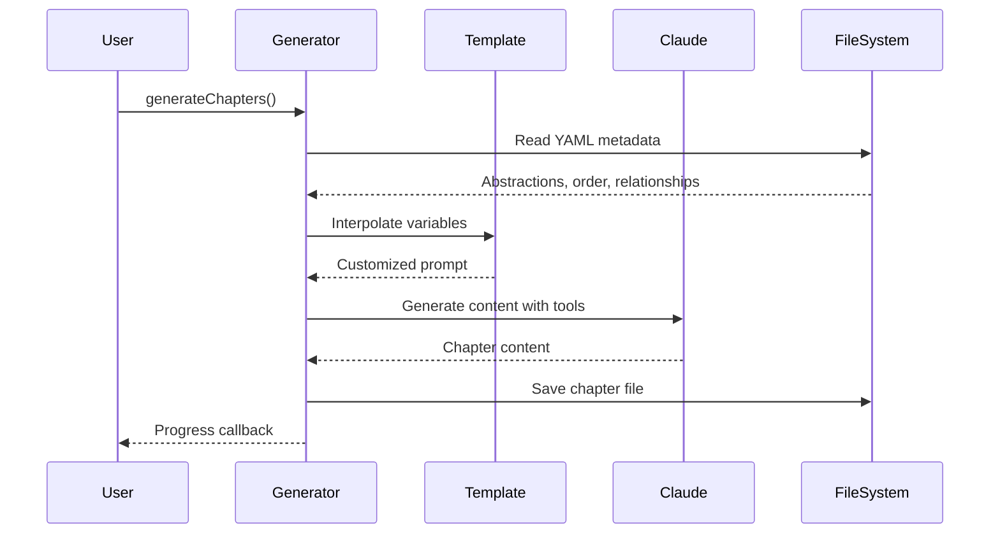

# Chapter 8: Chapter Generation Pipeline

Building on the [Prompt Template System](chapter_7_prompt_template_system.md), the Chapter Generation Pipeline is the heart of our tutorial creation system. Think of it as an educational content assembly line that transforms raw code analysis into structured, beginner-friendly tutorial chapters.

## The Content Factory Analogy

Imagine a publishing house that specializes in creating programming tutorials. Raw research materials (code abstractions, relationships) come in one end, and polished, educational chapters come out the other. The Chapter Generation Pipeline works exactly like this factory, but with AI-powered content creation.

Here's what flows through our pipeline:
- **Input Materials**: YAML files containing code abstractions, relationships, and chapter ordering
- **Processing Templates**: Prompt templates that guide AI content generation
- **AI Workforce**: Claude SDK integration for intelligent content creation
- **Quality Control**: Parallel processing, file management, and progress tracking
- **Final Output**: Structured markdown tutorial chapters ready for learners

## Basic Usage

The simplest way to generate chapters is through the main function in `src/chapter-generator.ts:252`:

```typescript
import { generateChaptersFromYaml } from './chapter-generator';

await generateChaptersFromYaml(
  'abstractions.yaml',      // Input: what to explain
  'relationships.yaml',     // Input: how concepts connect
  'chapter_order.yaml',     // Input: learning sequence
  './output/chapters',      // Output: where to save
  'template.md',           // Template: how to structure
  '/path/to/project'       // Context: project to analyze
);
```

This single function call orchestrates the entire chapter generation process, reading your project metadata and producing a complete set of tutorial chapters.

## Key Concepts

### The Three-Stage Content Pipeline

The Chapter Generation Pipeline actually consists of three sequential stages, each handled by a specialized class:

#### 1. Chapter Generation (ChapterGenerator)

The `ChapterGenerator` class creates initial draft chapters from abstractions. From `src/chapter-generator.ts:60`, it operates like a content factory:

```typescript
async generateChapters(): Promise<void> {
  const abstractions = await this.readAbstractions();
  const chapterOrder = await this.readChapterOrder();
  
  // Generate all chapters in parallel
  const chapterPromises = sortedChapters.map(async (chapter) => {
    const chapterContent = await this.generateChapter(/*...*/);
    await writeFile(chapterPath, chapterContent, 'utf-8');
  });
}
```

#### 2. Chapter Review (ChapterReviewer)

The `ChapterReviewer` class refines generated chapters for clarity and accuracy. From `src/chapter-reviewer.ts:46`, it acts as an editorial team:

```typescript
async reviewChapters(): Promise<void> {
  const chapterFiles = await this.getChapterFiles();
  
  // Review all chapters in parallel
  const reviewPromises = chapterFiles.map(async (chapterFile) => {
    const originalContent = await readFile(originalChapterPath, 'utf-8');
    const reviewedContent = await this.reviewChapter(/*...*/);
  });
}
```

#### 3. Tutorial Generation (TutorialGenerator)

The `TutorialGenerator` class transforms reviewed chapters into interactive tutorials. From `src/tutorial-generator.ts:47`, it adds hands-on learning elements:

```typescript
async generateTutorials(): Promise<void> {
  const reviewedChapterContent = await readFile(reviewedChapterPath, 'utf-8');
  const tutorialContent = await this.generateTutorial(/*...*/);
}
```

### Smart Template Interpolation

Each stage uses sophisticated template interpolation to customize content. From `src/chapter-generator.ts:204`, the system replaces placeholders with project-specific data:

```typescript
const prompt = promptTemplate
  .replace(/{project_name}/g, projectName)
  .replace(/{abstraction_name}/g, abstraction.name.trim())
  .replace(/{chapter_num}/g, chapterNum.toString())
  .replace(/{abstraction_description}/g, abstraction.description.trim())
  .replace(/{abstraction_file_paths}/g, abstraction.file_paths.join(', '));
```

This transforms generic templates into project-specific prompts that guide the AI to generate relevant, contextual content.

### Parallel Processing Architecture

One of the pipeline's most powerful features is parallel processing. From `src/chapter-generator.ts:84`, it generates multiple chapters simultaneously:

```typescript
// Generate all chapters in parallel
const chapterPromises = sortedChapters.map(async (chapter) => {
  return this.generateChapter(abstraction, chapter.index, /*...*/);
});

const chapterResults = await Promise.all(chapterPromises);
```

This dramatically reduces generation time while maintaining quality through careful resource management, including automatic listener limit handling at `src/chapter-generator.ts:81`.

## Under the Hood

Let's trace through how a single chapter gets generated:



### The Generation Process

Each chapter goes through a sophisticated generation process. Looking at `src/chapter-generator.ts:169`, the `generateChapter` method:

1. **Builds Context**: Creates chapter listings and previous chapter summaries at `src/chapter-generator.ts:183`
2. **Interpolates Templates**: Injects project-specific variables into prompts at `src/chapter-generator.ts:204`
3. **Calls Claude SDK**: Uses AI with file analysis tools at `src/chapter-generator.ts:225`
4. **Handles Errors**: Manages abort controllers and cleanup at `src/chapter-generator.ts:241`

The AI has access to powerful tools like `Read`, `LS`, `Glob`, and `Grep` to analyze your actual codebase while generating content, ensuring accuracy and relevance.

### Smart File Management

The pipeline implements intelligent file management through utilities in `src/utils/file-generation.ts:14`. The `checkFileExists` function prevents unnecessary regeneration:

```typescript
export function checkFileExists(filePath: string, options: FileGenerationOptions): FileExistenceCheck {
  const exists = existsSync(filePath);
  const shouldSkip = exists && !options.overwrite && !options.force;
  return { exists, path: filePath, shouldSkip };
}
```

This allows developers to run the pipeline repeatedly without wasting time regenerating unchanged content.

## Integration with the Full Workflow

The Chapter Generation Pipeline integrates seamlessly with the broader tutorial creation system. From `src/analyze-all.ts:122`, you can see how it fits into the complete workflow:

```typescript
// Step 4: Generate chapters
await generateChaptersFromYaml(
  abstractionsOutput,     // From Step 1: abstraction analysis
  relationshipsOutput,    // From Step 2: relationship mapping  
  chapterOrderOutput,     // From Step 3: chapter ordering
  chaptersDir,           // Coordinated output structure
  promptTemplatePath,    // From prompt template system
  projectDir            // Project context for code analysis
);
```

The pipeline consumes outputs from the [Content Analysis Framework](chapter_6_content_analysis_framework.md) and [Prompt Template System](chapter_7_prompt_template_system.md), then feeds its results to the review and tutorial generation stages.

Progress tracking integrates with the [React-based Terminal UI](chapter_1_react_based_terminal_ui.md) through callback functions defined at `src/chapter-generator.ts:54`:

```typescript
onProgress?: (message: string, type: 'skip' | 'generate' | 'complete') => void
```

This provides real-time updates to users about generation progress, file skipping, and completion status.

## Why This Matters

The Chapter Generation Pipeline represents a fundamental shift in how we create educational content. Instead of manually writing tutorials, we:

1. **Automate Content Creation**: Generate consistent, high-quality chapters from code analysis
2. **Ensure Accuracy**: Use AI with actual code access to verify explanations
3. **Scale Educational Content**: Create comprehensive tutorials for any codebase
4. **Maintain Quality**: Built-in review and refinement stages

This approach makes it practical to create and maintain up-to-date educational content for complex software systems.

## Conclusion

The Chapter Generation Pipeline transforms the challenge of creating educational content from a manual, time-consuming process into an automated, scalable system. Its three-stage approach (generation → review → tutorial creation) ensures content quality, while parallel processing maintains performance.

The pipeline's template interpolation system provides flexibility for different projects, and its intelligent file management offers practical workflow efficiency. Most importantly, it bridges the gap between technical code analysis and beginner-friendly learning materials.

Next, we'll explore the [File Generation Utilities](chapter_9_file_generation_utilities.md) that provide the foundational infrastructure supporting this entire content creation pipeline.