# Chapter 9: File Generation Utilities

Imagine you're organizing a massive digital library with thousands of books. You need a system that can automatically name books consistently, check if they already exist before creating duplicates, and manage different versions (original, reviewed, tutorial format). This is exactly what the File Generation Utilities do - they act as a smart librarian for our tutorial generation system.

## The Problem: File Management Chaos

When generating large numbers of tutorial files, several challenges emerge:

- **Inconsistent naming**: Chapter names like "React-based Terminal UI" vs "react_based_terminal_ui.md"
- **Accidental overwrites**: Losing hours of work by regenerating existing files
- **Manual directory management**: Creating folders and handling file existence checks
- **Version confusion**: Mixing up original chapters, reviewed versions, and final tutorials

As seen in the [Chapter Generation Pipeline](chapter_8_chapter_generation_pipeline.md), the system needs to check file existence before generating content:

```typescript
const fileCheck = checkFileExists(chapterPath, this.options);
if (fileCheck.shouldSkip) {
  this.options.onProgress?.(createSkipMessage(chapterFileName), 'skip');
  return null;
}
```

## Basic Usage

The simplest file generation utility is filename normalization:

```typescript
import { normalizeFileName } from './utils/file-generation';

// Transform messy input into clean, filesystem-safe names
const messy = "React-based Terminal UI!";
const clean = normalizeFileName(messy);
// Result: "react_based_terminal_ui"
```

Here's what happens step by step:
1. Trim whitespace from both ends
2. Convert to lowercase
3. Replace spaces with underscores
4. Remove special characters (keeping only letters, numbers, underscores, hyphens)
5. Collapse multiple underscores into single ones

## Key Concepts

### File Existence Checking

The core safety mechanism prevents accidental overwrites using the `FileExistenceCheck` interface defined in `src/utils/file-generation.ts:8-12`:

```typescript
interface FileExistenceCheck {
  exists: boolean;    // Whether the file is already there
  path: string;       // The full file path being checked
  shouldSkip: boolean; // Decision logic combining existence with user preferences
}
```

Here's how to use it:

```typescript
const fileCheck = checkFileExists('/path/to/file.md', { 
  overwrite: false, // Don't overwrite existing files
  force: false      // Don't force generation
});

if (fileCheck.shouldSkip) {
  console.log('File exists, skipping generation');
}
```

The `shouldSkip` logic protects your work: it returns `true` when a file exists and you haven't explicitly allowed overwrites.

### Filename Generation Patterns

The system provides specialized generators for different content types, all following consistent naming conventions:

```typescript
// Chapter files: chapter_1_react_based_terminal_ui.md
const chapterFile = generateChapterFileName(1, "React-based Terminal UI");

// Reviewed files: reviewed_chapter_1_react_based_terminal_ui.md  
const reviewedFile = generateReviewedChapterFileName(1, "React-based Terminal UI");

// Tutorial files: tutorial_1_react_based_terminal_ui.md
const tutorialFile = generateTutorialFileName(1, "React-based Terminal UI");
```

Each generator follows the same pattern: it takes a chapter number and a human-readable name, then produces a consistent filename using the normalization function from `src/utils/file-generation.ts:28-35`.

### User-Friendly Messages

The system provides helpful progress messages that integrate with the [React-based Terminal UI](chapter_1_react_based_terminal_ui.md):

```typescript
// When generating a new file
const generating = createGeneratingMessage("chapter_1_ui.md");
// Result: "📝 Generating: chapter_1_ui.md"

// When skipping an existing file
const skipping = createSkipMessage("chapter_1_ui.md");
// Result: "⏭️  Skipping existing file: chapter_1_ui.md"
```

These messages use emojis and consistent formatting to provide clear feedback during the generation process.

## Under the Hood

The filename normalization algorithm in `src/utils/file-generation.ts:28-35` is the foundation of consistent file naming:

```typescript
export function normalizeFileName(name: string): string {
  return name
    .trim()                           // Remove leading/trailing spaces
    .toLowerCase()                    // Convert to lowercase
    .replace(/\s+/g, '_')            // Spaces → underscores
    .replace(/[^a-z0-9_-]/g, '_')    // Special chars → underscores
    .replace(/_+/g, '_');            // Collapse multiple underscores
}
```

This transformation ensures that any chapter name, no matter how complex, becomes a valid filename that works across all operating systems.

The file generation process follows this sequence:

```mermaid
sequenceDiagram
    participant CG as ChapterGenerator
    participant FGU as FileGenerationUtils
    participant FS as FileSystem

    CG->>FGU: generateChapterFileName(index, name)
    FGU->>FGU: normalizeFileName(name)
    FGU->>CG: Return "chapter_1_normalized_name.md"
    
    CG->>FGU: checkFileExists(path, options)
    FGU->>FS: existsSync(path)
    FS->>FGU: boolean
    FGU->>FGU: Calculate shouldSkip logic
    FGU->>CG: Return {exists, path, shouldSkip}
    
    alt shouldSkip is false
        CG->>FGU: createGeneratingMessage(filename)
        FGU->>CG: "📝 Generating: filename"
        CG->>FS: writeFile(path, content)
    else shouldSkip is true
        CG->>FGU: createSkipMessage(filename)  
        FGU->>CG: "⏭️ Skipping existing file: filename"
    end
```



## Integration with Format Utilities

The File Generation Utilities work closely with the format utilities in `src/utils/format.ts`. While file generation handles naming and existence checking, format utilities handle content presentation:

```typescript
import { normalizeFileName } from './utils/file-generation';
import { formatChapterTitle } from './utils/format';

// Generate clean filename
const filename = normalizeFileName("Advanced React Patterns");
// Result: "advanced_react_patterns"

// Format human-readable title
const title = formatChapterTitle("Advanced React Patterns");
// Result: "Advanced React Patterns" (properly capitalized)
```

This separation allows the system to maintain both machine-readable filenames and human-readable content titles.

## Real-World Usage

Here's how the tutorial generation system in `src/tutorial-generator.ts:102-111` uses these utilities:

```typescript
const tutorialFileName = generateTutorialFileName(chapterNum, abstraction.name);
const tutorialPath = resolve(this.options.outputDir, tutorialFileName);

const fileCheck = checkFileExists(tutorialPath, this.options);
if (fileCheck.shouldSkip) {
  this.options.onProgress?.(createSkipMessage(tutorialFileName), 'skip');
  return { index: chapterNum, filename: chapterFile, skipped: true };
}

this.options.onProgress?.(createGeneratingMessage(tutorialFileName), 'generating');
```

This pattern ensures consistent behavior across all generators while providing user feedback through progress callbacks that connect to the [React-based Terminal UI](chapter_1_react_based_terminal_ui.md).

## Error Handling

The utilities include built-in safety measures:

```typescript
// Safe filename generation - handles edge cases
const safeName = normalizeFileName("  !!!Invalid@#$Name!!!  ");
// Result: "invalid_name" (not an empty string or invalid characters)

// Existence checking with fallback
try {
  const check = checkFileExists(somePath, options);
  if (check.exists && !options.overwrite) {
    // Handle gracefully
  }
} catch (error) {
  // File system errors are handled by the calling code
}
```

## Conclusion

File Generation Utilities solve the critical problem of managing large-scale content generation safely and consistently. By providing standardized filename generation, existence checking, and user-friendly messaging, they enable the tutorial generation system to run reliably without manual intervention or accidental data loss.

These utilities act as the foundation for file operations throughout the system, working seamlessly with the [Chapter Generation Pipeline](chapter_8_chapter_generation_pipeline.md) and providing feedback through the [React-based Terminal UI](chapter_1_react_based_terminal_ui.md).

Next, we'll explore how [Mock and Testing Infrastructure](chapter_10_mock_and_testing_infrastructure.md) ensures the reliability of all these file operations through comprehensive testing scenarios that verify both successful generation and proper error handling.