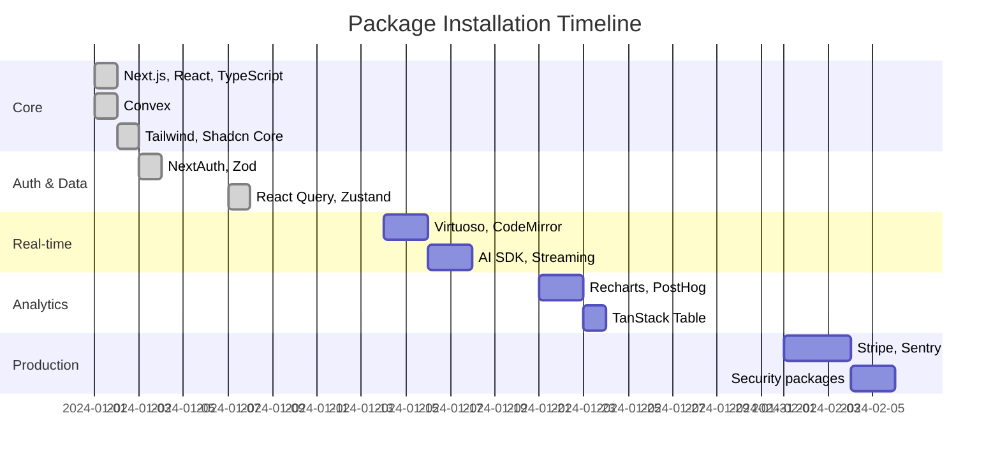

# Fondation Web Application Development Roadmap

## Overview

This roadmap follows a **progressive enhancement** approach, starting with the absolute minimum viable product and incrementally adding features. Each version is a deliverable, working application.

## Versions

- **[v0.1 - Core Pipeline](./v0.1-core-pipeline.md)** - Basic auth, repo list, job creation
- **[v0.2 - Execution & Feedback](./v0.2-execution-feedback.md)** - Real-time updates, results display
- **[v0.3 - User Experience](./v0.3-user-experience.md)** - Dashboard, configuration, chat mode
- **[v0.4 - Team Features](./v0.4-team-features.md)** - Organizations, collaboration
- **[v1.0 - Production Ready](./v1.0-production-ready.md)** - Polish, billing, security
- **[v1.1 - Advanced AI](./v1.1-advanced-ai.md)** - Multi-modal docs, code analysis

## Development Philosophy

### Start Minimal
Each version begins with only the packages absolutely necessary for that phase's features.

### Progressive Enhancement
- v0.1: Core infrastructure only (Next.js, Convex, NextAuth, minimal UI)
- v0.2: Add real-time features (WebSockets, streaming)
- v0.3: Enhance UX (charts, virtual scrolling, advanced forms)
- v0.4: Scale for teams (RBAC, audit logging)
- v1.0: Production hardening (monitoring, security, payments)

### Package Installation Timeline



## Key Principles

1. **Deliverable at Every Step**: Each version is a working application
2. **User Value First**: Every addition must provide clear user value
3. **Performance Conscious**: Monitor bundle size at each phase
4. **Type Safety**: Full TypeScript coverage with Zod validation
5. **Accessibility**: WCAG compliance from the start with Radix UI

## Success Metrics Per Version

| Version | Bundle Size | Lighthouse | Time to Interactive | Key Metric |
|---------|------------|------------|-------------------|------------|
| v0.1 | <200KB | >80 | <2s | Login success rate |
| v0.2 | <300KB | >85 | <2.5s | Job completion rate |
| v0.3 | <400KB | >85 | <3s | User engagement time |
| v0.4 | <450KB | >85 | <3s | Team adoption rate |
| v1.0 | <500KB | >90 | <2s | Paid conversion rate |

## Tech Stack Evolution

### Phase 1: Foundation (v0.1)
```json
{
  "next": "^15.0.1",
  "react": "^18.3.1",
  "convex": "^1.0.0",
  "next-auth": "5.0.0-beta.25",
  "tailwindcss": "^3.4.3",
  "shadcn-ui": "^0.9.5"
}
```

### Phase 2: Interactivity (v0.2)
```json
{
  // ... Phase 1 +
  "@tanstack/react-query": "^5.50.0",
  "react-virtuoso": "^4.12.6",
  "@uiw/react-codemirror": "^4.23.12"
}
```

### Phase 3: Enhancement (v0.3)
```json
{
  // ... Phase 2 +
  "recharts": "^2.15.2",
  "ai": "^4.3.16",
  "cmdk": "^1.1.1"
}
```

### Phase 4: Scale (v0.4-v1.0)
```json
{
  // ... Phase 3 +
  "stripe": "^14.0.0",
  "@sentry/nextjs": "^7.0.0",
  "posthog-js": "^1.246.0"
}
```

## Getting Started

1. Start with [v0.1 - Core Pipeline](./v0.1-core-pipeline.md)
2. Complete each phase before moving to the next
3. Run tests and performance checks at each milestone
4. Document decisions and learnings

## Resources

- [Architecture Document](../ARCHITECTURE.md)
- [Security Refinements](../ARCHITECTURE_REFINEMENTS.md)
- [Package Reference](./packages-reference.md)